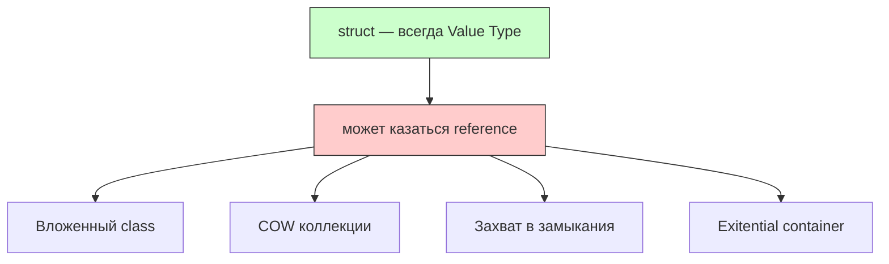
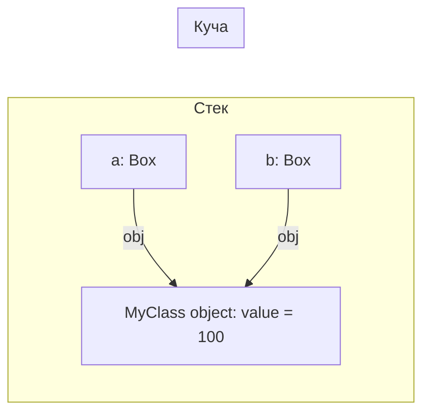
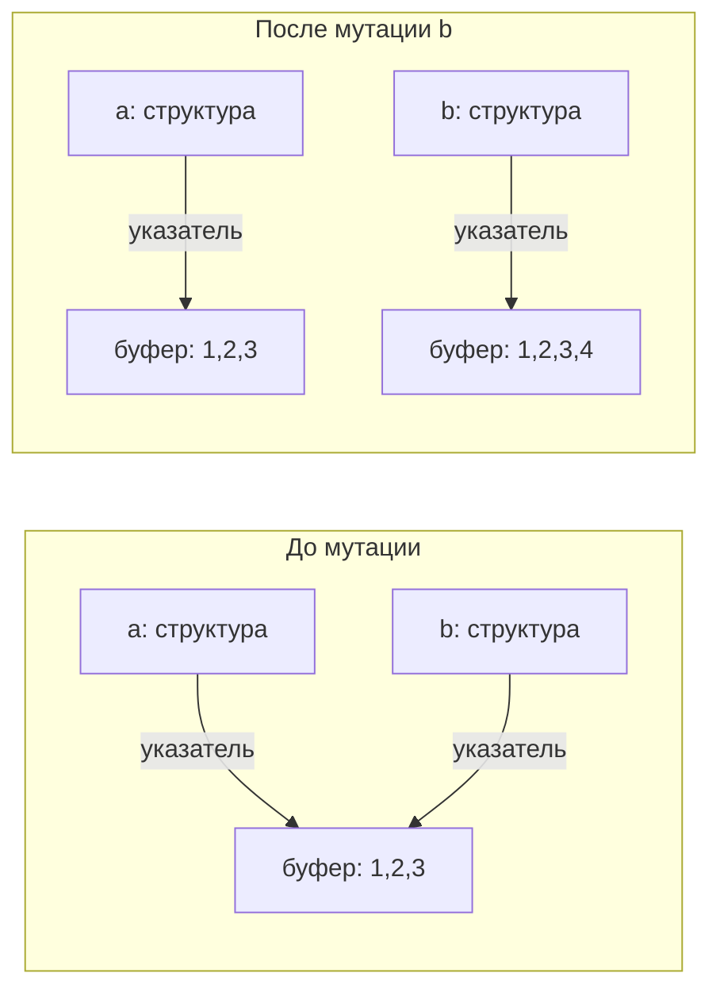
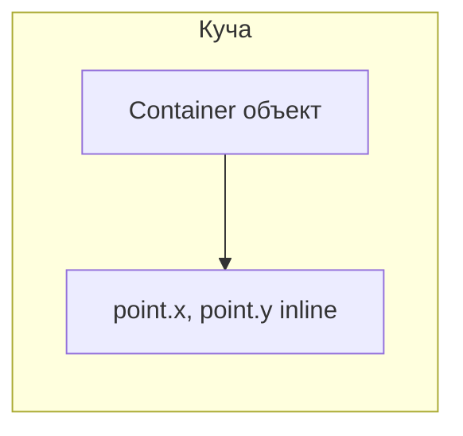

## Может ли struct вести себя как reference type? — Полное руководство

---
#swift #struct #value-type #reference-type #cow #memory

---
### Короткий ответ

**Никогда** семантически ([[struct]] всегда [[Value Type]]), но **может казаться**, что он ведёт себя как reference type, из-за вложенных [[reference type]]s, [[Copy-on-Write]] (COW) или escape-анализа.



---

### 1. [[Struct]] + [[class]] внутри (самый частый случай)

```swift
class MyClass {
    var value = 0
}

struct Box {
    var obj: MyClass   // ← reference type внутри
}

var a = Box(obj: MyClass())
var b = a             // копия Box (value semantics)

b.obj.value = 100

print(a.obj.value)    // 100 — изменилось!
print(a.obj === b.obj) // true — один и тот же объект
```

**Почему кажется reference?**  
`Box` скопирован ([[value semantic]]s), но `MyClass` — **один и тот же** объект в куче. При копировании структуры копируется ссылка на класс, а не сам объект класса.

**Правда:**  
Это **не** reference semantics структуры, а **reference semantics вложенного `class`**.



---

### 2. [[Copy-on-Write]] (COW) коллекции ([[Array]], [[Dictionary]], [[String]], [[Set Collection|Set]])

```swift
var a = [1, 2, 3]
var b = a               // копия структуры (общий буфер)
b.append(4)             // COW: создаётся новый буфер

print(a)  // [1, 2, 3]
print(b)  // [1, 2, 3, 4]
```

**Визуализация COW:**



**Почему кажется reference?**  
До мутации — общий буфер в куче, и изменения через одну переменную видны другой.

**Правда:**  
Это **value semantics с ленивым копированием** (COW). При мутации создаётся копия — классический value type.

```swift
// Проверка уникальности буфера
var a = [1, 2, 3]
var b = a

print(isKnownUniquelyReferenced(&a))  // false (буфер разделяется)

b.append(4)
print(isKnownUniquelyReferenced(&a))  // true (буфер уникален для a)
```

---

### 3. Struct в замыкании (escape → [[heap]])

```swift
func makeIncrementer() -> () -> Int {
    var counter = 0
    return {
        counter += 1   // counter "поднят" в кучу
        return counter
    }
}

let inc = makeIncrementer()
print(inc())  // 1
print(inc())  // 2
```

**Почему кажется reference?**  
Переменная `counter` живёт дольше функции, поэтому компилятор перемещает её в кучу. Изменения через замыкание видны при последующих вызовах.

**Правда:**  
Это **escape analysis**, а не reference semantics. Struct всё равно копируется при захвате, но захватывается **одна копия**, которая хранится в куче вместе с замыканием.

```swift
// Демонстрация: захват struct с class внутри
struct Counter {
    var value = 0
}

func makeCounterClosure() -> () -> Int {
    var counter = Counter()
    return {
        counter.value += 1
        return counter.value
    }
}

let closure = makeCounterClosure()
print(closure())  // 1
print(closure())  // 2
// Кажется reference, но counter — struct в куче
```

---

### 4. Struct внутри class — inline storage

```swift
class Container {
    var point = Point(x: 0, y: 0)   // struct inline внутри объекта класса
}

let container = Container()
let pointCopy = container.point     // копия структуры
container.point.x = 10

print(pointCopy.x)      // 0 (не изменилось)
print(container.point.x) // 10 (изменилось)
```

**Правда:**  
`Point` **не** отдельный объект в куче, а **встроен (inline)** в память `Container` → value semantics. При доступе через `container.point` возвращается копия структуры.



**Исключение:** если struct внутри class захвачена в замыкание:

```swift
class Container {
    var point = Point(x: 0, y: 0)
    
    func getPointChanger() -> () -> Void {
        return { [point] in
            // point — копия на момент захвата
            // изменения не повлияют на container.point
        }
    }
}
```

---

### 5. [[Existential container]] ([[any Protocol]])

```swift
protocol P {}
struct Small: P { let x: Int }      // 8 байт — inline в контейнере
struct Large: P { let a,b,c,d: Int } // 32 байта — указатель на кучу

let small: any P = Small(x: 42)   // значение в inline buffer
let large: any P = Large(a:1,b:2,c:3,d:4) // значение в куче
```

**Почему кажется reference?**  
Большие структуры в `any` вытесняются на кучу, и кажется, что они ведут себя как reference.

**Правда:**  
Это особенность existential container, а не семантика struct.

---

### Сравнительная таблица

| Ситуация | Кажется reference? | На самом деле |
|---|---|---|
| **Struct + class внутри** | Да | reference semantics от class |
| **COW-коллекции (Array, String и т.д.)** | Да (до мутации) | value semantics + ленивое копирование |
| **Struct в замыкании (escape)** | Да | escape analysis → heap |
| **Struct внутри class** | Нет | inline storage |
| **Большой struct в `any`** | Да | existential container → heap |
| **Чистый struct без reference внутри** | Нет | чистый value type |

---

### Как проверить, что struct действительно value type

```swift
// 1. Проверка идентичности — не работает для struct
struct Point { var x, y: Int }
var p1 = Point(x: 1, y: 2)
var p2 = p1

// p1 === p2  // ❌ Ошибка: struct не поддерживает ===

// 2. Проверка через inout
func modify(_ point: inout Point) {
    point.x += 1
}

var point = Point(x: 1, y: 2)
let originalX = point.x
modify(&point)
print(originalX)  // 1 (не изменилось)
print(point.x)    // 2 (изменилось)

// 3. Проверка копирования при присваивании
var a = Point(x: 1, y: 2)
var b = a
b.x = 10
print(a.x)  // 1 — независимая копия
```

---

### Лучшие практики

| Практика | Почему |
|---|---|
| **Не храни class внутри struct без необходимости** | Может создать ложное ощущение reference semantics |
| **Используй `@_effects(readonly)` для COW коллекций** | Оптимизация компилятора |
| **Для escape-анализа используй `@escaping` явно** | Ясность кода |
| **Документируй вложенные reference types** | `// Внимание: содержит class — будет shared` |
| **Используй `copy-on-write` для своих типов** | Оптимизация производительности |

```swift
// Хорошая документация
/// Внимание: содержит reference type (class) — изменения через одну копию влияют на другие.
struct SharedData {
    private let storage: Storage  // class
}
```

---

### Короткое резюме

| Ситуация | Кажется reference? | На самом деле |
|---|---|---|
| Struct + class внутри | Да | reference semantics от class |
| COW-коллекции (Array, String и т.д.) | Да (до мутации) | value semantics + ленивое копирование |
| Struct в замыкании (escape) | Да | escape analysis → heap |
| Struct внутри class | Нет | inline storage |
| Чистый struct без reference внутри | Нет | чистый value type |

**Главное правило 2026**:
> Struct **никогда** не становится reference type.  
> Если кажется, что он ведёт себя как reference — внутри почти всегда спрятано `class`, замыкание или COW-буфер.  
> Проверяй семантику через копирование при присваивании и оператор `===` (который не работает для struct).