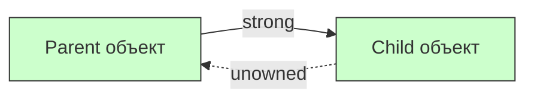
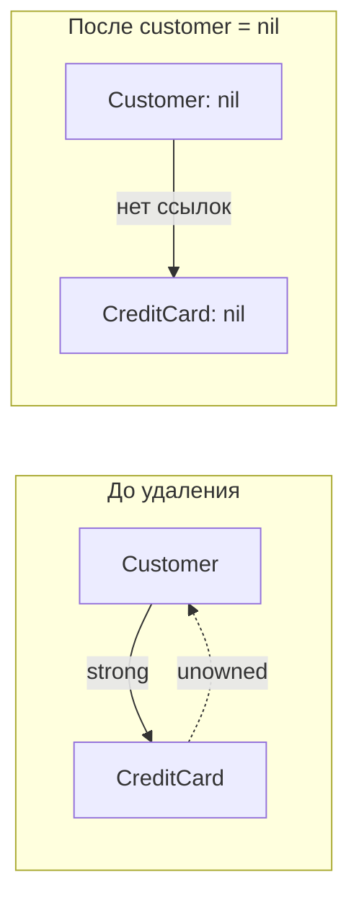

#swift #unowned #memory #arc #weak #memory-management

---
### Определение

**`unowned`** — это модификатор слабой ссылки в [[Swift]], который:

- **не увеличивает** счётчик ссылок ([[ARC]])
- **не является [[optional]]** (в отличие от `weak`)
- **предполагает**, что объект, на который ссылается, **живёт дольше**, чем владеющий им объект
- **крашит приложение** при попытке разыменовать уже освобождённый объект

> Проще говоря:  
> `unowned` = «я точно знаю, что этот объект будет жить дольше меня, поэтому не держу его сильно и не делаю optional»



---

### Когда использовать `unowned` (реальные сценарии 2025–2026)

| Ситуация | Почему именно `unowned`, а не `weak` | Пример из практики |
|---|---|---|
| **Объект A владеет объектом B, а B имеет обратную ссылку на A** | A живёт дольше B → B может использовать `unowned` на A | `Customer` → `CreditCard` (Customer живёт дольше карты) |
| **Замыкание захватывает self, но self гарантированно живёт дольше** | Нет смысла делать `weak` и проверять `?`, если `self` не может умереть | `lazy var closure = { [unowned self] in ... }` |
| **Делегирование в объекте, который создаётся владельцем и живёт не дольше** | Владелец управляет жизненным циклом делегата | delegate в кастомном view, где делегат — владелец view |
| **Вложенные объекты с чёткой иерархией владения** | Владелец → owned объект → unowned ссылка обратно | `Node` → `parent` (unowned) в дереве объектов |
| **Оптимизация производительности в горячих участках кода** | Нет optional-unwrapping → чуть быстрее и чище код | Анимации, игровые циклы, рендеринг |

---

### Синтаксис и варианты (все актуальные в Swift 6)

```swift
// 1. Простая unowned ссылка (самый частый)
class Apartment {
    unowned let tenant: Person
    init(tenant: Person) { self.tenant = tenant }
}

// 2. unowned в замыкании (самый популярный кейс)
class MyViewController {
    lazy var buttonAction: () -> Void = { [unowned self] in
        self.updateUI()
    }
}

// 3. unowned var + implicit unwrapped (редко, но встречается)
class Node {
    unowned var parent: Node?
}

// 4. unowned в параметре функции (очень редко)
func configure(delegate: unowned SomeDelegate) { ... }
```

---

### Сравнение `weak`, `unowned`, `unowned(unsafe)`

| Модификатор         | [[Optional]]? | [[ARC]]? | Что происходит при обращении к освобождённому объекту?   | Когда использовать в 2026                               |
| ------------------- | ------------- | -------- | -------------------------------------------------------- | ------------------------------------------------------- |
| **[[weak]]**        | Да            | Нет      | Ссылка становится [[nil]]                                | Когда объект может умереть раньше                       |
| **unowned**         | Нет           | Нет      | **Краш** (EXC_BAD_ACCESS)                                | Когда объект гарантированно живёт дольше                |
| **unowned(unsafe)** | Нет           | Нет      | **Неопределённое поведение** (может не крашнуться сразу) | Только в очень редких low-level случаях (почти никогда) |

**Правило 2026**:  
`unowned(unsafe)` — **никогда не используй**, если нет очень веских причин (например, взаимодействие с C-[[API]]).  
В 99,9% случаев достаточно обычного `unowned`.

---

### Классический пример: Customer → CreditCard

```swift
class Customer {
    let name: String
    var creditCard: CreditCard?
    
    init(name: String) {
        self.name = name
        print("Customer \(name) created")
    }
    
    deinit {
        print("Customer \(name) deallocated")
    }
}

class CreditCard {
    let number: String
    unowned let customer: Customer  // ← unowned, потому что карта не может существовать без клиента
    
    init(number: String, customer: Customer) {
        self.number = number
        self.customer = customer
        print("CreditCard \(number) created")
    }
    
    deinit {
        print("CreditCard \(number) deallocated")
    }
}

var customer: Customer? = Customer(name: "Alice")
let card = CreditCard(number: "1234-5678", customer: customer!)
customer?.creditCard = card

customer = nil
// Customer Alice deallocated
// CreditCard 1234-5678 deallocated (вместе с клиентом)
```



---

### Самые популярные ошибки с `unowned` (и как их избежать)

#### 1. Захват `self` в замыкании, которое живёт дольше `self`

```swift
// ❌ Ошибка — краш при разыменовании
class ButtonHandler {
    var onTap: (() -> Void)?
    
    func setup() {
        onTap = { [unowned self] in
            self.handleTap()
        }
    }
    
    func handleTap() { print("Tap") }
    deinit { print("Handler deinit") }
}

var handler: ButtonHandler? = ButtonHandler()
handler?.setup()
handler = nil
// handler освобождён
// если позже вызовется onTap → краш!

// ✅ Правильно — weak
onTap = { [weak self] in
    guard let self else { return }
    self.handleTap()
}
```

#### 2. `unowned` на объект, который может быть освобождён раньше

```swift
class Parent {
    let child: Child
    init() { child = Child(parent: self) }
    deinit { print("Parent deinit") }
}

class Child {
    unowned let parent: Parent // ← Ошибка: если Parent освободится раньше — краш
    
    init(parent: Parent) {
        self.parent = parent
    }
    deinit { print("Child deinit") }
}

var parent: Parent? = Parent()
parent = nil
// Parent deinit (Parent освободился)
// Child всё ещё имеет unowned ссылку на Parent → при обращении к parent будет краш
```

**Правильно — `weak` или пересмотреть владение:**

```swift
class Child {
    weak var parent: Parent?  // ✅ безопасно
}
```

#### 3. Использование `unowned` вместо `weak` только «чтобы не писать ?»

```swift
// ❌ Плохо — может крашнуться
unowned let delegate: SomeDelegate

// ✅ Хорошо — безопасно
weak var delegate: SomeDelegate?
```

---

### `unowned` в иерархиях (деревья, графы)

```swift
class TreeNode {
    let value: Int
    unowned let parent: TreeNode  // parent живёт дольше (владеет детьми)
    var children: [TreeNode] = []
    
    init(value: Int, parent: TreeNode) {
        self.value = value
        self.parent = parent
    }
    
    func addChild(value: Int) -> TreeNode {
        let child = TreeNode(value: value, parent: self)
        children.append(child)
        return child
    }
}

let root = TreeNode(value: 0, parent: root)  // корень ссылается на себя? Нужно осторожно
// Лучше: root.parent сделать optional
```

**Более правильный вариант:**

```swift
class TreeNode {
    let value: Int
    unowned let parent: TreeNode?  // optional для корня
    
    init(value: Int, parent: TreeNode?) {
        self.value = value
        self.parent = parent
    }
}
```

---

### Лучшие практики `unowned` в Swift 2026

| Практика                                                                                     | Почему                                                                  |
| -------------------------------------------------------------------------------------------- | ----------------------------------------------------------------------- |
| **Используй `unowned` только если на 100% уверен, что объект-владелец живёт дольше**         | Иначе краш                                                              |
| **В замыканиях — `unowned self` только если замыкание живёт не дольше `self`**               | Часто lazy var                                                          |
| **Предпочитай `weak` в большинстве случаев**                                                 | Это безопаснее                                                          |
| **Никогда не используй `unowned(unsafe)` в обычном коде**                                    | Неопределённое поведение                                                |
| **В [[SwiftUI]] — `unowned` почти не нужен**                                                 | Всё управляется через `@State`, `@ObservedObject`, `@EnvironmentObject` |
| **В [[Combine]] / [[async]] — `unowned` можно использовать, но чаще `weak` + [[guard let]]** | Безопасность                                                            |
| **Документируй** — всегда пиши комментарий                                                   | `unowned let parent: Node // parent живёт дольше этого узла`            |

```swift
// Хороший пример документирования
class CreditCard {
    unowned let customer: Customer // customer гарантированно живёт дольше карты
}
```

---

### `unowned` vs `weak` — когда что выбирать

| Критерий                   | `weak`                       | `unowned`                                    |
| -------------------------- | ---------------------------- | -------------------------------------------- |
| **Объект может стать nil** | ✅ Да                         | ❌ Нет (будет краш)                           |
| **Безопасность**           | Высокая                      | Низкая (требует гарантий)                    |
| **Производительность**     | Чуть медленнее               | Чуть быстрее                                 |
| **Удобство**               | Нужно разворачивать optional | Не нужно разворачивать                       |
| **Когда использовать**     | По умолчанию, делегаты       | Чёткие иерархии владения, [[lazy]] замыкания |

---

### Короткий итог 2026

> `unowned` — это **не-optional слабая ссылка**, которая **не держит** объект сильно и **крашит приложение**, если объект уже умер.  
> Используй `unowned` только когда **точно знаешь**, что объект-владелец живёт дольше.  
> В 99% случаев безопаснее `weak`.  
> Самый популярный кейс — `[unowned self]` в замыканиях и обратные ссылки в иерархиях владения.

**Главное правило:**
> «Если объект, на который ссылаешься, может стать `nil` раньше, чем ссылающийся — используй `weak`.  
> Если ты **абсолютно уверен**, что он **живёт дольше** — можно `unowned`.  
> В сомнениях — `weak`.»