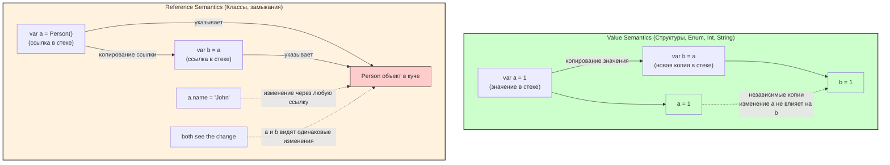
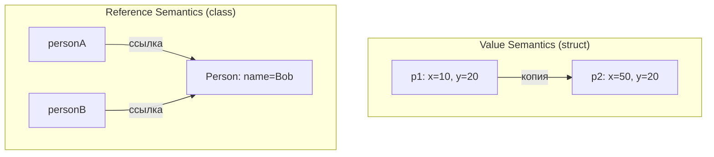
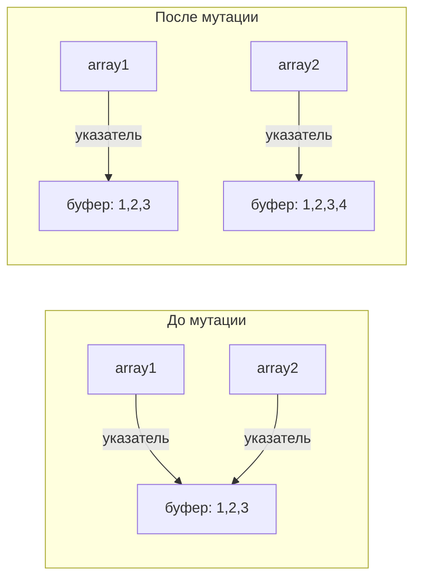
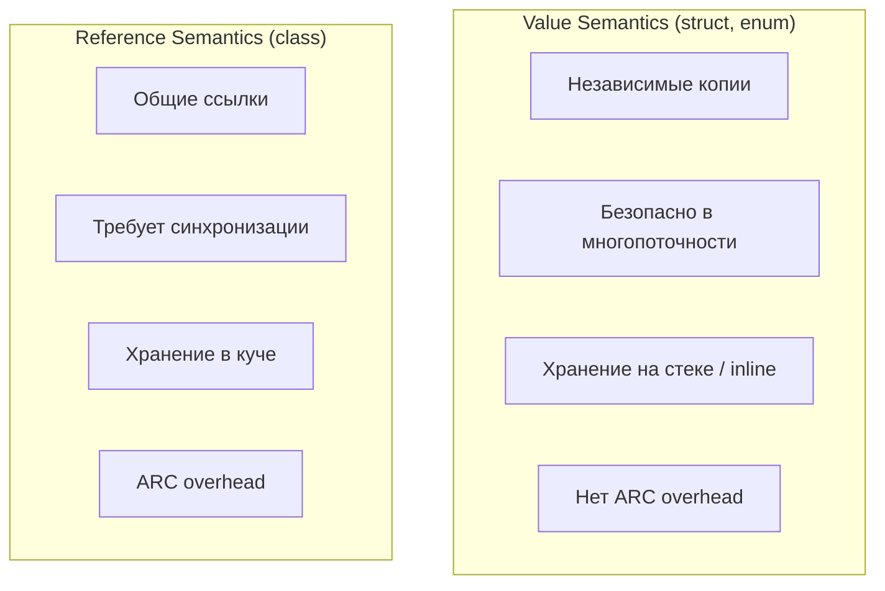

#swift #value-semantics #struct #copy-on-write #immutability #sendable

---
### Определение

**Value semantics (семантика значений)** в [[Swift]] — это ключевая особенность языка, которая отличает его от большинства других современных языков программирования. Когда вы присваиваете, передаёте или копируете значение переменной, создаётся **независимая копия** данных. Изменение одной копии **никогда** не влияет на другие копии.

Это противоположность **[[reference semantic]]s** (семантика ссылок), где присваивание копирует только **ссылку** (указатель), а само значение остаётся общим.



---

### Основные типы со value semantics в Swift (2026)

| Тип / Категория              | Примеры                                                        | Копируется ли при присваивании? | Изменение одной копии влияет на другие? | Sendable по умолчанию?             |
| ---------------------------- | -------------------------------------------------------------- | ------------------------------- | --------------------------------------- | ---------------------------------- |
| **Все структуры**            | [[struct]], [[enum]], [[tuple]]                                | **Да**                          | **Нет**                                 | Да (если свойства Sendable)        |
| **Основные типы Foundation** | [[String]], [[Data]], [[Date]], [[UUID]], [[URL]], [[Decimal]] | **Да**                          | **Нет**                                 | Да                                 |
| **Коллекции**                | [[Array]], [[Dictionary]], [[Set Collection\|Set]]             | **Да** ([[Copy-on-Write]])      | **Нет**                                 | Да (если T/Key/Value [[Sendable]]) |
| **Числовые типы**            | [[Int]], UInt, [[Float]], [[Double]], [[Bool]], Float16        | **Да**                          | **Нет**                                 | Да                                 |
| **Core Graphics структуры**  | [[CGPoint]], [[CGRect]], [[CGSize]]                            | **Да**                          | **Нет**                                 | Да                                 |

---

### Примеры value semantics vs reference semantics

```swift
// Value semantics — struct
struct Point {
    var x: Int
    var y: Int
}

var p1 = Point(x: 10, y: 20)
var p2 = p1           // создаётся полная копия
p2.x = 50

print(p1.x)           // 10 — не изменился
print(p2.x)           // 50

// Reference semantics — class
class Person {
    var name = "Alice"
}

let personA = Person()
let personB = personA   // копируется только ссылка
personB.name = "Bob"

print(personA.name)     // "Bob" — изменилось для всех
print(personB.name)     // "Bob"
```



---

### Самые важные особенности value semantics в Swift 2026

#### 1. Copy-on-Write (COW)

Большинство коллекций (Array, Dictionary, Set, String, Data) используют **ленивое копирование**:

- Пока вы не мутируете копию — она делит память с оригиналом (дешёво)
- Как только мутируете — создаётся независимая копия

```swift
var array1 = [1, 2, 3]          // выделена память
var array2 = array1             // array2 указывает на ту же память (COW)

print(isKnownUniquelyReferenced(&array1))  // false (разделяется)

array2.append(4)                // здесь создаётся новая копия массива

print(array1)  // [1, 2, 3]
print(array2)  // [1, 2, 3, 4]
```



#### 2. Value semantics = иммутабельность по умолчанию

Если все свойства `let` → экземпляр полностью неизменяемый:

```swift
struct ImmutableUser {
    let id: UUID
    let name: String
}

let user = ImmutableUser(id: UUID(), name: "Alice")
// user.name = "Bob" // ❌ Ошибка компиляции
```

#### 3. Value semantics + Swift Concurrency

Почти все типы со value semantics **автоматически Sendable** — их можно безопасно передавать между задачами и актёрами.

```swift
actor Cache {
    var users: [String: User] = [:]  // [String: User] — Sendable, если User — struct
}

struct User: Sendable {  // struct автоматически Sendable
    let id: UUID
    let name: String
}
```

---

### Когда value semantics ломается (ловушки)

#### 1. Struct содержит ссылочный тип (class, actor)

```swift
class PersonClass {
    var name = "Alice"
}

struct Container {
    var user: PersonClass   // PersonClass — reference semantics
}

var c1 = Container(user: PersonClass())
var c2 = c1                 // копия структуры
c2.user.name = "Bob"        // меняет объект в куче

print(c1.user.name)  // "Bob" — изменилось!
print(c1.user === c2.user)  // true — один и тот же класс
```

**Решение:** использовать `@frozen` или документировать поведение.

#### 2. NSMutable* коллекции (reference semantics)

```swift
import Foundation

var array1 = NSMutableArray(array: [1, 2, 3])
var array2 = array1   // копия ссылки, не данных!
array2.add(4)

print(array1)  // [1, 2, 3, 4] — изменилось!
```

**Решение:** всегда использовать Swift коллекции (`Array`, `Dictionary`, `Set`).

#### 3. Existential types ([[any Protocol]]) — боксинг

```swift
protocol P {}
struct LargeType: P { let a,b,c,d: Int }  // > 24 байта

let a: any P = LargeType(a: 1, b: 2, c: 3, d: 4)
let b = a  // копия existential container

// Но если тип > 24 байта, значение в куче
```

---

### Value semantics vs Reference semantics в Swift 6



| Характеристика                 | Value Semantics        | Reference Semantics       |
| ------------------------------ | ---------------------- | ------------------------- |
| **Присваивание**               | Копия данных           | Копия ссылки              |
| **Изменение одной переменной** | Не влияет на другие    | Влияет на все ссылки      |
| **Многопоточность**            | Безопасно по умолчанию | Требует синхронизации     |
| **Память**                     | Стек / [[inline]]      | Куча + [[ARC]]            |
| **Sendable**                   | Да (автоматически)     | Необходимо явное указание |

---

### Лучшие практики value semantics в Swift 2026

| Практика                                                                   | Почему                                   |
| -------------------------------------------------------------------------- | ---------------------------------------- |
| **Предпочитай struct / enum для большинства типов данных**                 | Безопаснее, предсказуемее                |
| **Делай свойства [[let]] по умолчанию**                                    | Иммутабельность = безопасность           |
| **Избегай class — если только не нужна именно reference semantics**        | Делегаты, view controllers, shared state |
| **actor — для mutable shared state вместо class + lock**                   | Безопасная многопоточность               |
| **final class + immutable свойства — если нужен reference type**           | Экономия vtable, ускорение dispatch      |
| **[[@MainActor]] — для UI-классов**                                        | UIViewController, ViewModel              |
| **[[Sendable]] — обязательно для всех типов, передаваемых между задачами** | Безопасность в многопоточности           |
| **Документируйте — пиши комментарий «value semantics — копия независима»** | Ясность для других разработчиков         |

```swift
// Хорошая документация
/// Внимание: Value semantics — каждая копия независима.
struct User {
    let id: UUID
    var name: String
}
```

---

### Короткий девиз 2026

> **Value semantics** — это когда каждая копия действительно независима.  
> В Swift 2026 это **основа** безопасного, предсказуемого и конкурентного кода.  
> Главное правило: struct / enum / String / Array — почти всегда value semantics.  
> class / actor — reference semantics (опасно без @MainActor / Sendable).

---

### Итог

**Value semantics** в Swift:

| Характеристика | Значение |
|---|---|
| **Передача** | По значению (копия) |
| **Изменение** | Не влияет на другие копии |
| **Где используется** | struct, enum, tuple, String, Array, Dictionary, Set |
| **Память** | Стек / inline / COW |
| **Безопасность** | Высокая (автоматически Sendable) |
| **Когда использовать** | По умолчанию для всех новых типов |

**Главное правило:**
> Предпочитай **value semantics** везде, где возможно. Это делает код безопаснее, предсказуемее и легче для многопоточности. Reference semantics используй только когда действительно нужна общая изменяемая ссылка (UI компоненты, сервисы, shared state).