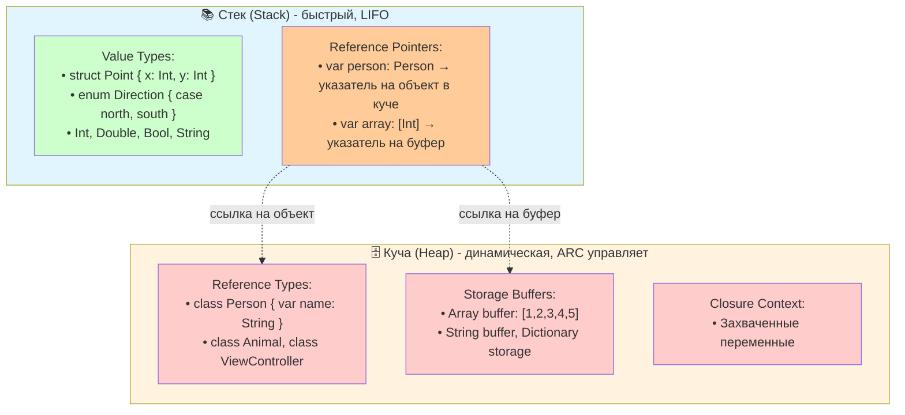

#swift #value-types #reference-types #struct #class #memory #heap #stack #performance

---
### Определение
В Swift все типы делятся на две большие категории: **типы значений ([[Value Type]]s)** и **ссылочные типы ([[Reference Type]]s)**. Это фундаментальное различие определяет, как данные копируются, передаются в функции и управляются в памяти.

- **Value Types:** При присваивании или передаче в функцию создается **независимая копия** данных. Изменение одной копии не влияет на другие.
- **Reference Types:** При присваивании или передаче копируется **только ссылка** на один и тот же объект в памяти. Все переменные указывают на один объект, и изменение через любую ссылку видно всем.

### Зачем это знать iOS-разработчику?
1.  **Производительность:** Value types обычно хранятся на стеке (быстрее), Reference types — в куче (медленнее).
2.  **Безопасность:** Value types по умолчанию безопасны в многопоточной среде.
3.  **Предсказуемость:** [[Value semantic]]s делает код проще для понимания.
4.  **Управление памятью:** Reference types требуют [[ARC]] и внимания к [[retain cycle]]s.
5.  **Выбор правильного инструмента:** Знание отличий помогает выбрать [[struct]] или [[class]] для конкретной задачи.

---

### Сравнительная таблица

| Характеристика                 | Value Types ([[struct]], [[enum]], [[tuple]])                                                            | Reference Types ([[class]], [[closure]]) |
| ------------------------------ | -------------------------------------------------------------------------------------------------------- | ---------------------------------------- |
| **Присваивание**               | Копия значений                                                                                           | Копия ссылки                             |
| **Изменение одной переменной** | Не влияет на другие                                                                                      | Влияет на все ссылки                     |
| **Хранение в памяти**          | Стек ([[stack]]) или внутри другого объекта                                                              | Куча ([[heap]])                          |
| **Сравнение**                  | По значению (`==`)                                                                                       | По идентичности (`===`)                  |
| **Наследование**               | Нет                                                                                                      | Да                                       |
| **Deinit / ARC**               | Не нужен                                                                                                 | Есть (счётчик ссылок)                    |
| **Thread-safety**              | Высокая (копии независимы)                                                                               | Низкая (нужна синхронизация)             |
| **Copy-on-Write**              | Автоматически для коллекций                                                                              | Нет                                      |
| **Примеры**                    | [[struct]], [[enum]], [[tuple]], [[Int]], [[String]], [[Array]], [[Dictionary]], [[Set Collection\|Set]] | [[class]], [[closure]], [[actor]]        |

---

### Схема памяти



---

### Подробные примеры

#### 1. **Value Type (struct) — копирование при присваивании**

```swift
struct Point {
    var x: Int
    var y: Int
}

var p1 = Point(x: 1, y: 2)
var p2 = p1           // ← создается полная копия

p2.x = 10             // меняем только копию

print(p1.x)           // 1 (оригинал не изменился)
print(p2.x)           // 10
```

#### 2. **Reference Type (class) — общая ссылка**

```swift
class Person {
    var name: String
    init(name: String) { self.name = name }
}

var alice = Person(name: "Alice")
var bob = alice        // ← копируется ссылка (указывают на один объект)

bob.name = "Bob"       // меняем через вторую ссылку

print(alice.name)      // "Bob" (оригинал изменился!)
print(bob.name)        // "Bob"
```

#### 3. **Value Type (Array) — [[Copy-on-Write]] (COW)**

```swift
var a = [1, 2, 3]
var b = a               // пока общий буфер (без копирования)

print(a.withUnsafeBufferPointer { $0.baseAddress })  // адрес 0x1000
print(b.withUnsafeBufferPointer { $0.baseAddress })  // тот же адрес 0x1000

b.append(4)             // здесь происходит копирование буфера

print(a)                // [1, 2, 3]
print(b)                // [1, 2, 3, 4]
print(a.withUnsafeBufferPointer { $0.baseAddress })  // адрес 0x1000
print(b.withUnsafeBufferPointer { $0.baseAddress })  // новый адрес
```

#### 4. **Value Type (String) — COW**

```swift
var str1 = "Hello"
var str2 = str1          // общий буфер

str2.append(" World")    // копирование при изменении

print(str1)              // "Hello"
print(str2)              // "Hello World"
```

#### 5. **Сравнение по значению vs по идентичности**

```swift
// Value Type — сравнение по содержимому
struct User {
    let id: Int
    let name: String
}

let user1 = User(id: 1, name: "Alice")
let user2 = User(id: 1, name: "Alice")
print(user1 == user2)    // true (если реализован Equatable)

// Reference Type — сравнение по идентичности
class PersonClass {
    let name: String
    init(name: String) { self.name = name }
}

let personA = PersonClass(name: "Alice")
let personB = PersonClass(name: "Alice")
print(personA === personB)  // false (разные объекты)
print(personA === personA)  // true (один и тот же объект)
```

---

### Влияние на многопоточность

#### Value Types — безопасны по умолчанию

```swift
struct Counter {
    var value: Int
}

// Каждый поток работает со своей копией — нет гонок данных
DispatchQueue.concurrentPerform(iterations: 100) { i in
    var counter = Counter(value: 0)  // своя копия
    counter.value += i
    // никаких проблем с синхронизацией
}
```

#### Reference Types — требуют синхронизации

```swift
class CounterClass {
    var value: Int = 0
}

let sharedCounter = CounterClass()

// ❌ Опасно — гонка данных без синхронизации
DispatchQueue.concurrentPerform(iterations: 100) { i in
    sharedCounter.value += i  // data race!
}

// ✅ Безопасно — с синхронизацией
let queue = DispatchQueue(label: "serial")
DispatchQueue.concurrentPerform(iterations: 100) { i in
    queue.sync {
        sharedCounter.value += i
    }
}
```

---

### Производительность: Stack vs Heap

| Характеристика | Stack | Heap |
|----------------|-------|------|
| **Скорость выделения** | Очень быстрая (~1 нс) | Медленнее (~50-100 нс) |
| **Скорость освобождения** | Мгновенное (при выходе из scope) | Зависит от ARC |
| **Размер** | Ограничен (1-8 MB на поток) | Большой (практически не ограничен) |
| **Фрагментация** | Нет | Может быть |
| **Управление** | Автоматическое (компилятор) | ARC (счётчик ссылок) |

```swift
// Value type на стеке (очень быстро)
func processPoint() {
    var point = Point(x: 1, y: 2)  // стек
    point.x += 1
} // point уничтожается при выходе из функции

// Reference type в куче (медленнее)
func processPerson() {
    let person = Person(name: "Alice")  // объект в куче, ссылка на стеке
    person.name = "Bob"
} // person освобождается ARC при отсутствии ссылок
```

---

### Когда выбирать Value Type (struct)

| Сценарий | Почему struct |
|----------|---------------|
| **Данные не должны быть общими** | Копии независимы |
| **Маленькие, простые данные** | Эффективно (на стеке) |
| **Многопоточность** | Безопасны по умолчанию |
| **Идентичность не важна** | Сравнение по значению |
| **Не нужно наследование** | struct не поддерживает наследование |
| **Стандартные типы** | `String`, `Array`, `Dictionary` — value types |

```swift
// ✅ Хорошие кандидаты для struct
struct Point { var x, y: Double }
struct User { let id: Int; var name: String }
struct Product { let id: String; var price: Decimal }
```

---

### Когда выбирать Reference Type (class)

| Сценарий                            | Почему class                              |
| ----------------------------------- | ----------------------------------------- |
| **Нужна общая изменяемая сущность** | Один объект, много ссылок                 |
| **Наследование необходимо**         | Только классы поддерживают                |
| **Требуется [[deinit]]**            | Для очистки ресурсов                      |
| **Идентичность важна**              | Сравнение через `===`                     |
| **UI компоненты ([[UIKit]])**       | [[UIView]], [[UIViewController]] — классы |

```swift
// ✅ Хорошие кандидаты для class
class UserSession { var token: String }
class NetworkManager { private var tasks: [URLSessionTask] }
class AppCoordinator { weak var viewController: UIViewController? }
```

---

### Смешанные примеры

```swift
// Структура, содержащая класс
struct Order {
    let id: UUID
    var items: [OrderItem]        // value type (COW)
    let payment: Payment          // reference type (class)
    
    mutating func addItem(_ item: OrderItem) {
        items.append(item)        // изменяет копию структуры
    }
}

class Payment {
    var status: PaymentStatus
    var transactionId: String?
    
    func process() {
        // изменяет общий объект
    }
}

var order1 = Order(id: UUID(), items: [], payment: Payment())
var order2 = order1               // копия структуры (но payment — тот же объект)

order1.addItem(OrderItem(...))    // меняется только order1
order1.payment.status = .paid     // меняется и в order1, и в order2!
```

---

### Короткое правило

> **Value Types (struct)** — по умолчанию.  
> **Reference Types (class)** — только когда нужна общая изменяемость, наследование или deinit.  
> Коллекции (`Array`, `Dictionary`, `String`) — value types с COW.

---

### Итог

| Аспект | Value Types | Reference Types |
|--------|-------------|-----------------|
| **Хранение** | Стек (быстро) | Куча (медленнее) |
| **Присваивание** | Копия данных | Копия ссылки |
| **Изменение** | Локальное | Глобальное (через все ссылки) |
| **Многопоточность** | Безопасно | Требует синхронизации |
| **Память** | Автоматическое | ARC |
| **Наследование** | Нет | Да |
| **deinit** | Нет | Да |
| **Примеры** | struct, enum, Int, String, Array | class, closure, actor |

**Главное правило Apple:** Начинайте с `struct`. Переходите на `class`, только если действительно нужна ссылочная семантика, наследование или `deinit`.