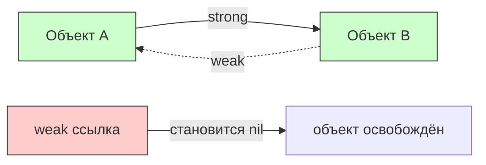
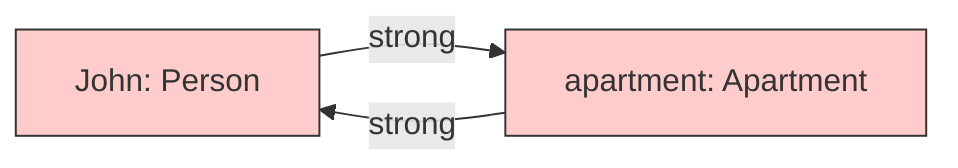
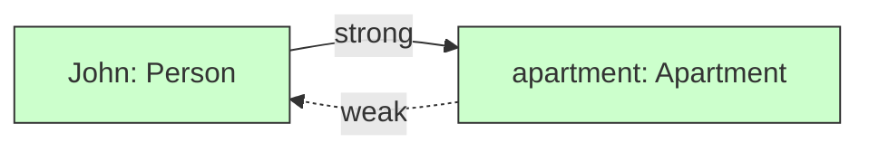
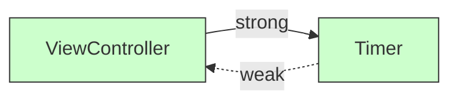
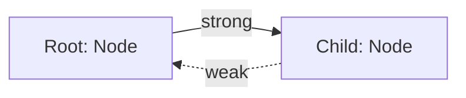

#swift #weak #memory #arc #retain-cycle #ios #memory-management

---

### Определение

**Weak references (слабые ссылки)** в [[Swift]] — это способ ссылаться на объект, который **не увеличивает** счётчик его ссылок ([[retain count]]) и **не удерживает** его в памяти, когда другие сильные ссылки на него отсутствуют. Если объект, на который указывает слабая ссылка, был освобождён из памяти, слабая ссылка **автоматически устанавливается в `nil`**.

Слабые ссылки — ключевой механизм для предотвращения **циклических зависимостей ([[retain cycle]]s)** и, как следствие, **утечек памяти**.



---

### Зачем нужны слабые ссылки?

| Проблема | Решение |
|---|---|
| **Retain cycle** (цикл сильных ссылок) | Объекты никогда не освобождаются → утечка памяти |
| **Делегаты / dataSource** | Делегат обычно не должен удерживать владельца |
| **Parent-child отношения** | Ребёнок должен иметь слабую ссылку на родителя |
| **Замыкания, захватывающие self** | Замыкание не должно удерживать объект дольше, чем нужно |
| **Наблюдатели (observers)** | Объект-наблюдатель не должен мешать освобождению наблюдаемого |

---

### Классический пример: Person и Apartment

#### Проблема (retain cycle)

```swift
class Person {
    var name: String
    var apartment: Apartment?     // сильная ссылка
    init(name: String) { self.name = name }
    deinit { print("\(name) освобождён из памяти") }
}

class Apartment {
    var tenant: Person?           // сильная ссылка → цикл!
    deinit { print("Квартира освобождена") }
}

var john: Person? = Person(name: "John")
var apartment: Apartment? = Apartment()

john?.apartment = apartment   // Person → Apartment (strong)
apartment?.tenant = john      // Apartment → Person (strong) → цикл!

john = nil
apartment = nil
// ❌ deinit не вызывается — утечка памяти!
```



#### Решение (weak reference)

```swift
class Apartment {
    weak var tenant: Person?     // ← слабая ссылка — разрывает цикл
    deinit { print("Квартира освобождена") }
}

var john: Person? = Person(name: "John")
var apartment: Apartment? = Apartment()

john?.apartment = apartment   // Person → Apartment (strong)
apartment?.tenant = john      // Apartment → Person (weak) → цикла нет!

john = nil   // Person освобождается
// John освобождён из памяти
apartment = nil  // Apartment освобождается
// Квартира освобождена
```



---

### Синтаксис и правила использования

```swift
// 1. weak всегда optional
class Example {
    weak var delegate: SomeDelegate?     // ✅ правильно
    // weak var value: SomeDelegate       // ❌ ошибка (non-optional)
}

// 2. weak только для class (не для struct)
class MyClass {}
struct MyStruct {}

class Container {
    weak var classRef: MyClass?          // ✅ работает
    // weak var structRef: MyStruct?     // ❌ ошибка (struct не поддерживает weak)
}

// 3. weak var (не let)
class Another {
    // weak let delegate: SomeDelegate?  // ❌ weak должен быть var
    weak var delegate: SomeDelegate?      // ✅ правильно
}
```

---

### `weak` в замыканиях (самый частый сценарий)

```swift
class ViewController: UIViewController {
    var timer: Timer?
    
    override func viewDidLoad() {
        super.viewDidLoad()
        
        // ❌ Опасно — retain cycle
        timer = Timer.scheduledTimer(withTimeInterval: 1.0, repeats: true) { _ in
            self.updateUI()   // strong capture → цикл
        }
        
        // ✅ Правильно — weak self
        timer = Timer.scheduledTimer(withTimeInterval: 1.0, repeats: true) { [weak self] _ in
            guard let self else { return }
            self.updateUI()
        }
    }
    
    func updateUI() { }
}
```



---

### `weak` в [[Combine]] и Swift Concurrency

```swift
import Combine

class ViewModel {
    var cancellables = Set<AnyCancellable>()
    
    func setup() {
        // ✅ Combine с weak self
        Just(42)
            .sink { [weak self] value in
                self?.update(value)
            }
            .store(in: &cancellables)
    }
    
    // ✅ async/await с weak self
    func fetchData() async {
        Task { [weak self] in
            guard let self else { return }
            await self.performFetch()
        }
    }
}
```

---

### Делегаты — самый частый паттерн

```swift
protocol DataLoaderDelegate: AnyObject {
    func didLoadData()
}

class DataLoader {
    weak var delegate: DataLoaderDelegate?   // ← weak обязателен!
    
    func load() {
        // ... загрузка данных
        delegate?.didLoadData()
    }
}

class ViewController: UIViewController, DataLoaderDelegate {
    let loader = DataLoader()
    
    override func viewDidLoad() {
        super.viewDidLoad()
        loader.delegate = self   // weak — нет retain cycle
        loader.load()
    }
    
    func didLoadData() {
        print("Data loaded")
    }
}
```

---

### `weak` в иерархиях (parent → child)

```swift
class Node {
    let value: Int
    weak var parent: Node?      // слабая ссылка на родителя
    var children: [Node] = []   // сильные ссылки на детей
    
    init(value: Int, parent: Node? = nil) {
        self.value = value
        self.parent = parent
    }
    
    func addChild(_ value: Int) -> Node {
        let child = Node(value: value, parent: self)
        children.append(child)
        return child
    }
}

let root = Node(value: 0)
let child = root.addChild(1)

print(child.parent === root)  // true (но через weak)
// root можно удалить, и child.parent станет nil
```



---

### Сравнение: `weak` vs `strong` vs `unowned`

| Характеристика                    | `strong`                 | `weak`                  | `unowned`                |
| --------------------------------- | ------------------------ | ----------------------- | ------------------------ |
| **Увеличивает retain count?**     | Да                       | Нет                     | Нет                      |
| **[[Optional]]?**                 | Нет                      | Да (`?`)                | Нет                      |
| **Становится `nil` при dealloc?** | Нет                      | Да                      | Нет                      |
| **Безопасность**                  | Высокая (но риск циклов) | Высокая                 | Низкая (crash)           |
| **Производительность**            | Высокая                  | Средняя                 | Высокая                  |
| **Когда использовать**            | Владение объектом        | Разрыв циклов, делегаты | Чёткие иерархии владения |

---

### Лучшие практики

| Практика | Почему |
|---|---|
| **Всегда используй `weak` для делегатов** | Предотвращает retain cycles |
| **В замыканиях всегда `[weak self]`** | Замыкания могут жить дольше, чем `self` |
| **Всегда разворачивай `weak` через `guard let` или `if let`** | Безопасный доступ |
| **Не используй `weak` для свойств, которые никогда не должны быть `nil`** | Лучше `unowned` или strong |
| **Проверяй `deinit` с логами** | Убедись, что объекты освобождаются |

```swift
// ✅ Правильное использование
someAsync { [weak self] in
    guard let self else { return }
    self.doSomething()
    self.doSomethingElse()
}

// ❌ Неправильно (опасно)
someAsync { [weak self] in
    self!.doSomething()   // может крашнуться
}
```

---

### Короткое правило

> **Weak reference** = «я не держу этот объект, и если он умрёт — моя ссылка станет `nil`».  
> Используй `weak` для:
> - делегатов (`delegate`)
> - замыканий (`[weak self]`)
> - обратных ссылок в иерархиях (`parent` → `child`)
> - любых ситуаций, где может возникнуть retain cycle

---

### Итог

**Weak references** в Swift:

| Характеристика                        | Значение                                                      |
| ------------------------------------- | ------------------------------------------------------------- |
| **Влияет на retain count?**           | Нет                                                           |
| **Становится `nil` при [[dealloc]]?** | Да                                                            |
| **Optional?**                         | Да (обязательно)                                              |
| **Только для class?**                 | Да                                                            |
| **Основное применение**               | Предотвращение retain cycles                                  |
| **Главное правило**                   | Всегда используй `weak` для делегатов и в замыканиях с `self` |

**Главное правило:**
> Если объект A ссылается на объект B (сильно), а B может ссылаться обратно на A — сделай обратную ссылку `weak`. Это предотвратит retain cycle и утечки памяти. В замыканиях всегда используй `[weak self]` + `guard let self`.