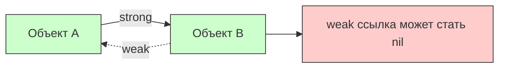
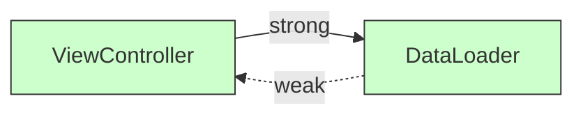

#swift #weak #memory #arc #retain-cycle #ios #memory-management

---

### Определение

**`weak`** — это модификатор слабой ссылки в Swift, который:

- **не увеличивает** счётчик ссылок ([[ARC]])
- **автоматически становится [[nil]]**, когда объект, на который она ссылается, освобождается
- **обязательно должен быть [[optional]]** (`?`), потому что объект может исчезнуть в любой момент
- **не приводит к крашу** при обращении к уже освобождённому объекту (в отличие от `unowned`)

> Проще говоря:  
> `weak` = «я не держу этот объект сильно, и если он умрёт раньше меня — моя ссылка просто станет `nil`»



---

### Когда использовать `weak` (реальные сценарии 2025–2026)

| Ситуация                                                                     | Почему именно `weak`                                               | Пример из практики                                            |
| ---------------------------------------------------------------------------- | ------------------------------------------------------------------ | ------------------------------------------------------------- |
| **Объект A владеет объектом B, а B имеет обратную ссылку на A**              | A может умереть раньше B → B должен безопасно стать `nil`          | delegate, `parent` в дереве объектов                          |
| **Замыкание захватывает `self`, но `self` может быть освобождён раньше**     | Предотвращение [[retain cycle]] + безопасный доступ                | `[weak self]` в замыканиях анимаций, сетевых запросов         |
| **Делегат, data source, observer**                                           | Владелец (например, view controller) может умереть раньше делегата | [[UITableViewDataSource]], [[CLLocationManagerDelegate]]      |
| **Любая обратная связь в иерархии владения, где нет гарантии порядка жизни** | Безопасность важнее производительности                             | [[Coordinator]] в [[SwiftUI]] → [[UIKit]], `child` → `parent` |
| **Кэширование слабых ссылок (weak cache)**                                   | Объекты могут быть удалены из памяти                               | [[NSCache]] с объектами, weak observers                       |

---

### Синтаксис и варианты (все актуальны в Swift 6)

```swift
// 1. Слабая ссылка на свойство (самый частый)
class Apartment {
    weak var tenant: Person?          // ← может стать nil
    init() { }
}

// 2. weak в замыкании (самый популярный кейс)
class MyViewController {
    var closure: (() -> Void)?
    
    func setupClosure() {
        closure = { [weak self] in
            guard let self else { return }     // безопасная проверка
            self.updateUI()
        }
    }
}

// 3. weak var + optional chaining
class Node {
    weak var parent: Node?
}

// 4. weak в параметре функции (редко, но встречается)
func configure(delegate: weak SomeDelegate?) { ... }
```

---

### Сравнение `weak` и `unowned` (таблица 2026)

| Характеристика                                       | `weak`                                       | `unowned`                                   | Когда выбирать в 2026           |
| ---------------------------------------------------- | -------------------------------------------- | ------------------------------------------- | ------------------------------- |
| **Optional?**                                        | Да (`?`)                                     | Нет                                         | `weak` — если может быть nil    |
| **ARC**                                              | Не увеличивает                               | Не увеличивает                              | —                               |
| **Что происходит при обращении к мёртвому объекту?** | Ссылка = `nil`                               | **Краш** (EXC_BAD_ACCESS)                   | `weak` — безопаснее             |
| **Проверка на существование**                        | [[if let]] / [[guard let]]                   | Нет проверки                                | `weak` — надёжнее               |
| **Производительность**                               | Чуть медленнее ([[optional]] [[unwrapping]]) | Чуть быстрее (нет проверки)                 | `unowned` — только при гарантии |
| **Самый частый кейс**                                | Делегаты, замыкания, parent/child            | Обратные ссылки с чёткой иерархией владения | `weak` — 90% случаев            |

---

### Классический пример: делегат

```swift
protocol DataLoaderDelegate: AnyObject {
    func didLoadData()
}

class DataLoader {
    weak var delegate: DataLoaderDelegate?  // ← weak для предотвращения retain cycle
    
    func load() {
        // ... загрузка данных
        delegate?.didLoadData()
    }
}

class ViewController: UIViewController, DataLoaderDelegate {
    let loader = DataLoader()
    
    override func viewDidLoad() {
        super.viewDidLoad()
        loader.delegate = self  // weak — нет retain cycle
        loader.load()
    }
    
    func didLoadData() {
        print("Data loaded")
    }
}
```



---

### Самые популярные ошибки с `weak` (и как их избежать)

#### 1. Забыли `[weak self]` в замыкании → retain cycle

```swift
// ❌ Ошибка — retain cycle
class NetworkManager {
    var onComplete: (() -> Void)?
    
    func fetch() {
        onComplete = {
            self.handleResult()   // self удерживается замыканием
        }
    }
    
    func handleResult() { }
}

// ✅ Правильно
func fetch() {
    onComplete = { [weak self] in
        guard let self else { return }
        self.handleResult()
    }
}
```

#### 2. Использование `weak` там, где нужен `unowned` (лишние проверки)

```swift
// ⚠️ Избыточный код
class Node {
    weak var parent: Node?
    
    func doSomething() {
        guard let parent = parent else { return }  // каждая проверка
        parent.notify()
    }
}

// ✅ Лучше (если parent живёт дольше)
class Node {
    unowned var parent: Node
    // parent.doSomething() — без проверок
}
```

#### 3. Забыли `guard let` / `if let` → краш на force unwrap

```swift
// ❌ Ошибка — может крашнуться
someAsync { [weak self] in
    self!.doSomething()   // краш, если self уже nil
}

// ✅ Правильно
someAsync { [weak self] in
    guard let self else { return }
    self.doSomething()
}
```

---

### `weak` в замыканиях — правильные паттерны

```swift
// Паттерн 1: guard let (рекомендуется)
someAsync { [weak self] in
    guard let self else { return }
    self.doSomething()
    self.doSomethingElse()
}

// Паттерн 2: if let (для коротких блоков)
someAsync { [weak self] in
    if let self {
        self.doSomething()
    }
}

// Паттерн 3: optional chaining (для одного вызова)
someAsync { [weak self] in
    self?.doSomething()
}

// Паттерн 4: с параметрами
someAsync { [weak self] result in
    guard let self else { return }
    self.handle(result)
}
```

---

### `weak` в Combine и Swift Concurrency

```swift
import Combine

class ViewModel {
    var cancellables = Set<AnyCancellable>()
    
    func setup() {
        // Combine
        SomePublisher()
            .sink { [weak self] value in
                self?.update(value)
            }
            .store(in: &cancellables)
    }
    
    // async/await
    func loadData() async {
        Task { [weak self] in
            guard let self else { return }
            await self.fetch()
        }
    }
}
```

---

### Лучшие практики `weak` в Swift 2026

| Практика | Почему |
|---|---|
| **Используй `weak` в 90% случаев, когда нужна слабая ссылка** | Безопаснее, чем `unowned` |
| **Используй `[weak self]` в замыканиях, если замыкание может жить дольше `self`** | Предотвращает retain cycles |
| **Всегда пиши `guard let self else { return }` или `if let self`** | Стандарт безопасности |
| **Не используй `weak` там, где объект гарантированно живёт дольше** | Лучше `unowned` для производительности |
| **В SwiftUI — `weak` почти не нужен** | `@ObservedObject`, `@StateObject`, `@EnvironmentObject` управляют памятью |
| **В Combine / async — `weak self` + `guard let` — стандарт** | Для подписок и задач |
| **Документируй — всегда пиши комментарий** | `weak var delegate: SomeDelegate? // weak, чтобы избежать retain cycle` |

```swift
// Хороший пример документирования
class DataLoader {
    weak var delegate: DataLoaderDelegate? // weak — предотвращает retain cycle
}
```

---

### Короткий итог 2026

> `weak` — это **безопасная слабая ссылка**, которая становится `nil`, когда объект умирает.  
> В 2026 году:  
> - используется для предотвращения retain cycle  
> - **обязательно optional** (`?`)  
> - в замыканиях — `[weak self]` + `guard let self`  
> - это **самый надёжный** и **самый часто используемый** способ слабой ссылки в Swift

**Главное правило:**
> «Если объект может стать `nil` раньше, чем ссылающийся на него объект — используй `weak`.  
> Это безопасно, надёжно и предотвращает retain cycles.  
> В сомнениях — всегда `weak` (а не `unowned`).»