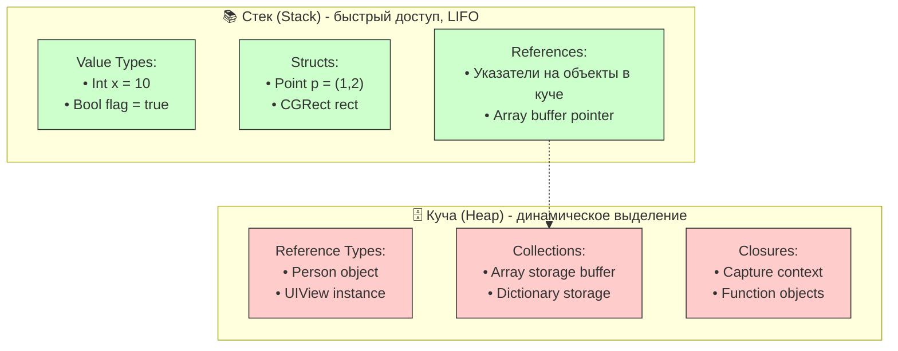

#memory #value-types #reference-types #struct #class #enum #swift #stack #heap #performance #cow

---

## Value Types vs Reference Types в Swift

### Определение
В [[Swift]] все типы делятся на две большие группы по способу хранения и передачи: **[[Value Type]]s (типы-значения)** и **[[Reference Type]]s (ссылочные типы)**. Это фундаментальное различие определяет, как данные копируются, передаются в функции и управляются в памяти.

- **Value Types**: При присваивании или передаче в функцию создаётся **независимая копия** данных.
- **Reference Types**: При присваивании или передаче копируется **только ссылка** на один и тот же объект в памяти.

### Зачем это знать iOS-разработчику?
1.  **Производительность:** Value types обычно хранятся на стеке ([[stack]]), что быстрее, чем куча ([[heap]]).
2.  **Безопасность:** Value types по умолчанию безопасны в многопоточной среде.
3.  **Предсказуемость:** Value semantics делает код проще для понимания.
4.  **Управление памятью:** Reference types требуют ARC и внимания к retain cycles.
5.  **Архитектура:** Выбор между struct и class влияет на дизайн приложения.

---

### Сравнительная таблица

| Характеристика | Value Types (struct, enum) | Reference Types (class) |
|---|---|---|
| **Присваивание** | Копия значений | Копия ссылки |
| **Изменение одной переменной** | Не влияет на другие | Влияет на все ссылки |
| **Хранение** | Стек (stack) или внутри объекта на куче | Всегда куча (heap) |
| **Сравнение** | По значению (`==` сравнивает поля) | По идентичности (`===`) |
| **Наследование** | Нет | Да |
| **Deinit / ARC** | Не нужен | Есть (счётчик ссылок) |
| **Thread-safety (по умолчанию)** | Высокая (копии независимы) | Низкая (нужна синхронизация) |
| **Копирование при мутации** | Автоматическое | Нет копирования |
| **Динамическая диспетчеризация** | Статическая | Динамическая |

---

### Value Types (Типы значений)

#### Основные представители
- **Структуры (struct)** — [[Point]], [[CGSize]], [[URLSession]]
- **Перечисления (enum)** — [[Optional]], [[Result]]
- **Кортежи (tuple)** — ([[Int]], [[String]])
- **Все примитивы** — Int, [[Double]], [[Bool]], String
- **Коллекции** — [[Array]], [[Dictionary]], [[Set Collection|Set]]

#### Примеры

```swift
// struct
struct Point {
    var x: Double
    var y: Double
}

var p1 = Point(x: 1, y: 2)
var p2 = p1           // ← полноценная копия
p2.x = 10
print(p1.x)           // 1 — оригинал не изменился
print(p2.x)           // 10
```

```swift
// enum
enum Status {
    case success(String)
    case failure(String)
}

var s1 = Status.success("OK")
var s2 = s1
s2 = .failure("Ошибка")
print(s1)             // success("OK") — независимая копия
```

```swift
// tuple
var coord1 = (x: 5, y: 7)
var coord2 = coord1
coord2.x = 100
print(coord1.x)       // 5
```

```swift
// Array (value type с COW)
var a = [1, 2, 3]
var b = a             // пока общий буфер
b.append(4)           // копирование происходит здесь
print(a)              // [1, 2, 3]
print(b)              // [1, 2, 3, 4]
```

---

### Reference Types (Ссылочные типы)

#### Основные представители
- **Классы ([[class]])** — [[UIView]], [[UIViewController]], User
- **Замыкания ([[closure]])** — функции как объекты
- **[[AnyObject]]** — протокол для ссылочных типов

#### Примеры

```swift
class Person {
    var name: String
    init(name: String) { self.name = name }
}

var alice1 = Person(name: "Алиса")
var alice2 = alice1           // ← та же самая ссылка
alice2.name = "Алиса 2.0"

print(alice1.name)            // "Алиса 2.0" — изменилось для всех
print(alice2.name)            // "Алиса 2.0"
```

```swift
// Функции как замыкания тоже reference type
var counter = 0
let increment = { counter += 1 }
let another = increment      // одна и та же функция
increment()
another()
print(counter)               // 2
```

```swift
// Проверка идентичности
let obj1 = Person(name: "John")
let obj2 = obj1
let obj3 = Person(name: "John")

print(obj1 === obj2)  // true (одна и та же ссылка)
print(obj1 === obj3)  // false (разные объекты)
print(obj1 == obj3)   // нужно реализовать Equatable
```

---

### Где что хранится в памяти



- **Value Types** обычно хранятся на стеке (stack), что очень быстро.
- Если value type содержит reference type (например, класс внутри структуры), ссылка хранится на стеке, а объект — в куче.
- **Reference Types** всегда хранятся в куче (heap) с управлением через ARC.
- Коллекции (Array, Dictionary) — value types, но их буфер данных находится в куче с [[Copy-On-Write|COW]] оптимизацией.

---

### Copy-on-Write (COW) — важная особенность коллекций

Коллекции Swift (`Array`, `Dictionary`, `Set`, `String`) — это **структуры**, но используют **Copy-on-Write**:

```swift
var a = [1, 2, 3]        // буфер в куче
var b = a                 // b ссылается на тот же буфер
b.append(4)               // здесь происходит реальная копия буфера
print(a)                  // [1, 2, 3] — не изменился
```

Это делает передачу больших коллекций почти бесплатной, пока никто не мутирует.

---

### Семантика: Value vs Reference

#### [[Value Semantic]]s (Семантика значений)
- Копии независимы
- Мутация одной не влияет на другие
- Предсказуемость, безопасность

```swift
var original = [1, 2, 3]
var copy = original
copy.append(4)
// original не изменился
```

#### [[Reference Semantic]]s (Ссылочная семантика)
- Все ссылки указывают на один объект
- Мутация через любую ссылку видна всем
- Нужна осторожность в многопоточной среде

```swift
let shared = Person(name: "Shared")
let ref1 = shared
let ref2 = shared
ref1.name = "Changed"
// ref2.name тоже "Changed"
```

---

### Когда выбирать struct vs class

| Критерий                                                 | Рекомендация  | Почему                                  |
| -------------------------------------------------------- | ------------- | --------------------------------------- |
| **Данные неизменяемы или независимы**                    | `struct`      | Безопасность, предсказуемость           |
| **Нужна изменяемость через несколько ссылок**            | `class`       | Один объект, много указателей           |
| **Много маленьких объектов**                             | `struct`      | Меньше накладных расходов [[ARC]]       |
| **Наследование необходимо**                              | `class`       | struct не поддерживает наследование     |
| **Объект должен жить после выхода из области видимости** | `class` (ARC) | struct уничтожается при выходе из scope |
| **Высокая производительность и безопасность потоков**    | `struct`      | Нет общих мутабельных состояний         |
| **Требуется deinit**                                     | `class`       | Только у классов есть [[deinit]]        |
| **Идентичность объекта важна**                           | `class`       | Можно сравнивать через `===`            |
| **Протоколы с associated type**                          | `struct`      | Чаще используются                       |

**Правило Apple (из документации Swift)**:
> Используйте `struct` по умолчанию.  
> Переходите на `class`, только если нужен один из этих случаев:  
> - Объект должен иметь **общую идентичность**  
> - Нужно **наследование**  
> - Требуется **deinit** или наблюдение за жизненным циклом

---

### Примеры из реальной разработки

#### 1. **Модели данных (обычно struct)**

```swift
struct User {
    let id: UUID
    var name: String
    var email: String
    var age: Int
}

struct Product {
    let id: String
    var price: Decimal
    var isAvailable: Bool
}
```

#### 2. **Сервисы и менеджеры (обычно class)**

```swift
class NetworkService {
    private let session = URLSession.shared
    private var cache: [String: Data] = [:]
    
    func fetchData(from url: URL) async throws -> Data {
        // реализация
    }
}

class UserManager {
    private(set) var currentUser: User?
    
    func login(username: String, password: String) async throws {
        // авторизация
    }
}
```

#### 3. **UI компоненты (class для UIKit, struct для SwiftUI)**

```swift
// UIKit — class
class CustomButton: UIButton {
    private var tapHandler: (() -> Void)?
    
    func onTap(_ handler: @escaping () -> Void) {
        tapHandler = handler
    }
}

// SwiftUI — struct
struct CustomButtonView: View {
    let title: String
    let action: () -> Void
    
    var body: some View {
        Button(title, action: action)
    }
}
```

#### 4. **Состояние (state) в архитектурах**

```swift
// Redux / TCA — state как struct
struct AppState {
    var user: User?
    var settings: Settings
    var isLoading: Bool
}

// ViewModel в MVVM — обычно class
class ProfileViewModel: ObservableObject {
    @Published var name: String = ""
    @Published var age: Int = 0
    
    func loadUser() {
        // загрузка данных
    }
}
```

---

### Смешанные примеры

```swift
struct Order {
    let id: UUID
    var items: [OrderItem]  // value type (COW)
    var customer: Customer  // value type
    let payment: Payment    // reference type (class)
    
    mutating func addItem(_ item: OrderItem) {
        items.append(item)
    }
}

class Payment {
    var status: PaymentStatus
    var transactionId: String?
    
    func process() {
        // бизнес-логика
    }
}
```

---

### Производительность: Stack vs Heap

| Характеристика | Stack | Heap |
|---|---|---|
| **Скорость** | Очень быстрый | Медленнее (в 3-4 раза) |
| **Управление** | Автоматическое (при вызове/выходе из функции) | Ручное через ARC |
| **Размер** | Ограничен (~1-8 MB на поток) | Большой |
| **Фрагментация** | Нет | Может быть |
| **Многопоточность** | Каждый поток свой стек | Общий, нужна синхронизация |

```swift
// Value type на стеке
func processValue() {
    var point = Point(x: 1, y: 2)  // стек
    // ... при выходе из функции очищается
}

// Reference type в куче
func processReference() {
    let person = Person(name: "John")  // объект в куче, ссылка на стеке
    // ... объект живёт, пока есть ссылки
}
```

---

### Производительность: цифры

```swift
// Выделение памяти
struct MyStruct { var value: Int }
class MyClass { var value: Int; init(value: Int) { self.value = value } }

// Struct: ~120 ms на 10 млн объектов
// Class: ~450 ms на 10 млн объектов (в 3-4 раза медленнее)

// Присваивание
// Struct: ~80 ms на 10 млн операций
// Class: ~200 ms на 10 млн операций (в 2-3 раза медленнее)
```

---

### Итог

**[[Value Type]]s ([[struct]], [[enum]]) — выбирайте по умолчанию:**
- Независимые копии при присваивании
- Безопасность в многопоточной среде
- Хранение на стеке (быстро)
- Нет проблем с [[retain cycle]]s
- COW делает большие коллекции эффективными

**[[Reference Type]]s (class) — выбирайте когда нужно:**
- Общая идентичность (несколько ссылок на один объект)
- Наследование
- deinit для очистки ресурсов
- Наблюдение за жизненным циклом
- Частые мутации больших данных

Понимание различий между value и reference types — фундамент для написания эффективного, безопасного и предсказуемого кода на Swift.