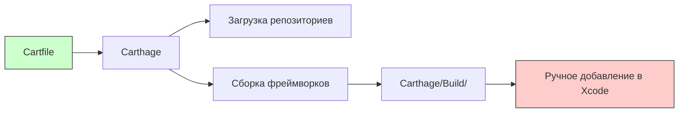

#carthage #dependency-management #ios #swift #xcode #decentralized

---
### Определение

**Carthage** — это децентрализованный менеджер зависимостей для проектов, разрабатываемых на языке програмming [[Swift]]. В отличие от [[CocoaPods]], Carthage сосредотачивается на **сборке** библиотек и фреймворков, **не изменяя структуру проекта**. Он не создаёт единый файл проекта, что даёт разработчику больше контроля над процессом интеграции зависимостей.

Carthage следует философии «минимального вмешательства»: он только загружает и собирает зависимости, а интеграцию в [[Xcode]]-проект вы делаете вручную.



---

### Почему Carthage?

| Преимущество              | Описание                                              |
| ------------------------- | ----------------------------------------------------- |
| **Не изменяет проект**    | Не создаёт `.xcworkspace`, не меняет настройки сборки |
| **Децентрализованный**    | Не зависит от центрального репозитория спецификаций   |
| **Гибкий контроль**       | Полный контроль над версиями зависимостей             |
| **Прозрачность**          | Что видишь в Cartfile, то и получаешь                 |
| **Поддержка подпроектов** | Можно собирать определённые таргеты                   |
| **Быстрее на [[CI]]**     | Кеширование собранных фреймворков                     |

---

### Установка Carthage

#### 1. **Через Homebrew (рекомендуется)**

```bash
brew install carthage
```

#### 2. **Через бинарный файл**

Скачать последнюю версию с [github.com/Carthage/Carthage/releases](https://github.com/Carthage/Carthage/releases)

#### 3. **Проверка установки**

```bash
carthage version
```

---

### Структура проекта с Carthage

```
MyApp/
├── MyApp.xcodeproj           # Ваш проект (не изменяется)
├── Cartfile                  # Зависимости (какие библиотеки)
├── Cartfile.resolved         # Зафиксированные версии (коммитить!)
├── Carthage/
│   ├── Build/                # Собранные фреймворки
│   │   ├── iOS/
│   │   ├── macOS/
│   │   └── tvOS/
│   └── Checkouts/            # Исходники библиотек
└── MyApp/                    # Ваш исходный код
```

> **Важно:** `Carthage/Build/` — коммитить **нужно**? Нет, но это спорно. Обычно коммитят, чтобы ускорить сборку на CI.

---

### Основной файл: Cartfile

#### 1. **Базовый синтаксис**

```ruby
# GitHub репозиторий (самый частый)
github "Alamofire/Alamofire" ~> 5.0

# Git репозиторий (любой)
git "https://github.com/ReactiveX/RxSwift.git" "main"

# Локальный путь
git "file:///Users/me/MyLocalLib" "main"

# Binary фреймворк (готовый .framework)
binary "https://example.com/MyFramework.json" ~> 1.0
```

#### 2. **Управление версиями**

| Синтаксис | Значение | Пример |
|---|---|---|
| `"1.0"` | Точная версия | `github "Alamofire/Alamofire" "5.8.0"` |
| `~> 1.0` | Совместимая версия (≥1.0, <2.0) | `github "Alamofire/Alamofire" ~> 5.0` |
| `>= 1.0` | Любая версия >=1.0 | `github "Alamofire/Alamofire" >= 5.0` |
| `"main"` / `"develop"` | Ветка | `github "Alamofire/Alamofire" "main"` |
| `"abc123"` | Коммит | `github "Alamofire/Alamofire" "abc123"` |

#### 3. **Несколько платформ**

```ruby
# По умолчанию собирается для iOS, macOS, tvOS, watchOS
github "Alamofire/Alamofire" ~> 5.0

# Ограничить платформы
github "SnapKit/SnapKit" ~> 5.0
  # Carthage соберёт только для iOS и macOS по умолчанию
```

---

### Команды Carthage

| Команда | Описание |
|---|---|
| `carthage update` | Загрузить и собрать все зависимости |
| `carthage update Alamofire` | Загрузить и собрать конкретную зависимость |
| `carthage checkout` | Только загрузить (без сборки) |
| `carthage build` | Собрать уже загруженные зависимости |
| `carthage outdated` | Показать устаревшие зависимости |
| `carthage version` | Показать версию Carthage |

#### Дополнительные флаги

```bash
# Собрать только для iOS
carthage update --platform iOS

# Не собирать, только загрузить
carthage update --no-build

# Использовать кеш
carthage update --use-xcframeworks

# Очистить кеш сборки
carthage update --cache-builds
```

---

### Пошаговый пример использования

#### Шаг 1: Установка Carthage

```bash
brew install carthage
```

#### Шаг 2: Переход в проект

```bash
cd ~/Projects/MyApp
```

#### Шаг 3: Создание Cartfile

```bash
touch Cartfile
```

#### Шаг 4: Редактирование Cartfile

```ruby
github "Alamofire/Alamofire" ~> 5.0
github "SnapKit/SnapKit" ~> 5.0
github "SDWebImage/SDWebImage" ~> 5.0
```

#### Шаг 5: Установка зависимостей

```bash
carthage update --platform iOS
```

После выполнения появится папка `Carthage/Build/iOS/` с `.framework` или `.xcframework` файлами.

#### Шаг 6: Интеграция в [[Xcode]]

1. Открыть проект в Xcode (`.xcodeproj`)
2. Выбрать **General** → **Frameworks, Libraries, and Embedded Content**
3. Нажать **+** → **Add Other...** → Выбрать `Carthage/Build/iOS/*.framework`
4. **Для каждого фреймворка**:
   - **Embed**: `Embed & Sign`
5. Добавить **Build Phase** для копирования фреймворков (опционально, см. ниже)

#### Шаг 7: Импорт библиотек в коде

```swift
import UIKit
import Alamofire
import SnapKit
import SDWebImage

class ViewController: UIViewController {
    override func viewDidLoad() {
        super.viewDidLoad()
        
        // Alamofire
        AF.request("https://api.example.com").response { _ in }
        
        // SnapKit
        button.snp.makeConstraints { make in
            make.center.equalToSuperview()
        }
        
        // SDWebImage
        imageView.sd_setImage(with: url)
    }
}
```

---

### Build Phase для копирования фреймворков

Для того чтобы фреймворки попадали в собранное приложение, нужно добавить скрипт в **Build Phases**:

1. Xcode → Target → **Build Phases**
2. **+** → **New Run Script Phase**
3. Назвать: `Carthage Copy Frameworks`
4. Добавить скрипт:

```bash
/usr/local/bin/carthage copy-frameworks
```

5. В **Input Files** добавить пути к фреймворкам:

```
$(SRCROOT)/Carthage/Build/iOS/Alamofire.framework
$(SRCROOT)/Carthage/Build/iOS/SnapKit.framework
$(SRCROOT)/Carthage/Build/iOS/SDWebImage.framework
```

6. В **Output Files**:

```
$(BUILT_PRODUCTS_DIR)/$(FRAMEWORKS_FOLDER_PATH)/Alamofire.framework
$(BUILT_PRODUCTS_DIR)/$(FRAMEWORKS_FOLDER_PATH)/SnapKit.framework
$(BUILT_PRODUCTS_DIR)/$(FRAMEWORKS_FOLDER_PATH)/SDWebImage.framework
```

---

### XCFramework (рекомендуемый формат)

Начиная с Carthage 0.37.0, поддерживаются **XCFramework** — универсальные фреймворки для нескольких платформ.

```bash
carthage update --use-xcframeworks
```

**Преимущества XCFramework**:
- Один .xcframework вместо нескольких .framework
- Поддержка нескольких платформ в одном бандле
- Упрощённая интеграция в Xcode

---

### Cartfile.resolved — важность для команды

`Cartfile.resolved` **обязательно** коммитить в [[Git]]. Он фиксирует точные версии установленных зависимостей.

```bash
git add Cartfile Cartfile.resolved
git commit -m "Add Carthage dependencies"
```

> **Важно:** папку `Carthage/` обычно коммитят? Это спорно:
> - **Коммитить:** ускоряет сборку на CI, не нужно пересобирать фреймворки
> - **Не коммитить:** уменьшает размер репозитория, но CI будет пересобирать каждый раз

---

### Обновление зависимостей

```bash
# Проверить устаревшие зависимости
carthage outdated

# Обновить всё
carthage update

# Обновить конкретную зависимость
carthage update Alamofire

# Обновить только загрузку (без сборки)
carthage checkout
carthage build
```

---

### Решение проблем

| Проблема | Решение |
|---|---|
| **Не собирается фреймворк** | Убедиться, что библиотека поддерживает Carthage. Иногда нужен `--no-use-binaries` |
| **Дублирование символов** | Удалить старые фреймворки из `Carthage/Build` |
| **Фреймворк не найден** | Проверить пути в Build Phases |
| **Сборка очень долгая** | Использовать кеш: `carthage update --cache-builds` |
| **XCFramework не подхватывается** | Проверить версию Carthage (`>0.37.0`) и флаг `--use-xcframeworks` |

---

### Carthage vs CocoaPods vs SPM

| Характеристика                | [[CocoaPods]]   | Carthage          | [[SPM]]       |
| ----------------------------- | --------------- | ----------------- | ------------- |
| **Изменяет проект**           | ✅ (xcworkspace) | ❌                 | ❌             |
| **Автоматическая интеграция** | ✅               | ❌                 | ✅ (Xcode 11+) |
| **Контроль над проектом**     | Низкий          | Высокий           | Средний       |
| **Скорость на [[CI]]**        | Средняя         | Высокая (c кешем) | Высокая       |
| **Простота использования**    | ★★★★☆           | ★★★☆☆             | ★★★★★         |
| **Экосистема**                | ★★★★★           | ★★★☆☆             | ★★★★☆         |
| **Поддержка Obj-C**           | ★★★★★           | ★★★★☆             | ★★☆☆☆         |

---

### Итог

**Carthage** — это децентрализованный, прозрачный и гибкий менеджер зависимостей.

| Аспект | Оценка |
|---|---|
| **Гибкость** | ★★★★★ |
| **Скорость (с кешем)** | ★★★★★ |
| **Простота для новичков** | ★★★☆☆ |
| **Экосистема** | ★★★☆☆ |

**Короткое правило:**
> Используй Carthage, если:
> - Нужен полный контроль над интеграцией фреймворков
> - Проект большой и требует высокой производительности сборки на CI
> - Не нравится автоматическое изменение проекта CocoaPods

**Когда не использовать Carthage:**
> - Новый Swift-проект (лучше SPM)
> - Легаси Obj-C проект (лучше CocoaPods)
> - Нужны ресурсы (изображения, локализации, xib) — Carthage не всегда их корректно подхватывает