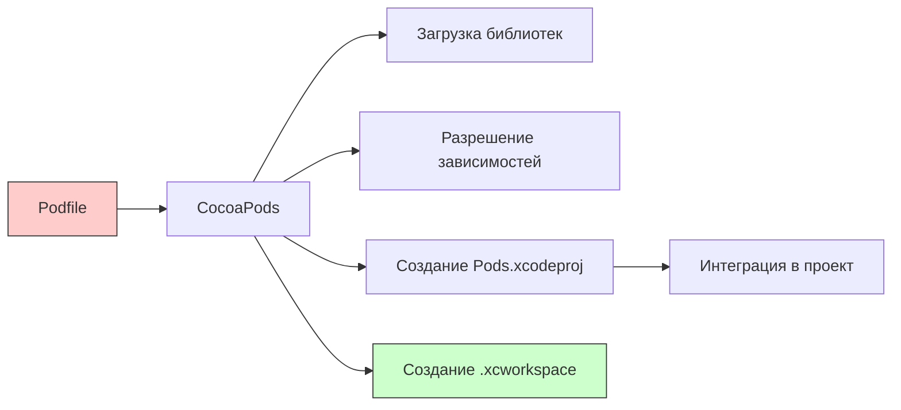

#cocoapods #dependency-management #ios #swift #objective-c #xcode #ruby

---
### Определение

**CocoaPods** — это менеджер зависимостей для проектов, разрабатываемых на языках программирования [[Swift]] и [[Objective-C]] в экосистеме Apple. Он упрощает процесс установки, управления и обновления внешних библиотек и фреймворков в ваших проектах. CocoaPods автоматически разрешает зависимости, обеспечивая удобный способ интеграции сторонних библиотек в ваши приложения.



---

### Почему CocoaPods?

| Преимущество                 | Описание                                                 |
| ---------------------------- | -------------------------------------------------------- |
| **Огромное сообщество**      | Самый популярный менеджер зависимостей для [[iOS]]/macOS |
| **Широкая экосистема**       | Почти все популярные библиотеки поддерживают CocoaPods   |
| **Простота использования**   | Одна команда `pod install` — и зависимости готовы        |
| **Автоматическая настройка** | Не нужно вручную добавлять фреймворки в проект           |
| **Поддержка ресурсов**       | Работа с изображениями, локализациями, шрифтами          |
| **Поддержка Swift и Obj-C**  | Оба языка работают отлично                               |

---

### Установка CocoaPods

#### 1. **Базовая установка (через RubyGems)**

```bash
sudo gem install cocoapods
```

#### 2. **Установка конкретной версии**

```bash
sudo gem install cocoapods -v 1.15.0
```

#### 3. **Установка через Homebrew**

```bash
brew install cocoapods
```

#### 4. **Настройка (первый запуск)**

```bash
pod setup
```

> Это может занять несколько минут — скачивается репозиторий спецификаций.

#### 5. **Проверка версии**

```bash
pod --version
```

---

### Структура проекта с CocoaPods

```
MyApp/
├── MyApp.xcodeproj           # Оригинальный проект
├── MyApp.xcworkspace         # Рабочая область (открывать её)
├── Podfile                   # Конфигурация зависимостей
├── Podfile.lock              # Зафиксированные версии
├── Pods/                     # Папка с зависимостями (не коммитить!)
│   ├── Alamofire/
│   ├── SnapKit/
│   └── Pods.xcodeproj
└── MyApp/                    # Ваш исходный код
```

---

### Основной файл: Podfile

#### 1. **Базовая структура**

```ruby
platform :ios, '13.0'
use_frameworks!

target 'MyApp' do
  pod 'Alamofire', '~> 5.0'
  pod 'SnapKit', '~> 5.0'
end
```

#### 2. **Разные таргеты**

```ruby
target 'MyApp' do
  pod 'Alamofire'
  
  target 'MyAppTests' do
    inherit! :search_paths
    pod 'OHHTTPStubs/Swift'
  end
end
```

#### 3. **Подспецификации**

```ruby
pod 'Alamofire', :subspecs => ['Core', 'Network']
```

#### 4. **Разные платформы**

```ruby
# iOS
platform :ios, '13.0'

# macOS
platform :osx, '11.0'

# tvOS
platform :tvos, '14.0'

# watchOS
platform :watchos, '7.0'
```

---

### Управление версиями

| Синтаксис | Значение | Пример |
|---|---|---|
| `'1.0'` | Точная версия | `pod 'Alamofire', '5.8.0'` |
| `'~> 1.0'` | Совместимая версия (≥1.0, <2.0) | `pod 'Alamofire', '~> 5.0'` |
| `'>= 1.0'` | Любая версия >=1.0 | `pod 'Alamofire', '>= 5.0'` |
| `'< 2.0'` | Любая версия <2.0 | `pod 'Alamofire', '< 6.0'` |
| `:branch => 'main'` | Ветка Git | `pod 'Alamofire', :git => '...', :branch => 'main'` |
| `:commit => 'abc123'` | Коммит | `pod 'Alamofire', :git => '...', :commit => 'abc123'` |
| `:path => '../Lib'` | Локальный путь | `pod 'MyLib', :path => '../MyLib'` |

---

### Команды CocoaPods

| Команда | Описание |
|---|---|
| `pod init` | Создать Podfile в текущей папке |
| `pod install` | Установить зависимости (первый раз или после изменений Podfile) |
| `pod update` | Обновить все зависимости до последних версий |
| `pod update [POD_NAME]` | Обновить конкретную зависимость |
| `pod outdated` | Показать устаревшие зависимости |
| `pod search [NAME]` | Поиск библиотеки |
| `pod deintegrate` | Удалить CocoaPods из проекта |
| `pod cache clean --all` | Очистить кеш |
| `pod repo update` | Обновить локальный репозиторий спецификаций |

---

### Пошаговый пример использования

#### Шаг 1: Установка CocoaPods

```bash
sudo gem install cocoapods
```

#### Шаг 2: Переход в проект

```bash
cd ~/Projects/MyApp
```

#### Шаг 3: Создание Podfile

```bash
pod init
```

#### Шаг 4: Редактирование Podfile

```ruby
platform :ios, '15.0'
use_frameworks!

target 'MyApp' do
  pod 'Alamofire', '~> 5.0'
  pod 'SnapKit', '~> 5.0'
  pod 'SDWebImage', '~> 5.0'
end
```

#### Шаг 5: Установка зависимостей

```bash
pod install
```

#### Шаг 6: Открытие проекта

```bash
open MyApp.xcworkspace
```

(⚠️ **Важно:** больше не открывайте `.xcodeproj`, только `.xcworkspace`)

#### Шаг 7: Импорт библиотек в коде

```swift
import UIKit
import Alamofire
import SnapKit
import SDWebImage

class ViewController: UIViewController {
    override func viewDidLoad() {
        super.viewDidLoad()
        
        // Alamofire
        AF.request("https://api.example.com").response { response in
            // ...
        }
        
        // SnapKit
        button.snp.makeConstraints { make in
            make.center.equalToSuperview()
        }
        
        // SDWebImage
        imageView.sd_setImage(with: url)
    }
}
```

---

### Работа с ресурсами

CocoaPods автоматически подключает ресурсы зависимостей (изображения, локализации, шрифты, xib/storyboard).

```ruby
pod 'Kingfisher'  # содержит изображения
pod 'IQKeyboardManagerSwift'  # содержит xib
```

**Доступ к ресурсам в своём поде:**

```ruby
s.resource_bundles = {
    'MyPod' => ['MyPod/Assets/*.png', 'MyPod/Resources/*.xib']
}
```

---

### Podfile.lock — важность для команды

`Podfile.lock` **обязательно** коммитить в Git. Он фиксирует точные версии установленных зависимостей.

```bash
git add Podfile Podfile.lock
git commit -m "Add CocoaPods dependencies"
```

> **Важно:** папку `Pods/` коммитить **не нужно** (добавьте в `.gitignore`).

```gitignore
# .gitignore
Pods/
*.xcworkspace
```

---

### Обновление и поддержка

```bash
# Проверить устаревшие зависимости
pod outdated

# Обновить всё
pod update

# Обновить конкретную библиотеку
pod update Alamofire

# Обновить версию CocoaPods
sudo gem update cocoapods
```

---

### Подключение своего подспецификации

```ruby
# Podfile
pod 'MyPrivateLib', :git => 'https://github.com/mycompany/MyPrivateLib.git', :tag => '1.0.0'
pod 'MyLocalLib', :path => '../MyLocalLib'
```

---

### Решение проблем

| Проблема | Решение |
|---|---|
| `pod install` очень долгий | `pod repo update` + `pod cache clean --all` |
| Конфликт версий (incompatible) | Обновить библиотеки или указать точные версии |
| `Unable to find a specification` | `pod repo update` или добавить источник `source` в Podfile |
| `Pods/` не генерируется | Проверить права на папку проекта |
| Xcode не видит импорты | Открыть `.xcworkspace`, а не `.xcodeproj` |

---

### Поддержка старых версий

```ruby
# Старый проект на Objective-C без фреймворков
platform :ios, '9.0'
# use_frameworks!  # закомментировать

target 'OldApp' do
  pod 'AFNetworking'
end
```

---

### CocoaPods vs Carthage vs SPM

| Характеристика | CocoaPods | Carthage | SPM |
|---|---|---|---|
| **Популярность** | ★★★★★ | ★★★☆☆ | ★★★★☆ |
| **Простота** | ★★★★☆ | ★★★☆☆ | ★★★★★ |
| **Скорость** | ★★★☆☆ | ★★☆☆☆ | ★★★★★ |
| **Поддержка Obj-C** | ★★★★★ | ★★★★☆ | ★★☆☆☆ |
| **Интеграция** | Авто | Ручная | Авто (Xcode) |
| **Изменяет проект** | ✅ | ❌ | ❌ |

---

### Итог

**CocoaPods** — это мощный, проверенный временем менеджер зависимостей для iOS/macOS разработки.

| Аспект | Оценка |
|---|---|
| **Простота использования** | ★★★★☆ |
| **Экосистема** | ★★★★★ |
| **Надёжность** | ★★★★☆ |
| **Скорость** | ★★★☆☆ |

**Короткое правило:**
> Для новых Swift-проектов предпочитай SPM, но в легаси-проектах на Objective-C или проектах с большими зависимостями CocoaPods остаётся стандартом. Для CI/CD используй `pod install --repo-update` и кешируй папку `Pods/`.