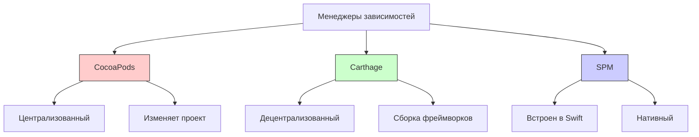
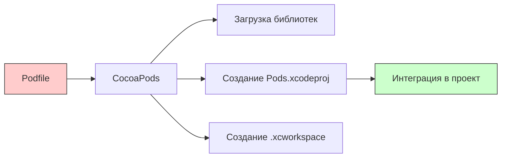
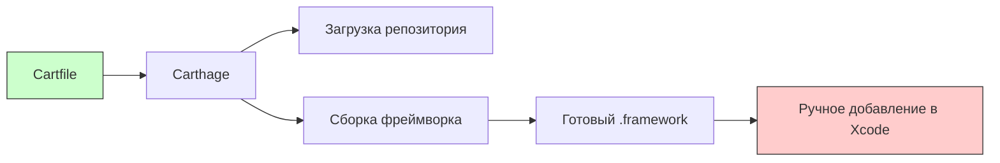
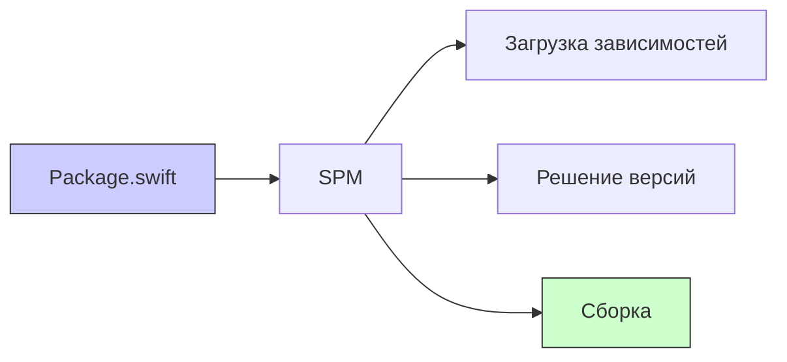

#dependency-management #cocoapods #carthage #spm #ios #swift #xcode

---
### Определение

**[[CocoaPods]], [[Carthage]] и Swift Package Manager ([[SPM]])** — три основных инструмента для управления зависимостями в проектах на [[Swift]] и [[Objective-C]]. Каждый имеет свою философию, архитектуру и сценарии использования.



---

### Сравнительная таблица

| Характеристика | CocoaPods | Carthage | SPM |
|---|---|---|---|
| **Тип** | Централизованный | Децентрализованный | Встроенный |
| **Поддержка Swift** | ✅ | ✅ | ✅ (нативный) |
| **Поддержка Obj-C** | ✅ | ✅ | ⚠️ Ограниченная |
| **Изменяет проект** | ✅ (создаёт .xcworkspace) | ❌ (только ссылки) | ❌ (интеграция через Xcode) |
| **Сборка зависимостей** | Автоматическая | Ручная / скриптами | Автоматическая |
| **Скорость сборки** | Средняя | Медленнее (сборка фреймворков) | Быстрая |
| **Разрешение версий** | Автоматическое | Ручное (через Cartfile.resolved) | Автоматическое (через Package.resolved) |
| **Экосистема** | Огромная (~100k библиотек) | Средняя (~30k) | Растёт, но меньше |
| **Поддержка серверных проектов** | ❌ | ❌ | ✅ |
| **Поддержка iOS/macOS/tvOS/watchOS** | ✅ | ✅ | ✅ (но ограничена) |
| **Поддержка Linux/Windows** | ❌ | ❌ | ✅ |
| **Сложность использования** | Средняя | Выше | Низкая |

---

## 1. CocoaPods — самый популярный

### Определение

**CocoaPods** — централизованный менеджер зависимостей, который автоматически загружает, собирает и интегрирует библиотеки в [[Xcode]]-проект. Он управляет зависимостями через файл `Podfile` и создаёт единую рабочую область (`.xcworkspace`).

### Как работает



### Пример Podfile

```ruby
platform :ios, '13.0'
use_frameworks!

target 'MyApp' do
  pod 'Alamofire', '~> 5.0'
  pod 'SnapKit', '~> 5.0'
  
  target 'MyAppTests' do
    inherit! :search_paths
    pod 'OHHTTPStubs/Swift'
  end
end
```

### Преимущества

| Преимущество | Описание |
|---|---|
| **Огромное сообщество** | Самый популярный менеджер, почти все библиотеки поддерживают CocoaPods |
| **Легкая интеграция** | Одна команда `pod install` — и зависимости готовы |
| **Автоматическая настройка** | Не нужно вручную добавлять фреймворки в проект |
| **Поддержка ресурсов** | Работа с изображениями, локализациями, шрифтами |

### Недостатки

| Недостаток | Описание |
|---|---|
| **Изменяет структуру проекта** | Добавляет `.xcworkspace`, меняет настройки сборки |
| **Неявное разрешение версий** | Может конфликтовать из-за разных требований к версиям |
| **Медленный `pod install`** | При большом количестве зависимостей |
| **Риск конфликтов в командной работе** | `Podfile.lock` нужно коммитить, но `Pods/` — нет |

### Команды

```bash
pod init                     # Создать Podfile
pod install                  # Установить зависимости
pod update                   # Обновить зависимости
pod update Alamofire         # Обновить конкретную зависимость
pod search SnapKit           # Поиск библиотеки
pod deintegrate              # Удалить CocoaPods из проекта
```

---

## 2. Carthage — децентрализованный

### Определение

**Carthage** — децентрализованный менеджер зависимостей, который только загружает и собирает библиотеки, но **не изменяет** [[Xcode]]-проект. Разработчик сам добавляет скомпилированные фреймворки в проект.

### Как работает



### Пример Cartfile

```ruby
# Cartfile
github "Alamofire/Alamofire" ~> 5.0
github "SnapKit/SnapKit" ~> 5.0
```

### Преимущества

| Преимущество | Описание |
|---|---|
| **Не изменяет проект** | Только генерирует фреймворки, интеграция ручная |
| **Гибкий контроль версий** | Полный контроль над версиями зависимостей |
| **Быстрее на CI** | Кеширование сборок, только код |
| **Поддержка подпроектов** | Можно собирать определённые таргеты |

### Недостатки

| Недостаток | Описание |
|---|---|
| **Ручная интеграция** | Нужно добавлять фреймворки в проект вручную |
| **Долгая сборка** | Сборка каждой зависимости (особенно big libraries) |
| **Сложность настройки** | Для автоматизации нужны скрипты |
| **Меньше библиотек** | Разработчики реже тестируют Carthage, чем CocoaPods |

### Команды

```bash
carthage update               # Загрузить и собрать все зависимости
carthage update Alamofire     # Обновить конкретную
carthage build --platform iOS # Собрать только для iOS
carthage checkout             # Только загрузить (без сборки)
```

### Интеграция в Xcode

1. Перетащить `Carthage/Build/iOS/*.framework` в Xcode
2. Добавить в "Embedded Binaries"
3. Добавить скрипт в Build Phases для копирования фреймворков:

```bash
/usr/local/bin/carthage copy-frameworks
```

---

## 3. Swift Package Manager (SPM) — будущее

### Определение

**SPM** — официальный менеджер зависимостей, встроенный в [[Swift]]. Начиная с [[Xcode]] 11, он интегрирован нативно и не требует дополнительных инструментов.

### Как работает



### Пример Package.swift

```swift
// swift-tools-version:5.9
import PackageDescription

let package = Package(
    name: "MyPackage",
    dependencies: [
        .package(url: "https://github.com/Alamofire/Alamofire.git", from: "5.0.0"),
    ],
    targets: [
        .target(name: "MyApp", dependencies: ["Alamofire"]),
    ]
)
```

### Преимущества

| Преимущество | Описание |
|---|---|
| **Нативная поддержка Apple** | Встроен в Swift и Xcode |
| **Простота** | Не требует установки, работает «из коробки» |
| **Без изменений проекта** | Интеграция через Xcode напрямую |
| **Cross-platform** | Поддерживает iOS, macOS, Linux, Windows |
| **Быстрая сборка** | Как часть Swift-компилятора |

### Недостатки

| Недостаток | Описание |
|---|---|
| **Ограниченная поддержка Obj-C** | Создан для Swift, Obj-C работает плохо |
| **Экосистема меньше** | Не все библиотеки мигрировали на SPM |
| **Ресурсы** | Поддержка ресурсов (изображения, локализация) появилась недавно |
| **Динамические фреймворки** | Не поддерживаются (только статические) |

---

## Выбор инструмента — критерии

| Сценарий | Рекомендация | Почему |
|---|---|---|
| **Новый Swift-проект** | **SPM** | Нативный, простой, будущее |
| **Легаси Obj-C проект** | **CocoaPods** | Лучшая поддержка Obj-C |
| **Библиотека, ориентированная на iOS** | **SPM + CocoaPods** | Оба, для широкой аудитории |
| **Монорепозиторий / несколько проектов** | **Carthage** | Гибкость, кеширование сборок |
| **Серверный Swift (Vapor, etc.)** | **SPM** | Единственный рабочий вариант |
| **Проект с кучей мелких зависимостей** | **SPM** | Быстро, удобно |
| **Проект с большими фреймворками (Realm, Firebase)** | **CocoaPods** | Лучше протестировано сообществом |

---

## Миграция между инструментами

### CocoaPods → SPM

```bash
# 1. Удалить CocoaPods
pod deintegrate

# 2. Добавить SPM зависимости в Xcode
# File → Add Package Dependencies → URL

# 3. Заменить импорты в коде (обычно не нужно)
```

### Carthage → SPM

```bash
# 1. Удалить Carthage
rm -rf Carthage/
rm Cartfile Cartfile.resolved

# 2. Добавить SPM зависимости
# File → Add Package Dependencies → URL
```

---

## Короткая шпаргалка

| Действие | CocoaPods | Carthage | SPM |
|---|---|---|---|
| **Установка** | `sudo gem install cocoapods` | `brew install carthage` | Встроен в Swift |
| **Создание конфига** | `pod init` | `touch Cartfile` | `swift package init` |
| **Добавление зависимости** | `pod 'Name'` | `github "user/Name"` | `package(url:from:)` |
| **Установка/обновление** | `pod install` | `carthage update` | Через Xcode |
| **Файл блокировки** | `Podfile.lock` | `Cartfile.resolved` | `Package.resolved` |
| **Интеграция в Xcode** | `.xcworkspace` | Ручная | Авто через Xcode |

---

### Итог

| Инструмент | Лучший для | Худший для |
|---|---|---|
| **CocoaPods** | Obj-C, огромные библиотеки, простота | Крупные проекты с конфликтами |
| **Carthage** | Гибкость, монорепозитории, CI/CD | Быстрая интеграция, новички |
| **SPM** | Swift, новые проекты, серверный Swift | Obj-C, динамические фреймворки |

**Главное правило 2026:**
> Для новых Swift-проектов однозначно **SPM**. CocoaPods — для поддержки легаси и Obj-C. Carthage — для специальных случаев (монорепозитории, сложные настройки сборки). В идеальном мире будущее — только SPM.