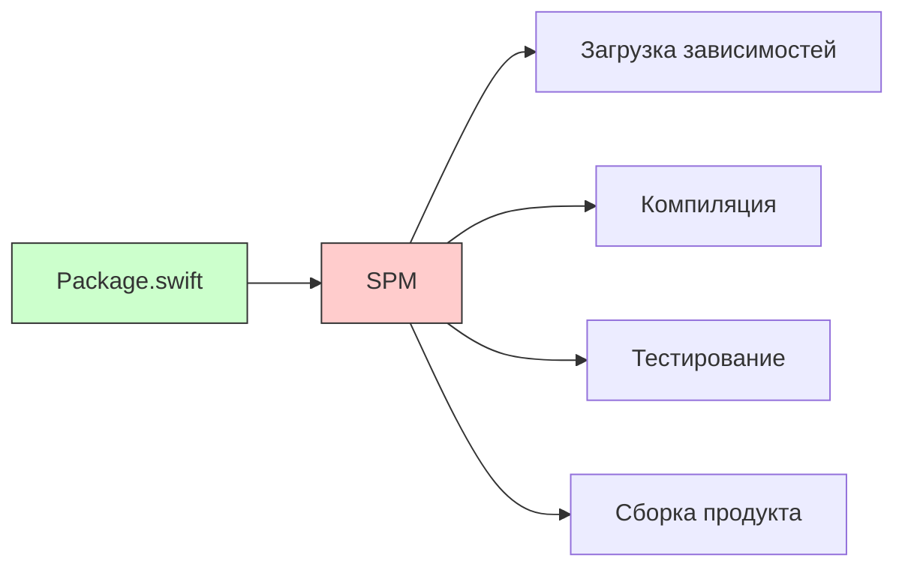

#spm #swift #dependency-management #xcode #package-manager #ios #macos

---

### Определение

**Swift Package Manager (SPM)** — это официальный менеджер зависимостей и инструмент сборки для [[Swift]], предоставляемый Apple. В отличие от сторонних решений ([[CocoaPods]], [[Carthage]]), SPM **встроен в язык** Swift и является нативным инструментом, что обеспечивает глубокую интеграцию с экосистемой Apple.

SPM предназначен для:
- Управления зависимостями (подключение сторонних библиотек)
- Сборки проектов
- Тестирования пакетов
- Публикации и распространения библиотек



---

### Для чего нужен SPM?

| Задача                    | Решение SPM                                      |
| ------------------------- | ------------------------------------------------ |
| **Добавление библиотеки** | Указать [[URL]] и версию в `Package.swift`       |
| **Управление версиями**   | [[Git]]-теги, семантическое версионирование      |
| **Сборка проекта**        | `swift build`                                    |
| **Тестирование**          | `swift test`                                     |
| **Интеграция с Xcode**    | Встроенная поддержка (без генерации `xcodeproj`) |
| **Монорепозитории**       | Модульность через локальные пакеты               |
| **Cross-platform**        | iOS, macOS, Linux, Windows                       |

---

### Ключевые возможности SPM

| Возможность | Описание |
|---|---|
| **Встроен в Swift** | Не требует установки сторонних инструментов |
| **Поддержка Git** | Зависимости загружаются из Git-репозиториев |
| **Семантическое версионирование** | Автоматическое разрешение версий |
| **Модульность** | Разделение кода на таргеты (targets) |
| **Продукты** | Библиотеки (.a, .framework) и исполняемые файлы |
| **Интеграция с Xcode** | Прямое добавление пакетов через файл `.xcodeproj` или `.xcworkspace` |
| **Cross-platform** | Работает на macOS, Linux, Windows |
| **Swift 6** | Полная поддержка |

---

### Структура пакета SPM

```
MyPackage/
├── Package.swift           # Манифест пакета (конфигурация)
├── Sources/
│   └── MyPackage/
│       └── MyPackage.swift # Исходный код
├── Tests/
│   └── MyPackageTests/
│       └── MyPackageTests.swift # Тесты
└── README.md
```

---

### Создание нового пакета

#### 1. **Инициализация пустого пакета**

```bash
mkdir MyPackage
cd MyPackage
swift package init --type library    # или --type executable
```

#### 2. **Автоматически созданный Package.swift**

```swift
// swift-tools-version: 5.9
import PackageDescription

let package = Package(
    name: "MyPackage",
    products: [
        .library(name: "MyPackage", targets: ["MyPackage"]),
    ],
    targets: [
        .target(name: "MyPackage"),
        .testTarget(name: "MyPackageTests", dependencies: ["MyPackage"]),
    ]
)
```

---

### Определение зависимостей

#### 1. **Добавление зависимости**

```swift
// swift-tools-version: 5.9
import PackageDescription

let package = Package(
    name: "MyApp",
    dependencies: [
        // По тегу (семантическая версия)
        .package(url: "https://github.com/Alamofire/Alamofire.git", from: "5.0.0"),
        
        // По конкретной ветке
        .package(url: "https://github.com/ReactiveX/RxSwift.git", branch: "main"),
        
        // По конкретному коммиту
        .package(url: "https://github.com/apple/swift-collections.git", revision: "abc123"),
        
        // Локальный пакет
        .package(path: "../LocalPackage"),
    ],
    targets: [
        .target(
            name: "MyApp",
            dependencies: [
                "Alamofire",
                .product(name: "RxSwift", package: "RxSwift"),
            ]
        ),
    ]
)
```

#### 2. **Управление версиями**

| Формат | Пример | Описание |
|---|---|---|
| **`from:`** | `from: "1.2.3"` | Совместимая версия (≥1.2.3, <2.0.0) |
| **`exact:`** | `exact: "1.2.3"` | Точная версия |
| **`branch:`** | `branch: "main"` | Ветка (могут быть нестабильные изменения) |
| **`revision:`** | `revision: "abc123"` | Коммит (для отладки) |

---

### Target и Product

#### 1. **Таргет (Target)** — минимальная единица сборки

```swift
targets: [
    .target(
        name: "Core",
        dependencies: [],
        path: "Sources/Core",           // путь (опционально)
        exclude: ["Legacy"],            // исключить из сборки
        sources: ["File1.swift"],       // конкретные файлы (обычно не нужно)
        resources: [.process("Assets")] // ресурсы (изображения, локализации)
    ),
    .testTarget(
        name: "CoreTests",
        dependencies: ["Core"]
    ),
]
```

#### 2. **Продукт (Product)** — то, что экспортируется наружу

```swift
products: [
    .library(
        name: "Core",
        targets: ["Core"]
    ),
    .executable(
        name: "MyTool",
        targets: ["MyTool"]
    ),
]
```

---

### Работа с SPM из командной строки

| Команда | Описание |
|---|---|
| `swift package init` | Создать новый пакет |
| `swift build` | Собрать пакет |
| `swift test` | Запустить тесты |
| `swift package update` | Обновить зависимости |
| `swift package resolve` | Загрузить зависимости без сборки |
| `swift package show-dependencies` | Показать дерево зависимостей |
| `swift package clean` | Очистить временные файлы |
| `swift package generate-xcodeproj` | Сгенерировать Xcode проект (устарело) |

---

### Интеграция с Xcode

#### 1. **Добавление пакета через Xcode GUI**

1. File → Add Package Dependencies
2. Введите URL пакета (например, `https://github.com/Alamofire/Alamofire.git`)
3. Выберите правила версионирования
4. Добавьте пакет к таргету

#### 2. **Xcode и SPM (без `generate-xcodeproj`)**

Начиная с Xcode 11, SPM интегрирован нативно:
- Откройте `.xcodeproj` или `.xcworkspace`
- Файлы пакета отображаются в Project Navigator
- Зависимости обновляются автоматически

#### 3. **Мониторинг версий в Xcode**

File → Packages → Update to Latest Package Versions

---

### Ресурсы и локализация

```swift
targets: [
    .target(
        name: "MyPackage",
        resources: [
            .process("Assets"),           // копировать папку Assets
            .copy("Config.plist"),        // скопировать файл
            .process("Localizable.strings") // локализация
        ]
    )
]
```

Доступ к ресурсам в коде:

```swift
import Foundation

// Bundle.module автоматически создаётся SPM
let url = Bundle.module.url(forResource: "image", withExtension: "png")
```

---

### Тестирование

```swift
import XCTest
@testable import MyPackage

final class MyPackageTests: XCTestCase {
    func testExample() {
        XCTAssertEqual(MyPackage.hello(), "Hello, World!")
    }
}
```

---

### Публикация пакета

1. Создать Git-репозиторий
2. Загрузить код
3. Создать Git-тег (например, `git tag 1.0.0`)
4. (Опционально) Добавить README.md, LICENSE

```bash
git init
git add .
git commit -m "Initial commit"
git tag 1.0.0
git remote add origin https://github.com/user/MyPackage.git
git push --tags
```

---

### SPM vs CocoaPods vs Carthage

| Характеристика | SPM | CocoaPods | Carthage |
|---|---|---|---|
| **Интеграция** | Встроен в Swift/Xcode | Требует установки и файла Podfile | Требует установки |
| **Скорость** | Быстрая | Средняя | Медленная (сборка фреймворков) |
| **Поддержка Obj-C** | Ограниченная (с 5.0+) | Полная | Полная |
| **Поддержка iOS/macOS** | ✅ | ✅ | ✅ |
| **Поддержка Linux** | ✅ | ❌ | ❌ |
| **Динамические фреймворки** | ❌ (статические библиотеки) | ✅ | ✅ |
| **Ресурсы (изображения и т.д.)** | ✅ (с SPM 5.3+) | ✅ | ❌ |
| **Сложность** | Низкая | Средняя | Высокая |

---

### Swift 6 и SPM

В Swift 6 SPM получил улучшения:

- **Лучшая поддержка ресурсов**
- **Ускорение сборки** (параллельные тесты)
- **Интеграция с `swift-syntax`**
- **Плагины** (Swift Package Plugin)

---

### Ежедневные команды (шпаргалка)

```bash
# Инициализация
swift package init --name MyPackage --type library

# Добавление зависимостей (редактируем Package.swift)
vim Package.swift

# Загрузка зависимостей
swift package resolve

# Сборка
swift build

# Тесты
swift test

# Обновление зависимостей
swift package update

# Очистка
swift package clean

# Показать зависимости (дерево)
swift package show-dependencies
```

---

### Итог

**Swift Package Manager** — это официальный, встроенный в экосистему Swift инструмент для управления зависимостями и сборки.

| Аспект | Оценка |
|---|---|
| **Простота использования** | ★★★★★ |
| **Интеграция с Xcode** | ★★★★★ |
| **Скорость** | ★★★★★ |
| **Cross-platform** | ★★★★☆ |
| **Поддержка Obj-C** | ★★★☆☆ |

**Главное правило:**
> Для новых Swift-проектов предпочитай SPM. Он встроен, прост, не требует дополнительных инструментов. CocoaPods и Carthage оставь для поддержки легаси-проектов и Obj-C зависимостей.