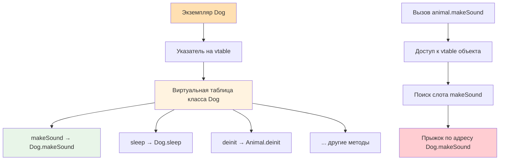

**Table Dispatch** — это один из видов **динамической диспетчеризации** в Swift, при котором выбор конкретной реализации метода происходит **во время выполнения** через **таблицу указателей** (vtable или witness table).

В Swift существует **два вида таблиц**:

| Вид таблицы       | Когда используется                    | Название в документации    | Скорость | Размер overhead |
| ----------------- | ------------------------------------- | -------------------------- | -------- | --------------- |
| **vtable**        | Обычные методы классов (не [[final]]) | [[Class]] vtable           | ★★★★☆    | Средний         |
| **witness table** | Методы протоколов (без @objc)         | [[Protocol]] witness table | ★★★★☆    | Средний         |

**Главное отличие от Message Dispatch**:
- Table Dispatch — это **фиксированная таблица** на класс/протокол  
- [[Message Dispatch]] — это **динамический поиск** через objc_msgSend  

### 2. Как работает Table Dispatch (vtable)

1. При компиляции для каждого класса, имеющего виртуальные методы, создаётся **vtable** — массив указателей на реализации методов.
2. Каждый объект класса содержит **указатель на свою vtable** (в метаданных экземпляра).
3. При вызове метода компилятор знает **смещение** (offset) метода в таблице.
4. Во время выполнения берётся vtable объекта → по смещению берётся указатель на функцию → вызов.

Схема (Mermaid):



### 3. Примеры кода

#### Пример 1 — Классический vtable (классы)

```swift
class Animal {
    func makeSound() {          // виртуальный метод → vtable
        print("Generic")
    }
}

class Dog: Animal {
    override func makeSound() {
        print("Woof!")
    }
}

class Cat: Animal {
    override func makeSound() {
        print("Meow!")
    }
}

let animals: [Animal] = [Dog(), Cat(), Animal()]
animals.forEach { $0.makeSound() }
// Woof!
// Meow!
// Generic
```

**Здесь** каждый вызов идёт через vtable соответствующего класса.

#### Пример 2 — Witness Table (протоколы без @objc)

```swift
protocol SoundMaker {
    func makeSound()
}

struct Dog: SoundMaker {
    func makeSound() { print("Woof!") }
}

struct Cat: SoundMaker {
    func makeSound() { print("Meow!") }
}

let makers: [any SoundMaker] = [Dog(), Cat()]
makers.forEach { $0.makeSound() }
// Woof!
// Meow!
```

**Witness table** создаётся для каждой пары (тип + протокол).

#### Пример 3 — Сравнение скоростей (примерный бенчмарк 2026)

```swift
class Base {
    func compute() -> Int { 42 }
}

final class Fast: Base {
    override func compute() -> Int { 42 }  // final → direct dispatch
}

class Slow: Base {
    override func compute() -> Int { 42 }  // vtable
}

protocol Computable {
    func compute() -> Int
}

struct StructFast: Computable {
    func compute() -> Int { 42 }  // witness table
}

func test() {
    let fast = Fast()
    let slow = Slow()
    let structFast = StructFast()
    
    let start = CFAbsoluteTimeGetCurrent()
    for _ in 0..<1_000_000_000 {
        _ = fast.compute()      // direct → самый быстрый
    }
    print("Direct:", CFAbsoluteTimeGetCurrent() - start)
    
    // Аналогично для slow и structFast
}
```

**Результаты (примерно)**:
- Direct: ~0.8–1.2 с  
- vtable / witness: ~1.5–2.5 с  
- objc_msgSend: ~4–8 с

### 4. Таблица: все виды диспетчеризации в Swift 2026

| Механизм                   | Тип диспетчеризации | Скорость | Размер кода | Полиморфизм | Примеры                                |
| -------------------------- | ------------------- | -------- | ----------- | ----------- | -------------------------------------- |
| [[Direct Dispatch]]        | Статическая         | ★★★★★    | Минимальный | Нет         | `final func`, `static func`, `private` |
| Table Dispatch (vtable)    | Динамическая        | ★★★★☆    | Средний     | Да          | Обычные методы классов                 |
| [[Witness Table Dispatch]] | Динамическая        | ★★★★☆    | Средний     | Да          | Протоколы без @objc                    |
| [[Message Dispatch]]       | Динамическая        | ★★☆☆☆    | Большой     | Да          | `@objc`, `dynamic`, NSObject           |

### 5. Реальные сценарии в iOS-разработке

#### Сценарий 1 — [[SwiftUI]] и Table Dispatch

```swift
protocol ViewModel {
    var title: String { get }
}

class UserViewModel: ViewModel {
    var title: String = "Профиль"
}

func makeViewModel() -> some ViewModel {  // some → компилятор знает тип
    UserViewModel()
}
```

**Здесь** `some` позволяет статическую диспетчеризацию.

#### Сценарий 2 — [[UIKit]] и vtable

```swift
class CustomViewController: UIViewController {
    override func viewDidLoad() {
        super.viewDidLoad()
        // vtable используется для вызова viewDidLoad
    }
}
```

#### Сценарий 3 — Протоколы и witness table

```swift
protocol Renderable {
    func render()
}

struct Circle: Renderable {
    func render() { print("○") }
}

let items: [any Renderable] = [Circle()]
items.forEach { $0.render() }  // witness table
```

### 6. Лучшие практики 2026 года (Swift 6 strict concurrency)

- Используйте **final** и **static** везде, где полиморфизм не нужен  
- Для протоколов — [[some Protocol]] при возврате  
- [[any Protocol]] — только для коллекций, свойств, делегатов  
- `@objc dynamic` — только для [[KVO]], [[Delegate]], старый [[UIKit]]  
- В [[SwiftUI]] — `some View`, `some ViewModel` — стандарт  
- В горячих путях (рендеринг, циклы) — избегайте `any` и `@objc`  
- Для максимальной скорости — [[generic]] `<T: Protocol>` вместо [[any]]

**Короткий девиз**:
> «Table Dispatch — это золотая середина между скоростью и полиморфизмом.  
> final, static, some — для максимальной производительности.  
> any и @objc — только когда без них никак.»
