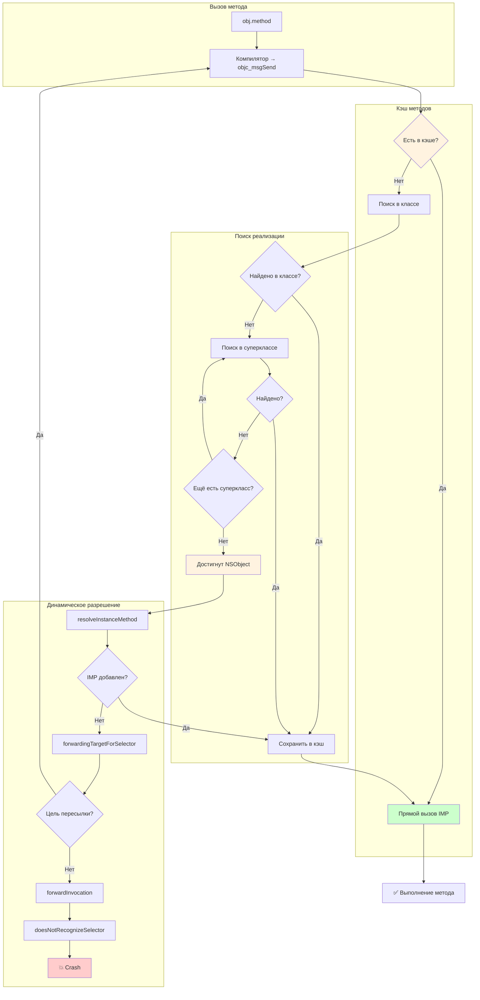

#swift #dispatch #message-dispatch #objc #dynamic #performance #objective-c #runtime

---
### Определение
**Message Dispatch (месседж-диспетчеризация)** — это вид динамической диспетчеризации в [[Swift]], основанный на механизме отправки сообщений [[Objective-C]] runtime (`objc_msgSend`). При таком вызове метод не вызывается напрямую, а **сообщение** отправляется объекту, и runtime определяет, какая реализация должна быть выполнена на основе класса получателя .

Это самый гибкий, но и самый медленный вид диспетчеризации в [[Swift]]. Он используется для обеспечения совместимости с Objective-C, поддержки динамических функций, таких как **[[KVO]] (Key-Value Observing)**, **[[Swizzling]]** и **динамическая подмена реализации** методов во время выполнения .

### Зачем это знать iOS-разработчику?
1.  **Совместимость с Objective-C:** Необходим при работе с [[UIKit]], Foundation и другими Objective-C фреймворками .
2.  **Динамические функции:** KVO, Swizzling, динамическая замена методов — возможны только через Message Dispatch .
3.  **Производительность:** Самый медленный вид диспетчеризации, избегайте его в горячих путях .
4.  **Понимание runtime:** Важно для отладки и понимания того, как работают Objective-C объекты .
5.  **Миграция кода:** При переходе с Objective-C на Swift нужно понимать, когда сохраняется динамическое поведение .

---

### Message Dispatch vs Другие виды диспетчеризации

| Вид диспетчеризации | Время определения | Скорость | Полиморфизм | Переопределение | Инлайнинг | Динамическая замена |
|---------------------|-------------------|----------|-------------|-----------------|-----------|---------------------|
| **Direct / Static** | Компиляция | ★★★★★ | Нет | Нет | Да | Нет |
| **Table (vtable)** | Выполнение | ★★★★☆ | Да | Да | Редко | Нет |
| **Witness Table** | Выполнение | ★★★★☆ | Да | Да | Редко | Нет |
| **Message** | Выполнение | ★★☆☆☆ | Да | Да | Почти никогда | Да |

**Примерные цифры производительности:**
- **Direct Dispatch:** ~1–2 нс
- **Table Dispatch:** ~3–5 нс
- **Witness Table:** ~3–5 нс
- **Message Dispatch:** ~10–20 нс

---

### Как работает Message Dispatch



**Ключевые компоненты:**
- **objc_msgSend:** Функция, отправляющая сообщение объекту.
- **Selector (`SEL`):** Идентификатор метода (например, `@selector(viewDidLoad)`).
- **IMP (Implementation Pointer):** Указатель на реализацию метода.
- **Method Swizzling:** Замена IMP во время выполнения.

---

### Когда используется Message Dispatch

#### 1. **Методы, помеченные @objc dynamic**

```swift
class MyClass: NSObject {
    // Message Dispatch
    @objc dynamic func dynamicMethod() {
        print("Dynamic")
    }
    
    // Table Dispatch (обычный метод)
    func normalMethod() {
        print("Normal")
    }
}
```

#### 2. **Наследование от [[NSObject]] (без dynamic)**

```swift
class ViewController: UIViewController {
    // Методы UIViewController используют Message Dispatch
    override func viewDidLoad() {
        super.viewDidLoad()  // Message Dispatch
    }
}
```

#### 3. **KVO (Key-Value Observing)**

```swift
class Person: NSObject {
    @objc dynamic var name: String  // Message Dispatch для KVO
    
    init(name: String) {
        self.name = name
    }
}

let person = Person(name: "Alice")
person.addObserver(
    self,
    forKeyPath: "name",
    options: [.new],
    context: nil
)  // KVO работает только через Message Dispatch
```

#### 4. **Методы, переопределенные из Objective-C**

```swift
class CustomView: UIView {
    // Переопределение метода Objective-C → Message Dispatch
    override func touchesBegan(_ touches: Set<UITouch>, with event: UIEvent?) {
        super.touchesBegan(touches, with: event)
    }
}
```

#### 5. **Свойства с @objc**

```swift
class DataModel: NSObject {
    // Message Dispatch для доступа через runtime
    @objc var value: String = ""
}
```

---

### Синтаксис и примеры

#### 1. **Объявление методов с Message Dispatch**

```swift
import Foundation

class MyClass: NSObject {
    // Message Dispatch
    @objc dynamic func messageDispatched() {
        print("Message dispatch")
    }
    
    // Table Dispatch
    func tableDispatched() {
        print("Table dispatch")
    }
}

let obj = MyClass()
obj.messageDispatched()  // objc_msgSend
obj.tableDispatched()    // vtable
```

#### 2. **KVO пример**

```swift
class Observable: NSObject {
    @objc dynamic var counter: Int = 0
}

class Observer: NSObject {
    var observation: NSKeyValueObservation?
    
    func observe(_ observable: Observable) {
        observation = observable.observe(\.counter, options: [.new]) { _, change in
            print("Counter changed to: \(change.newValue ?? 0)")
        }
    }
}

let observable = Observable()
let observer = Observer()
observer.observe(observable)

observable.counter = 42  // KVO срабатывает через Message Dispatch
```

#### 3. **Method Swizzling**

```swift
extension UIViewController {
    @objc dynamic func swizzled_viewDidLoad() {
        print("Swizzled viewDidLoad")
        swizzled_viewDidLoad()  // вызывает оригинальный метод
    }
    
    static func swizzle() {
        let originalSelector = #selector(viewDidLoad)
        let swizzledSelector = #selector(swizzled_viewDidLoad)
        
        guard let originalMethod = class_getInstanceMethod(self, originalSelector),
              let swizzledMethod = class_getInstanceMethod(self, swizzledSelector) else {
            return
        }
        
        method_exchangeImplementations(originalMethod, swizzledMethod)
    }
}

// После swizzling все viewDidLoad будут логировать
UIViewController.swizzle()
```

---

### Производительность: пример измерения

```swift
import Darwin

class Test: NSObject {
    // Message Dispatch
    @objc dynamic func messageMethod() { }
    
    // Table Dispatch
    func tableMethod() { }
}

func measure(_ name: String, iterations: Int, _ block: () -> Void) {
    let start = mach_absolute_time()
    for _ in 0..<iterations {
        block()
    }
    let end = mach_absolute_time()
    
    var info = mach_timebase_info()
    mach_timebase_info(&info)
    let elapsed = (end - start) * UInt64(info.numer) / UInt64(info.denom)
    let avg = Double(elapsed) / Double(iterations)
    print("\(name): \(String(format: "%.2f", avg)) нс")
}

let test = Test()
measure("Table", iterations: 10_000_000) {
    test.tableMethod()
}

measure("Message", iterations: 10_000_000) {
    test.messageMethod()
}

// Примерный результат:
// Table: 3.5 нс
// Message: 15.2 нс
```

---

### Когда использовать Message Dispatch

| Сценарий                  | Рекомендация               | Альтернатива                               |
| ------------------------- | -------------------------- | ------------------------------------------ |
| **KVO**                   | ✅ Необходим                | Combine (`@Published`, `ObservableObject`) |
| **Method Swizzling**      | ✅ Только через Message     | Редко нужно                                |
| **[[Core Data]]**         | ✅ @objc dynamic свойства   | `@NSManaged`                               |
| **UIKit переопределения** | ✅ Необходим                | -                                          |
| **Горячие циклы**         | ❌ Избегать                 | Static / Table Dispatch                    |
| **Новые Swift-проекты**   | ❌ Только при необходимости | [[Combine]], [[SwiftUI]]                   |

---

### Оптимизации и best practices

#### 1. **Избегайте @objc dynamic, если не нужны динамические функции**

```swift
// ❌ Плохо — избыточный Message Dispatch
class MyClass {
    @objc dynamic func process() { }
}

// ✅ Хорошо — Table Dispatch
class MyClass {
    func process() { }
}
```

#### 2. **Используйте Combine вместо KVO для Swift-кода**

```swift
// ❌ Старый способ — KVO через Message Dispatch
class Person: NSObject {
    @objc dynamic var name: String = ""
}

// ✅ Новый способ — Combine
class Person: ObservableObject {
    @Published var name: String = ""
}
```

#### 3. **Для свойств, требующих KVO, используйте @objc без dynamic если возможно**

```swift
// Минимальный overhead — только @objc (без dynamic)
class Model: NSObject {
    @objc var value: String  // Message Dispatch, но KVO не работает
}

// Для KVO нужен dynamic
class Model: NSObject {
    @objc dynamic var value: String  // Полный Message Dispatch
}
```

#### 4. **Ограничьте использование [[@objc]]**

```swift
// ❌ Плохо — избыточно
@objc class MyClass {
    @objc func process() { }
}

// ✅ Хорошо — только когда нужно
class MyClass {
    @objc func process() { }  // только для совместимости
}
```

---

### Message Dispatch в SwiftUI и Combine

Современные фреймворки Apple (SwiftUI, Combine) минимизируют необходимость в Message Dispatch:

```swift
// SwiftUI — ObservableObject вместо KVO
class ViewModel: ObservableObject {
    @Published var data: String = ""  // Combine, не Message
}

// Combine — Publishers вместо target-action
class MyClass {
    private var cancellables = Set<AnyCancellable>()
    
    func setup() {
        NotificationCenter.default
            .publisher(for: .someNotification)
            .sink { _ in }  // Combine
            .store(in: &cancellables)
    }
}
```

---

### Swift 6 и Message Dispatch

Swift 6 не меняет фундаментально Message Dispatch, но:

- **Усиливает рекомендации** по использованию Swift-native подходов вместо Objective-C.
- **@preconcurrency** помогает управлять совместимостью.
- **Акцент на Combine** для реактивного программирования вместо KVO.

```swift
// Swift 6 — предпочтительный подход
@Observable
class ViewModel {
    var data: String = ""  // Swift Observation, не KVO
}
```

---

### Короткое правило

> **Message Dispatch** — самый медленный, но самый гибкий вид диспетчеризации.  
> Используйте только для KVO, Method Swizzling, совместимости с Objective-C.  
> В новом коде предпочитайте Combine, SwiftUI и статическую диспетчеризацию.

### Итог

**Message Dispatch** — мощный, но дорогой механизм диспетчеризации:

1.  **Самый медленный вызов** (~10–20 нс) — через Objective-C runtime .
2.  **Позволяет**:
    - KVO (Key-Value Observing)
    - Method Swizzling
    - Динамическую замену реализаций
    - Совместимость с Objective-C кодом
3.  **Применяется для**:
    - `@objc dynamic` методов и свойств
    - Наследников `NSObject`
    - UIKit методов
4.  **Избегайте** в горячих путях и новом Swift-коде .
5.  **Альтернативы**: Combine (`@Published`, `ObservableObject`), SwiftUI, статическая диспетчеризация .

Понимание Message Dispatch важно для работы с legacy-кодом и динамическими функциями, но в современных Swift-приложениях его использование должно быть минимальным .