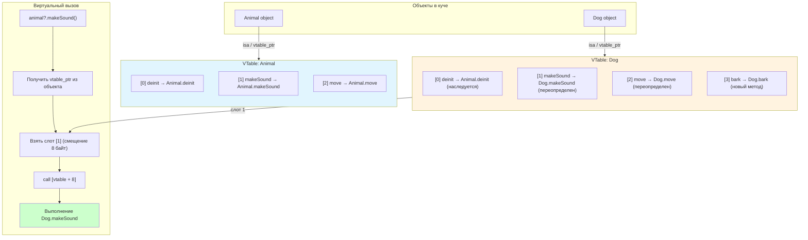

#swift #dispatch #table-dispatch #vtable #dynamic-dispatch #performance #polymorphism

---
### Определение
**Table Dispatch (vtable — virtual table)** — это вид динамической диспетчеризации, используемый в Swift для методов классов, которые могут быть переопределены в подклассах . При таком вызове компилятор создает таблицу виртуальных методов (vtable) для каждого класса, и вызов метода выполняется через поиск в этой таблице во время выполнения .

Table Dispatch обеспечивает полиморфное поведение (возможность переопределения методов), при этом сохраняя более высокую производительность по сравнению с Message Dispatch, так как не использует [[Objective-C]] [[runtime]] .

### Зачем это знать iOS-разработчику?
1.  **Полиморфизм:** Table Dispatch — основной механизм, обеспечивающий переопределение методов в классах .
2.  **Производительность:** Быстрее [[Message Dispatch]] (~3–5 нс против ~10–20 нс), но медленнее [[Direct Dispatch]] .
3.  **Понимание классов:** Важно знать, какие методы используют Table Dispatch для оптимизации .
4.  **Оптимизация:** Использование `final` может переключить метод на Direct Dispatch .
5.  **Анализ кода:** Понимание помогает предсказывать производительность вызовов .

---

### Table Dispatch vs Другие виды диспетчеризации

| Вид диспетчеризации                                           | Время определения | Скорость | Полиморфизм | Переопределение | Инлайнинг     | Динамическая замена |
| ------------------------------------------------------------- | ----------------- | -------- | ----------- | --------------- | ------------- | ------------------- |
| **[[Direct Dispatch\|Direct]] / [[Static Dispatch\|Static]]** | Компиляция        | ★★★★★    | Нет         | Нет             | Да            | Нет                 |
| **Table (vtable)**                                            | Выполнение        | ★★★★☆    | Да          | Да              | Редко         | Нет                 |
| **[[Witness Table]]**                                         | Выполнение        | ★★★★☆    | Да          | Да              | Редко         | Нет                 |
| **[[Message Dispatch\|Message]]**                             | Выполнение        | ★★☆☆☆    | Да          | Да              | Почти никогда | Да                  |

**Примерные цифры производительности:**
- **Direct Dispatch:** ~1–2 нс
- **Table Dispatch:** ~3–5 нс
- **Witness Table:** ~3–5 нс
- **Message Dispatch:** ~10–20 нс

---

### Как работает Table Dispatch (vtable)



**Ключевые компоненты:**
- **vtable (virtual table):** Массив указателей на методы класса.
- **isa pointer:** Указатель на класс объекта, содержащий ссылку на vtable.
- **Косвенный вызов:** Вызов через индекс в таблице (например, `object.vtable[0]()`).

---

### Когда используется Table Dispatch

#### 1. **Обычные методы классов (без final)**

```swift
class Animal {
    // Table Dispatch — может быть переопределен
    func makeSound() {
        print("Generic sound")
    }
    
    func move() {
        print("Moving")
    }
}

class Dog: Animal {
    // Table Dispatch — переопределение
    override func makeSound() {
        print("Woof!")
    }
}

let animal: Animal = Dog()
animal.makeSound()  // Table Dispatch → "Woof!"
```

#### 2. **Методы, не помеченные [[final]]**

```swift
class Service {
    // Table Dispatch
    func process() { }
    
    // Direct Dispatch (final)
    final func critical() { }
}
```

#### 3. **Свойства классов ([[get]]/[[Set Collection]])**

```swift
class Person {
    // Геттер и сеттер через Table Dispatch
    var name: String = ""
    
    // Вычисляемое свойство — Table Dispatch
    var greeting: String {
        return "Hello, \(name)"
    }
}
```

---

### Примеры кода

#### 1. **Базовый полиморфизм**

```swift
class Shape {
    func draw() { print("Drawing shape") }
    func area() -> Double { return 0 }
}

class Circle: Shape {
    override func draw() { print("Drawing circle") }
    override func area() -> Double { return Double.pi * radius * radius }
    var radius: Double = 1.0
}

class Square: Shape {
    override func draw() { print("Drawing square") }
    override func area() -> Double { return side * side }
    var side: Double = 1.0
}

let shapes: [Shape] = [Circle(), Square(), Shape()]
for shape in shapes {
    shape.draw()   // Table Dispatch — правильная реализация
}
```

#### 2. **Влияние [[final]] на диспетчеризацию**

```swift
class Parent {
    func methodA() { }        // Table Dispatch
    final func methodB() { }  // Direct Dispatch
}

class Child: Parent {
    override func methodA() { }  // Table Dispatch
    // Нельзя override methodB()
}
```

#### 3. **Vtable в памяти**

```swift
// Упрощенное представление vtable
class MyClass {
    func method1() { }
    func method2() { }
    func method3() { }
}

// vtable для MyClass:
// [method1 IMP, method2 IMP, method3 IMP]

class SubClass: MyClass {
    override func method2() { }
}

// vtable для SubClass:
// [method1 IMP (унаследованный), method2 IMP (переопределенный), method3 IMP (унаследованный)]
```

---

### Table Dispatch в иерархии классов

```swift
class A {
    func a() { }  // Table: индекс 0
    func b() { }  // Table: индекс 1
}

class B: A {
    override func a() { }  // Table: индекс 0 (переопределен)
    func c() { }           // Table: новый метод — индекс 2
}

class C: B {
    override func b() { }  // Table: индекс 1 (переопределен)
    override func c() { }  // Table: индекс 2 (переопределен)
}

// vtable для C:
// [a: B.a, b: C.b, c: C.c]
```

---

### Производительность: пример измерения

```swift
import Darwin

class Test {
    // Table Dispatch
    func tableMethod() { }
    
    // Direct Dispatch
    final func directMethod() { }
}

func measure(_ name: String, iterations: Int, _ block: () -> Void) {
    let start = mach_absolute_time()
    for _ in 0..<iterations {
        block()
    }
    let end = mach_absolute_time()
    
    var info = mach_timebase_info()
    mach_timebase_info(&info)
    let elapsed = (end - start) * UInt64(info.numer) / UInt64(info.denom)
    let avg = Double(elapsed) / Double(iterations)
    print("\(name): \(String(format: "%.2f", avg)) нс")
}

let test = Test()
measure("Table", iterations: 10_000_000) {
    test.tableMethod()
}

measure("Direct", iterations: 10_000_000) {
    test.directMethod()
}

// Примерный результат:
// Table: 3.5 нс
// Direct: 1.2 нс
```

---

### Оптимизации для Table Dispatch

#### 1. **Используйте final для методов, которые не нужно переопределять**

```swift
class Service {
    // Table Dispatch
    func optionalOverride() { }
    
    // Direct Dispatch — быстрее
    final func criticalPath() { }
}
```

#### 2. **Используйте final для всего класса, если наследование не нужно**

```swift
// ✅ Хорошо — все методы Direct Dispatch
final class FastService {
    func process() { }
}

// ❌ Медленнее — Table Dispatch для всех методов
class SlowService {
    func process() { }
}
```

#### 3. **Помечайте методы, вызываемые в циклах, как final**

```swift
class Processor {
    final func processItem(_ item: Int) -> Int {
        return item * 2
    }
    
    func processAll(_ items: [Int]) -> [Int] {
        return items.map { processItem($0) }  // Direct Dispatch
    }
}
```

---

### Table Dispatch vs Witness Table

| Характеристика | Table Dispatch | Witness Table |
|----------------|----------------|---------------|
| **Используется для** | Классы | Протоколы |
| **Где хранится таблица** | В классе (vtable) | В existential container |
| **Скорость** | ~3–5 нс | ~3–5 нс |
| **Полиморфизм** | Да | Да |
| **Пример** | `class Animal { func sound() }` | `protocol Animal { func sound() }` |

---

### Когда Table Dispatch предпочтительнее

| Сценарий                      | Рекомендация        | Почему                     |
| ----------------------------- | ------------------- | -------------------------- |
| **Полиморфизм**               | ✅ Table Dispatch    | Позволяет переопределение  |
| **Горячие циклы**             | ❌ Используйте final | Direct Dispatch быстрее    |
| **Библиотечные классы**       | ✅ Table Dispatch    | Для расширяемости          |
| **Objective-C совместимость** | ❌ Message Dispatch  | Для [[KVO]], [[Swizzling]] |

---

### Лучшие практики

#### 1. **По умолчанию используйте классы с Table Dispatch для расширяемости**

```swift
// Хорошо для библиотек и фреймворков
open class LibraryClass {
    public func customize() { }  // Table Dispatch
}
```

#### 2. **В приложении, если наследование не нужно, используйте final**

```swift
// Внутри приложения — быстрее
final class AppService {
    func process() { }  // Direct Dispatch
}
```

#### 3. **Для горячих путей делайте методы final**

```swift
class DataProcessor {
    final func transform(_ data: Data) -> Data { }  // Direct Dispatch
}
```

---

### Короткое правило

> **Table Dispatch** — основной механизм полиморфизма в Swift-классах.  
> Используйте `final` для методов и классов, чтобы ускорить вызовы до Direct Dispatch.  
> Table Dispatch быстрее Message Dispatch, но медленнее Direct.

### Итог

**Table Dispatch (vtable)** — ключевой механизм динамической диспетчеризации в Swift:

1.  **Средняя скорость** (~3–5 нс) — быстрее Message, медленнее Direct .
2.  **Обеспечивает полиморфизм** — позволяет переопределять методы .
3.  **Применяется для**:
    - Обычных методов классов (не final)
    - Свойств классов
    - Переопределенных методов
4.  **Оптимизация**:
    - Используйте `final` для переключения на Direct Dispatch
    - Для классов без наследования делайте их `final`
5.  **Сравнение с другими**:
    - Direct Dispatch → быстрее, но нет полиморфизма
    - Message Dispatch → медленнее, но динамическая замена методов

Понимание Table Dispatch важно для баланса между производительностью и гибкостью при проектировании иерархий классов .