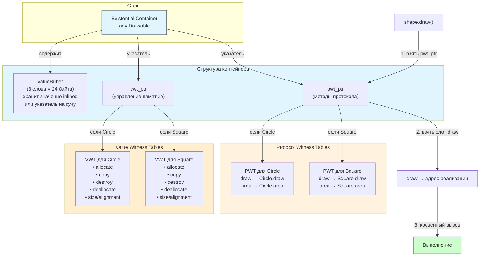

#swift #dispatch #witness-table #protocol #dynamic-dispatch #performance #existential

---
### Определение
**Witness Table** — это вид динамической диспетчеризации, используемый в [[Swift]] для вызова методов протоколов. Каждый тип, соответствующий протоколу, имеет свою **witness table** — таблицу указателей на реализации требований протокола . При вызове метода через [[existential type]] ([[any Protocol]]) или протокол в качестве параметра, вызов выполняется через поиск в witness table во время выполнения .

Witness Table обеспечивает полиморфное поведение для протоколов, сохраняя производительность на уровне [[Table Dispatch]] (vtable) и не требуя наследования от [[NSObject]] .

### Зачем это знать iOS-разработчику?
1.  **Протокол-ориентированное программирование:** Witness Table — основа динамической диспетчеризации для протоколов .
2.  **Производительность:** Понимание overhead existential типов помогает оптимизировать код .
3.  **[[Generic]] vs Existential:** Важно знать разницу между [[some Protocol]] (статическая) и [[any Protocol]] (динамическая) .
4.  **Оптимизация:** Использование [[generic]]s может заменить witness table на [[static dispatch]] .
5.  **Swift 6:** Усиление рекомендаций по использованию [[some]] вместо [[any]] для производительности .

---

### Witness Table vs Другие виды диспетчеризации

| Вид диспетчеризации | Время определения | Скорость | Полиморфизм | Переопределение | Инлайнинг | Использование |
|---------------------|-------------------|----------|-------------|-----------------|-----------|---------------|
| **Direct / Static** | Компиляция | ★★★★★ | Нет | Нет | Да | struct, final class, generic |
| **Table (vtable)** | Выполнение | ★★★★☆ | Да | Да | Редко | Классы |
| **Witness Table** | Выполнение | ★★★★☆ | Да | Да | Редко | Протоколы (existential) |
| **Message** | Выполнение | ★★☆☆☆ | Да | Да | Почти никогда | @objc, dynamic |

**Примерные цифры производительности:**
- **Direct Dispatch:** ~1–2 нс
- **Table Dispatch:** ~3–5 нс
- **Witness Table:** ~3–5 нс
- **Message Dispatch:** ~10–20 нс

---

### Как работает Witness Table



**Ключевые компоненты:**
- **[[Existential Container]]:** Структура (~40–48 байт), хранящая:
  - Буфер значений (value buffer) — до 24 байт (или указатель на кучу)
  - Value Witness Table (vwt) — управление жизненным циклом (копирование, освобождение)
  - Protocol Witness Table (pwt) — таблица методов протокола
- **Protocol Witness Table:** Массив указателей на реализации методов для конкретного типа.

---

### Когда используется Witness Table

#### 1. **Existential type (any Protocol)**

```swift
protocol Drawable {
    func draw()
    func area() -> Double
}

struct Circle: Drawable {
    func draw() { print("○") }
    func area() -> Double { return Double.pi * radius * radius }
    var radius: Double = 1.0
}

struct Square: Drawable {
    func draw() { print("□") }
    func area() -> Double { return side * side }
    var side: Double = 1.0
}

// Existential container с witness table
let shapes: [any Drawable] = [Circle(), Square()]

for shape in shapes {
    shape.draw()   // Witness Table Dispatch
}
```

#### 2. **Параметры типа any Protocol**

```swift
func drawShape(_ shape: any Drawable) {
    shape.draw()  // Witness Table Dispatch
}

drawShape(Circle())  // создается existential container
```

#### 3. **Свойства типа any Protocol**

```swift
class Canvas {
    var currentShape: any Drawable  // Witness Table для доступа
}
```

---

### Примеры кода

#### 1. **Базовый протокол с witness table**

```swift
protocol Animal {
    func sound()
    func move()
}

struct Dog: Animal {
    func sound() { print("Woof!") }
    func move() { print("Running") }
}

struct Cat: Animal {
    func sound() { print("Meow!") }
    func move() { print("Walking") }
}

let animals: [any Animal] = [Dog(), Cat()]

for animal in animals {
    animal.sound()   // Witness Table — разные реализации
    animal.move()    // Witness Table
}
```

#### 2. **Existential container в памяти**

```swift
print(MemoryLayout<Circle>.size)        // 8 (radius)
print(MemoryLayout<any Drawable>.size)  // 40 (existential container)
// 40 = 24 (value buffer) + 8 (vwt) + 8 (pwt)
```

#### 3. **Generic vs Existential**

```swift
// ❌ Existential — witness table overhead
func drawExistential(_ shape: any Drawable) {
    shape.draw()  // ~3–5 нс, witness table
}

// ✅ Generic — static dispatch
func drawGeneric<T: Drawable>(_ shape: T) {
    shape.draw()  // ~1–2 нс, direct
}

let circle = Circle()
drawExistential(circle)  // witness table
drawGeneric(circle)      // static dispatch
```

---

### Witness Table vs vtable: сравнение

| Характеристика          | Witness Table              | vtable (Table Dispatch)         |
| ----------------------- | -------------------------- | ------------------------------- |
| **Используется для**    | Протоколы                  | Классы                          |
| **Где хранится**        | В existential container    | В классе                        |
| **Создание**            | При соответствии протоколу | При создании класса             |
| **[[Overhead]] памяти** | ~40–48 байт на existential | ~8 байт на объект (isa)         |
| **Скорость**            | ~3–5 нс                    | ~3–5 нс                         |
| **Пример**              | `any Drawable`             | `class Animal { func sound() }` |

---

### Производительность: пример измерения

```swift
import Darwin

protocol EmptyProtocol {
    func method()
}

struct MyType: EmptyProtocol {
    func method() { }
}

func measure(_ name: String, iterations: Int, _ block: () -> Void) {
    let start = mach_absolute_time()
    for _ in 0..<iterations {
        block()
    }
    let end = mach_absolute_time()
    
    var info = mach_timebase_info()
    mach_timebase_info(&info)
    let elapsed = (end - start) * UInt64(info.numer) / UInt64(info.denom)
    let avg = Double(elapsed) / Double(iterations)
    print("\(name): \(String(format: "%.2f", avg)) нс")
}

// Direct (generic)
func directCall<T: EmptyProtocol>(_ value: T) {
    value.method()
}

// Existential (witness table)
func existentialCall(_ value: any EmptyProtocol) {
    value.method()
}

let value = MyType()

measure("Direct (generic)", iterations: 10_000_000) {
    directCall(value)
}

measure("Existential (witness)", iterations: 10_000_000) {
    existentialCall(value)
}

// Примерный результат:
// Direct (generic): 1.2 нс
// Existential (witness): 3.8 нс
```

---

### Оптимизации для Witness Table

#### 1. **Используйте generics вместо existential**

```swift
// ❌ Existential — witness table
func process(_ items: [any Drawable]) {
    for item in items {
        item.draw()  // witness table на каждой итерации
    }
}

// ✅ Generic — static dispatch
func process<T: Drawable>(_ items: [T]) {
    for item in items {
        item.draw()  // static dispatch
    }
}
```

#### 2. **Используйте opaque types (some) для возвращаемых значений**

```swift
// ❌ Existential — witness table
func makeDrawable() -> any Drawable {
    return Circle()
}

// ✅ Opaque type — static dispatch
func makeDrawable() -> some Drawable {
    return Circle()  // тип известен компилятору
}
```

#### 3. **Для коллекций используйте generic constraints**

```swift
// ❌ Existential overhead
struct Container {
    var items: [any Drawable]  // witness table для каждого элемента
}

// ✅ Generic — static
struct Container<T: Drawable> {
    var items: [T]  // тип известен
}
```

#### 4. **Используйте @inlinable для протоколов в библиотеках**

```swift
@inlinable
public func drawShape<T: Drawable>(_ shape: T) {
    shape.draw()  // может быть инлайнится
}
```

---

### Existential Container: детали

```swift
// Упрощенная структура existential container
struct ExistentialContainer<Protocol> {
    var valueBuffer: (UInt64, UInt64, UInt64)  // 24 байта для значения
    var valueWitnessTable: UnsafePointer<ValueWitnessTable>  // 8 байт
    var protocolWitnessTable: UnsafePointer<ProtocolWitnessTable>  // 8 байт
}

// Protocol Witness Table
struct ProtocolWitnessTable {
    var method1: UnsafeRawPointer
    var method2: UnsafeRawPointer
    // ...
}
```

**Когда значение попадает в кучу:**
- Если тип значения > 24 байт, existential container хранит указатель на объект в куче.
- Для классов всегда хранится ссылка (8 байт).

---

### Witness Table в Swift 6

Swift 6 усиливает рекомендации по производительности:

- **Предпочтение `some` над `any`** для возвращаемых значений .
- **Generics** для параметров вместо existential .
- **Акцент на статическую диспетчеризацию** для протоколов .

```swift
// Swift 6 — предпочтительный подход
protocol Renderable {
    func render()
}

// ✅ Хорошо — generic
func render<T: Renderable>(_ item: T) {
    item.render()
}

// ❌ Медленнее — existential
func render(_ item: any Renderable) {
    item.render()
}
```

---

### Короткое правило

> **Witness Table** — механизм динамической диспетчеризации для протоколов.  
> Используйте `any Protocol` только когда нужен динамический полиморфизм.  
> Для производительности предпочитайте **generics** (`<T: Protocol>`) и **opaque types** (`some Protocol`).

### Итог

**Witness Table** — ключевой механизм для протоколов в Swift:

1.  **Средняя скорость** (~3–5 нс) — быстрее Message, медленнее Direct .
2.  **Обеспечивает полиморфизм** для протоколов .
3.  **Применяется для**:
    - Existential types (`any Protocol`)
    - Параметров типа `any Protocol`
    - Свойств типа `any Protocol`
    - Коллекций `[any Protocol]`
4.  **Оптимизация**:
    - Используйте **generics** (`<T: Protocol>`) вместо existential
    - Используйте **opaque types** (`some Protocol`) для возвращаемых значений
    - Для коллекций используйте generic constraints
5.  **Overhead памяти**:
    - Existential container: ~40–48 байт
    - Для типов > 24 байт — дополнительная аллокация в куче

Понимание Witness Table важно для баланса между гибкостью протоколов и производительностью в Swift .