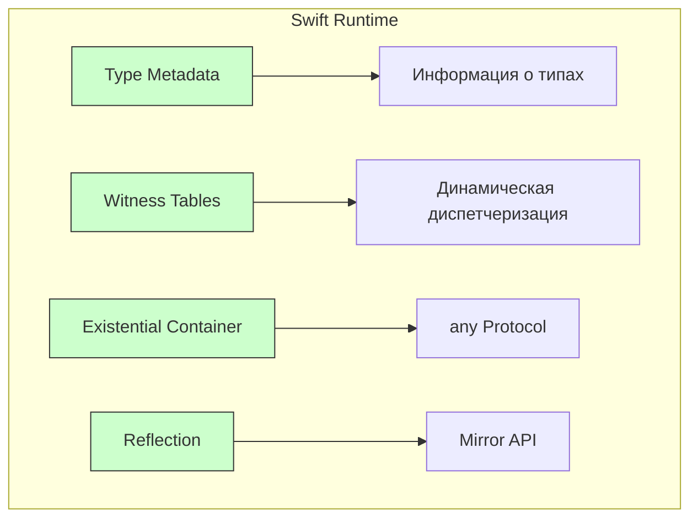
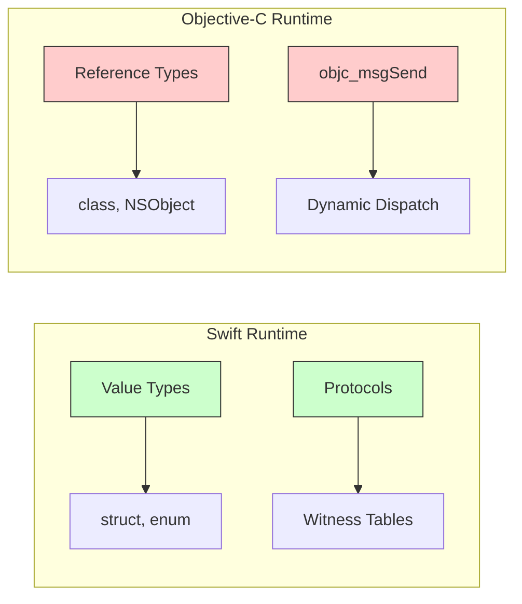

#swift #runtime #metadata #reflection #witness-table #type-system

---

### Определение

**Swift Runtime** — это низкоуровневая часть стандартной библиотеки [[Swift]], которая отвечает за **динамическое поведение языка** во время выполнения программы. Она обеспечивает работу механизмов, которые невозможно реализовать на этапе компиляции: рефлексию, динамическую диспетчеризацию, приведение типов и управление памятью.

Swift Runtime — это **не** то же самое, что Objective-C Runtime. С 2019–2020 годов (Swift 5.1+) большая часть динамики переехала на **нативный Swift Runtime**, хотя ObjC-рантайм всё ещё используется для совместимости с Cocoa/[[Foundation]]/[[UIKit]].



---

### Что обеспечивает Swift Runtime

| Компонент                      | Что делает                                                                 | Когда активно используется                                           |
| ------------------------------ | -------------------------------------------------------------------------- | -------------------------------------------------------------------- |
| **Type Metadata**              | Хранит информацию о типе: имя, размер, alignment, vtable, протоколы и т.д. | `type(of:)`, `Mirror`, [[generic]], [[Any]]                          |
| **Value Witness Table**        | Функции копирования, перемещения, уничтожения [[value type]]s              | [[struct]], [[enum]], [[Array]] ([[Copy-On-Write\|COW]]), [[String]] |
| **Protocol [[Witness Table]]** | Таблица реализаций протокола для конкретного типа                          | [[Protocol]], [[any]], [[some]], динамический вызов                  |
| **VTable / Dispatch Table**    | Таблица виртуальных методов для классов                                    | [[class]] без `final`, `override`                                    |
| **[[Existential Container]]**  | Хранит значение `any Protocol` (value buffer + metadata + witness table)   | [[any Protocol]], `Any`, [[AnyObject]]                               |
| **Error Handling**             | Поддержка `throw`, `try`, `catch`, `throws`, `rethrows`                    | Все [[throws]]-функции                                               |
| **Dynamic Casting**            | Реализация `as?`, `as!`, `is`                                              | Приведение типов во время выполнения                                 |
| **Reflection [[API]]**         | Mirror, CustomReflectable, ReflectionMirror                                | Отладка, сериализация, инспекторы                                    |

---

### Swift Runtime vs Objective-C Runtime

| Аспект | Swift Runtime | Objective-C Runtime |
|---|---|---|
| **Основной механизм** | Value Witness Table, Protocol Witness Table, VTable | objc_msgSend + dispatch table |
| **Скорость** | Очень быстрая (статическая + динамическая) | Медленнее (всегда динамическая) |
| **Поддержка value types** | Полная (struct, enum, generics) | Отсутствует |
| **Рефлексия** | `Mirror`, `Reflection` | `class_getInstanceMethod`, `objc_property_t` |
| **Method Swizzling** | Сложно (требует `@objc`) | Легко (`method_exchangeImplementations`) |
| **Использование в чистом Swift** | Основной | Только для ObjC-интеропа |



---

### Основные компоненты Swift Runtime

#### 1. Type Metadata (Метаданные типа)

Каждый тип в Swift имеет метаданные — структуру, содержащую информацию о типе.

```swift
import Foundation

struct User {
    let name: String
    let age: Int
}

let user = User(name: "Alice", age: 30)

// Получение метаданных типа
let typeInfo = type(of: user)
print(typeInfo)                // User

// Размер типа в памяти
print(MemoryLayout<User>.size)     // 32 (String 16 + Int 8 + alignment)
print(MemoryLayout<User>.stride)   // 32
print(MemoryLayout<User>.alignment)// 8
```

#### 2. Value Witness Table (VWT)

VWT — это таблица функций для управления жизненным циклом value types.

```swift
struct Point {
    var x, y: Int
}

// Компилятор автоматически создаёт VWT для Point:
// - initializeWithCopy: копирование
// - assignWithCopy: присваивание с копированием
// - destroy: уничтожение
// - и т.д.

var p1 = Point(x: 1, y: 2)
var p2 = p1  // используется VWT для копирования
```

#### 3. Protocol Witness Table (PWT)

PWT — таблица реализаций методов протокола для конкретного типа.

```swift
protocol Drawable {
    func draw() -> String
}

struct Circle: Drawable {
    func draw() -> String { return "○" }
}

struct Square: Drawable {
    func draw() -> String { return "□" }
}

// Для Circle создаётся PWT: [draw → Circle.draw]
// Для Square создаётся PWT: [draw → Square.draw]

let shapes: [any Drawable] = [Circle(), Square()]
for shape in shapes {
    print(shape.draw())  // вызов через PWT
}
```

#### 4. VTable (Virtual Table)

VTable — таблица виртуальных методов для классов.

```swift
class Animal {
    func sound() -> String { return "???" }
    func move() -> String { return "moving" }
}

class Dog: Animal {
    override func sound() -> String { return "Woof!" }
}

class Cat: Animal {
    override func sound() -> String { return "Meow!" }
}

// VTable для Animal: [sound → Animal.sound, move → Animal.move]
// VTable для Dog:     [sound → Dog.sound, move → Animal.move]
// VTable для Cat:     [sound → Cat.sound, move → Animal.move]

let animals: [Animal] = [Dog(), Cat()]
for animal in animals {
    print(animal.sound())  // вызов через VTable
}
```

#### 5. Existential Container (Экзистенциальный контейнер)

Когда вы используете `any Protocol`, Swift создаёт контейнер для хранения значения.

```swift
protocol Drawable {
    func draw()
}

struct SmallShape: Drawable {  // ≤ 24 байта
    let x, y: Int
    func draw() { print("○") }
}

struct LargeShape: Drawable {  // > 24 байта
    let a, b, c, d: Int
    func draw() { print("□") }
}

// Existential container (32 байта на 64-bit):
// - value buffer (24 байта) — для SmallShape (inline) или указатель на кучу для LargeShape
// - Protocol Witness Table (8 байт) — указатель на методы Drawable
// - Value Witness Table (8 байт) — указатель на функции копирования/уничтожения

let small: any Drawable = SmallShape(x: 1, y: 2)   // inline в контейнере
let large: any Drawable = LargeShape(a: 1, b: 2, c: 3, d: 4)  // значение в куче
```

---

### Примеры использования Swift Runtime на практике

#### 1. Простая рефлексия (Mirror)

```swift
struct User {
    let name: String
    var age: Int
    private var password: String = "secret"
}

let user = User(name: "Анна", age: 28)

let mirror = Mirror(reflecting: user)
print("Тип:", mirror.subjectType)           // User
print("Количество детей:", mirror.children.count) // 2 (name и age)

for child in mirror.children {
    print("Свойство:", child.label ?? "—", "=", child.value)
}
// name = Анна
// age = 28
// password НЕ видно (private)
```

#### 2. Динамическое создание типа (через Type Metadata)

```swift
func createInstance<T>(of type: T.Type) -> T? where T: ExpressibleByStringLiteral {
    return type.init("Hello from runtime")
}

let str = createInstance(of: String.self)   // "Hello from runtime"
let path = createInstance(of: NSString.self)  // "Hello from runtime"
```

#### 3. Проверка соответствия протоколу в runtime

```swift
protocol Loggable {
    func log()
}

extension String: Loggable {
    func log() { print("String:", self) }
}

let value: Any = "Test log"
if let loggable = value as? Loggable {
    loggable.log()  // → String: Test log
}
```

#### 4. Witness Table в действии (протоколы)

```swift
protocol Drawable {
    func draw()
}

struct Circle: Drawable {
    func draw() { print("○") }
}

let shape: any Drawable = Circle()
shape.draw()  // вызов через witness table
```

#### 5. Dynamic Casting (as?, as!)

```swift
func process(value: Any) {
    if let string = value as? String {
        print("String: \(string)")
    } else if let int = value as? Int {
        print("Int: \(int)")
    } else {
        print("Unknown type")
    }
}

process(value: "Hello")   // String: Hello
process(value: 42)        // Int: 42
process(value: 3.14)      // Unknown type
```

---

### Когда Swift Runtime активно работает в 2026 году

| Сценарий | Использует Swift Runtime? |
|---|---|
| `any Protocol` и `some Protocol` | ✅ Да (Witness Table, Existential Container) |
| `Mirror` и рефлексия | ✅ Да (Type Metadata) |
| `as?`, `as!`, `is` | ✅ Да (Dynamic Casting) |
| Generics с протоколами | ✅ Да (Witness Table) |
| Динамические вызовы в классах без `final` | ✅ Да (VTable) |
| Обработка ошибок (throws, try) | ✅ Да (Error Handling) |
| `type(of:)`, MemoryLayout | ✅ Да (Type Metadata) |
| `@objc` методы | ❌ Нет (Objective-C Runtime) |
| UIKit/AppKit API | ❌ Нет (Objective-C Runtime) |

---

### Swift Runtime и производительность

| Механизм | Примерный overhead | Когда критично |
|---|---|---|
| **Static dispatch** | ~0 нс | Всегда предпочтительнее |
| **VTable dispatch** | ~3-5 нс | В горячих циклах |
| **Witness Table dispatch** | ~3-5 нс | В горячих циклах |
| **Existential container** | ~32 байта + возможный heap | При большом количестве `any` |
| **Dynamic casting (as?)** | ~10-20 нс | В циклах с большим количеством элементов |

```swift
// Быстро (static dispatch)
struct FastShape {
    func draw() { print("○") }
}

// Медленнее (witness table dispatch)
protocol Shape { func draw() }
struct SlowShape: Shape { func draw() { print("○") } }
let shape: any Shape = SlowShape()
shape.draw()  // dynamic dispatch
```

---

### Итог — коротко и честно

- **Swift Runtime** — это **нативная** динамика Swift (с 2019+)
- Он **быстрее** и **мощнее** ObjC Runtime для value types и generics
- ObjC Runtime всё ещё живёт для совместимости с Cocoa/UIKit/AppKit
- В чистом Swift-коде ты работаешь почти всегда с **Swift Runtime**

**Главное правило**:
> «Если ты пишешь чистый Swift без `@objc` и Foundation — ты работаешь с **Swift Runtime**.  
> Если используешь UIKit/AppKit/ObjC API — под капотом включается **Objective-C Runtime**.»

**Самые частые места, где ты «видишь» его работу:**
- `Mirror` (рефлексия)
- `any` / `some` протоколы
- `as?` / `as!` (приведение типов)
- вызовы методов классов без `final`