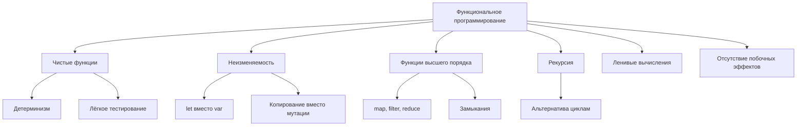

#fp #functional-programming #swift #immutability #pure-functions #higher-order #map-filter-reduce

---

## Функциональное программирование (FP) в [[Swift]]

### Определение
**Функциональное программирование (Functional Programming, FP)** — это парадигма программирования, в которой вычисления строятся как **применение функций к значениям**, избегая изменения состояния и мутабельных данных. FP рассматривает функции как **граждане первого класса** (их можно передавать, возвращать, присваивать) и делает акцент на **декларативном** стиле (описание *что* нужно сделать, а не *как*).

Swift не является чисто функциональным языком (как Haskell), но активно поддерживает функциональные концепции: функции высшего порядка, неизменяемые типы (структуры, `let`), замыкания и возможность писать чистые функции.

### Зачем это знать iOS-разработчику?
1.  **Повышение надёжности:** Чистые функции и неизменяемые данные уменьшают количество багов.
2.  **Параллелизм:** Отсутствие мутабельного состояния упрощает многопоточное программирование.
3.  **Читаемость:** Декларативный код (цепочки `map`/`filter`/`reduce`) легче понять.
4.  **Тестируемость:** Чистые функции легко тестировать изолированно.
5.  **SwiftUI:** Декларативный UI — прямое следствие функциональных идей.

---

### Ключевые принципы FP



---

## 1. Чистые функции (Pure Functions)

Чистая функция:
- **Детерминирована** — одинаковые входы дают одинаковые выходы.
- **Не имеет побочных эффектов** — не меняет внешнее состояние.

```swift
// ❌ Нечистая функция (побочный эффект + зависит от внешнего состояния)
var counter = 0
func increment() -> Int {
    counter += 1  // побочный эффект
    return counter
}

// ❌ Нечистая функция (зависит от времени)
func getCurrentTime() -> String {
    return Date().description  // разный результат на каждый вызов
}

// ✅ Чистая функция
func add(_ a: Int, _ b: Int) -> Int {
    return a + b  // всегда a+b
}

// ✅ Чистая функция (даже с модификацией, но локальной)
func processNumbers(_ numbers: [Int]) -> [Int] {
    return numbers.map { $0 * 2 }  // не меняет входной массив
}
```

---

## 2. Неизменяемость (Immutability)

В FP предпочитают неизменяемые данные. В Swift это достигается через `let` и структуры.

```swift
// ❌ Мутабельный подход
var numbers = [1, 2, 3, 4, 5]
numbers.append(6)
numbers[0] = 0

// ✅ Иммутабельный подход
let numbers = [1, 2, 3, 4, 5]
let newNumbers = numbers + [6]
let updatedNumbers = [0] + numbers.dropFirst()
```

**Структуры и неизменяемость:**

```swift
struct Point {
    let x: Int
    let y: Int
}

let p1 = Point(x: 1, y: 2)
// p1.x = 3  // ❌ Ошибка: нельзя изменить let свойство

// Создаём новую копию
let p2 = Point(x: p1.x + 1, y: p1.y)
```

---

## 3. Функции высшего порядка (Higher-Order Functions)

Функции, которые принимают другие функции как аргументы или возвращают их.

### 3.1 [[map]] — преобразование элементов

```swift
let numbers = [1, 2, 3, 4, 5]

// Императивный подход
var doubled: [Int] = []
for n in numbers {
    doubled.append(n * 2)
}

// Декларативный (FP) подход
let doubledFP = numbers.map { $0 * 2 }      // [2, 4, 6, 8, 10]
let strings = numbers.map { "Item \($0)" }  // ["Item 1", "Item 2", ...]
```

### 3.2 [[filter]] — фильтрация

```swift
let numbers = [1, 2, 3, 4, 5, 6, 7, 8, 9, 10]

let evens = numbers.filter { $0 % 2 == 0 }  // [2, 4, 6, 8, 10]
let greaterThan5 = numbers.filter { $0 > 5 } // [6, 7, 8, 9, 10]
```

### 3.3 [[reduce]] — свёртка

```swift
let numbers = [1, 2, 3, 4, 5]

let sum = numbers.reduce(0, +)        // 15
let product = numbers.reduce(1, *)    // 120
let concatenated = numbers.reduce("") { $0 + "\($1)" }  // "12345"
```

### 3.4 [[compactMap]] — фильтрация nil

```swift
let strings = ["1", "a", "2", "b", "3"]
let ints = strings.compactMap { Int($0) }  // [1, 2, 3]
```

### 3.5 [[flatMap]] — разворачивание вложенных массивов

```swift
let nested = [[1, 2], [3, 4], [5]]
let flat = nested.flatMap { $0 }  // [1, 2, 3, 4, 5]
```

### 3.6 zip и комбинации

```swift
let names = ["Alice", "Bob", "Charlie"]
let ages = [25, 30, 35]

let pairs = zip(names, ages).map { "\($0) is \($1)" }
// ["Alice is 25", "Bob is 30", "Charlie is 35"]
```

---

## 4. Цепочки вызовов ([[Chaining]])

```swift
let numbers = [1, 2, 3, 4, 5, 6, 7, 8, 9, 10]

let result = numbers
    .filter { $0 % 2 == 0 }      // [2, 4, 6, 8, 10]
    .map { $0 * $0 }              // [4, 16, 36, 64, 100]
    .reduce(0, +)                 // 220

print(result)  // 220
```

---

## 5. Ленивые вычисления (Lazy Evaluation)

```swift
let numbers = [1, 2, 3, 4, 5]

// Обычная цепочка — создаёт промежуточные массивы
let result = numbers
    .map { $0 * 2 }
    .filter { $0 > 5 }
    .prefix(2)

// Ленивая цепочка — вычисления происходят только когда нужны
let lazyResult = numbers.lazy
    .map { $0 * 2 }
    .filter { $0 > 5 }
    .prefix(2)

// Только необходимые элементы будут обработаны
```

---

## 6. Замыкания как функции

```swift
// Функция, возвращающая другую функцию
func makeMultiplier(factor: Int) -> (Int) -> Int {
    return { $0 * factor }
}

let multiplyBy2 = makeMultiplier(factor: 2)
let multiplyBy3 = makeMultiplier(factor: 3)

print(multiplyBy2(5))  // 10
print(multiplyBy3(5))  // 15

// Каррирование (currying)
func add(_ a: Int) -> (Int) -> Int {
    return { b in a + b }
}

let add5 = add(5)
print(add5(3))  // 8
```

---

## 7. Рекурсия

```swift
// Императивный подход (цикл)
func factorialIterative(_ n: Int) -> Int {
    var result = 1
    for i in 1...n {
        result *= i
    }
    return result
}

// Рекурсивный подход (FP)
func factorialRecursive(_ n: Int) -> Int {
    return n <= 1 ? 1 : n * factorialRecursive(n - 1)
}

print(factorialRecursive(5))  // 120
```

---

## 8. FP и [[OOP|ООП]] в Swift: сравнение

| Характеристика       | FP                      | ООП                          |
| -------------------- | ----------------------- | ---------------------------- |
| **Состояние**        | Неизменяемое            | Изменяемое (внутри объектов) |
| **Стиль**            | Декларативный           | Императивный                 |
| **Основная единица** | Функция                 | Объект                       |
| **Данные**           | Отдельно от поведения   | Внутри объекта               |
| **Побочные эффекты** | Избегаются              | Часто присутствуют           |
| **Параллелизм**      | Безопасен по умолчанию  | Требует синхронизации        |
| **Тестирование**     | Легкое (чистые функции) | Зависит от состояния         |

### Пример одной задачи в двух парадигмах

```swift
// Исходные данные
let users = [
    User(name: "Alice", age: 25, isActive: true),
    User(name: "Bob", age: 17, isActive: true),
    User(name: "Charlie", age: 30, isActive: false),
    User(name: "Diana", age: 22, isActive: true)
]

// 🏛️ ООП подход
class UserProcessor {
    func getActiveAdultNames(users: [User]) -> [String] {
        var result: [String] = []
        for user in users {
            if user.isActive && user.age >= 18 {
                result.append(user.name.uppercased())
            }
        }
        return result
    }
}
let processor = UserProcessor()
let oopResult = processor.getActiveAdultNames(users: users)

// 🧬 FP подход
let fpResult = users
    .filter { $0.isActive && $0.age >= 18 }
    .map { $0.name.uppercased() }

// Оба дают ["ALICE", "DIANA"]
```

---

## 9. FP в [[SwiftUI]]

SwiftUI — декларативный фреймворк, вдохновлённый функциональными идеями.

```swift
import SwiftUI

struct ContentView: View {
    @State private var items = ["Apple", "Banana", "Orange"]
    @State private var filterText = ""
    
    var filteredItems: [String] {
        items
            .filter { filterText.isEmpty || $0.localizedCaseInsensitiveContains(filterText) }
            .sorted()
            .map { "🍎 \($0)" }
    }
    
    var body: some View {
        VStack {
            TextField("Filter", text: $filterText)
                .textFieldStyle(RoundedBorderTextFieldStyle())
                .padding()
            
            List(filteredItems, id: \.self) { item in
                Text(item)
            }
        }
    }
}
```

---

## 10. Функциональные библиотеки для Swift

- **[[Combine]]** — реактивное программирование ([[Publisher]]/[[Subscriber]])
- **Swift Algorithms** — расширенные алгоритмы для коллекций
- **Swift Collections** — дополнительные структуры данных
- **PointFree** — функциональные библиотеки (есть платные)

```swift
import Combine

// Combine — реактивная функциональная цепочка
let publisher = [1, 2, 3, 4, 5].publisher

publisher
    .map { $0 * 2 }
    .filter { $0 > 5 }
    .sink { print($0) }  // 6, 8, 10
```

---

### Преимущества FP

| Преимущество | Описание |
|--------------|----------|
| **Надёжность** | Чистые функции и неизменяемость уменьшают баги |
| **Параллелизм** | Нет гонок данных — безопасный многопоточный код |
| **Тестируемость** | Чистые функции легко тестировать |
| **Читаемость** | Декларативный код часто понятнее императивного |
| **Переиспользование** | Функции легко комбинировать |

### Недостатки FP

| Недостаток | Описание |
|------------|----------|
| **Производительность** | Копирование данных может быть дорогим |
| **Кривая обучения** | Непривычно для разработчиков с ООП-бэкграундом |
| **Рекурсия** | Может привести к переполнению стека (хвостовая рекурсия помогает) |
| **Чистота vs практичность** | Чистый FP не всегда практичен (логирование, ввод-вывод) |

---

### Короткое правило

> **Функциональное программирование** — описание *что*, а не *как*.  
> Используй **`let`**, **`map`**, **`filter`**, **`reduce`** вместо циклов и мутабельных переменных.  
> Думай о преобразованиях данных через цепочки чистых функций.

---

### Итог

**Функциональное программирование** в Swift:

1.  **Ключевые концепции:** чистые функции, неизменяемость, функции высшего порядка
2.  **Основные инструменты:** `map`, `filter`, `reduce`, `compactMap`, `flatMap`, `lazy`
3.  **Преимущества:** надёжность, тестируемость, параллелизм
4.  **Недостатки:** производительность копирования, кривая обучения
5.  **SwiftUI:** декларативный UI — прямое применение FP идей
6.  **Combine:** реактивное функциональное программирование

Swift не является чисто функциональным языком, но активно поддерживает FP-концепции. Сочетание ООП, POP и FP делает Swift мощным и гибким языком для разработки.