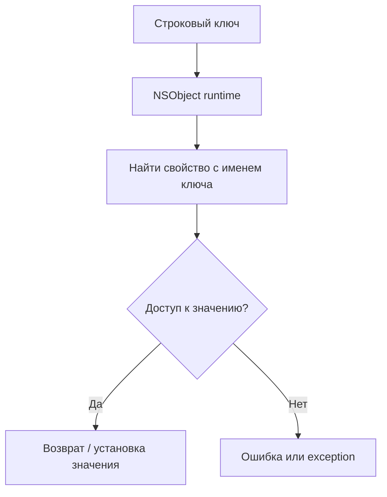

#general_theory #Swift
## 📘 Определение

**KVC (Key-Value Coding)** — это механизм, который позволяет **доступ к свойствам объектов через строки**, а не напрямую через свойства или методы.

Особенности:

- Часть **[[Objective-C]] [[runtime]]**, работает с [[NSObject]].
    
- Позволяет динамически получать и изменять значения свойств с помощью строковых ключей ([[String]]).
    
- Используется вместе с **[[KVO]]** для наблюдения за изменениями.
    

**Пример применения:**

- Доступ к свойству объекта по имени, переданному динамически.
    
- Массовое обновление свойств объектов.
    
- Использование в [[Core Data]] или Cocoa Bindings.
    

---

## 🔹 Примеры кода

### 1. Простейший пример

```swift
import Foundation

class Person: NSObject {
    @objc var name: String
    @objc var age: Int
    
    init(name: String, age: Int) {
        self.name = name
        self.age = age
    }
}

let person = Person(name: "Alice", age: 30)

// Получение значения через KVC
let nameValue = person.value(forKey: "name")
print(nameValue!) // Alice

// Установка значения через KVC
person.setValue("Bob", forKey: "name")
print(person.name) // Bob
```

---

### 2. Использование KVC с массивом ключей (`dictionaryWithValues(forKeys:)`)

```swift
let keys = ["name", "age"]
let dict = person.dictionaryWithValues(forKeys: keys)
print(dict) // ["name": "Bob", "age": 30]
```

---

### 3. Массовое обновление через `setValuesForKeys`

```swift
let updates: [String: Any] = ["name": "Charlie", "age": 25]
person.setValuesForKeys(updates)
print(person.name) // Charlie
print(person.age)  // 25
```

---

### 4. Доступ к вложенным свойствам (Key Path)

```swift
class Address: NSObject {
    @objc var city: String
    init(city: String) { self.city = city }
}

person.setValue(Address(city: "NY"), forKey: "address")
let city = person.value(forKeyPath: "address.city")
print(city!) // NY
```

---

### 5. Обработка ошибок при KVC

```swift
do {
    try person.validateValue("John", forKey: "name")
    person.setValue("John", forKey: "name")
} catch {
    print("Ошибка установки значения через KVC: \(error)")
}
```

---

## 🖼 Схема работы KVC



---

## 💡 Замечания

- KVC работает только с `NSObject` и свойствами, помеченными `@objc`.
    
- Позволяет **динамически управлять данными**, что полезно для UI, [[Core Data]] и сериализации.
    
- В [[Swift]] для большинства случаев лучше использовать **KeyPath** вместо KVC для безопасного доступа.
    
- KVC часто используется вместе с [[KVO]] для реактивного обновления UI.
    

---

## 📖 Дополнительно

- [Apple Docs — Key-Value Coding](https://developer.apple.com/documentation/objectivec/key-value_coding)
    
- [KVC vs Swift KeyPath](https://www.swiftbysundell.com/articles/key-paths-in-swift/)
    

---
