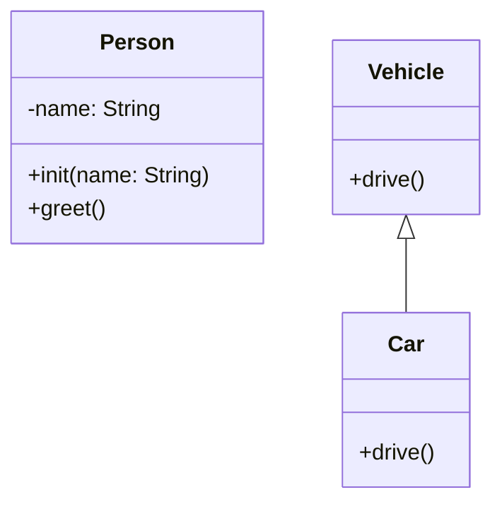

#general_theory #Swift
## 📘 Определение

**OOP (Object-Oriented Programming)** — это парадигма программирования, основанная на **объектах**, которые объединяют **данные** (свойства) и **поведение** (методы).

Основные принципы OOP:

1. **Инкапсуляция** — скрытие внутренней реализации объекта и предоставление интерфейса.
    
2. **Наследование** — возможность создавать новые классы на основе существующих.
    
3. **Полиморфизм** — объекты могут использовать один интерфейс, но реализовывать разные поведения.
    
4. **Абстракция** — выделение сущностей и их ключевых характеристик.
    

В [[Swift]] OOP реализуется через **классы**, **наследование**, **протоколы** и **extensions**.

---

## 🔹 Примеры кода

### 1. Простейший класс с инкапсуляцией

```swift
class Person {
    private var name: String
    
    init(name: String) {
        self.name = name
    }
    
    func greet() {
        print("Hello, my name is \(name)")
    }
}

let alice = Person(name: "Alice")
alice.greet() // Hello, my name is Alice
// alice.name // Ошибка: private
```

---

### 2. Наследование

```swift
class Vehicle {
    func drive() {
        print("Driving a vehicle")
    }
}

class Car: Vehicle {
    override func drive() {
        print("Driving a car")
    }
}

let car = Car()
car.drive() // Driving a car
```

---

### 3. Полиморфизм

```swift
let vehicles: [Vehicle] = [Vehicle(), Car()]

for v in vehicles {
    v.drive() // Vehicle или Car в зависимости от объекта
}
```

---

### 4. Абстракция через протоколы

```swift
protocol Drawable {
    func draw()
}

class Circle: Drawable {
    func draw() {
        print("Drawing a circle")
    }
}

class Rectangle: Drawable {
    func draw() {
        print("Drawing a rectangle")
    }
}

let shapes: [Drawable] = [Circle(), Rectangle()]
shapes.forEach { $0.draw() }
```

---

### 5. Использование классов и наследования с инициализацией

```swift
class Animal {
    var name: String
    init(name: String) { self.name = name }
    func speak() { print("Some sound") }
}

class Dog: Animal {
    override func speak() { print("Woof!") }
}

let dog = Dog(name: "Buddy")
dog.speak() // Woof!
print(dog.name) // Buddy
```

---

## 🖼 Схема OOP



---

## 💡 Замечания

- В Swift **структуры и enum** тоже могут содержать методы и свойства, но наследование возможно только у **классов**.
    
- OOP подходит для **моделирования реальных объектов** и сложных систем.
    
- Протоколы дают возможность использовать **полиморфизм без наследования**.
    
- Используйте **инкапсуляцию**, чтобы скрывать детали реализации и упрощать поддержку кода.
    

---

## 📖 Дополнительно

- [Apple Docs — The Swift Programming Language: Classes and Structures](https://docs.swift.org/swift-book/LanguageGuide/ClassesAndStructures.html)
    
- [Ray Wenderlich — Object-Oriented Swift](https://www.raywenderlich.com/5993-object-oriented-swift-tutorial-getting-started)
    

---
