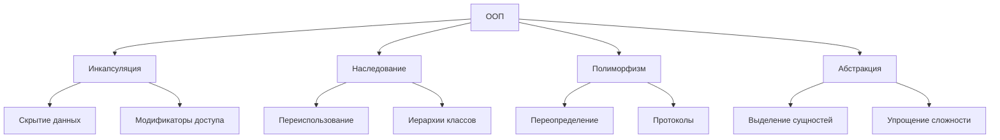

#oop #object-oriented #swift #classes #protocols #inheritance #encapsulation #polymorphism #abstraction

---

## ООП (Объектно-Ориентированное Программирование) в Swift

### Определение
**Объектно-Ориентированное Программирование (ООП)** — это парадигма программирования, основанная на концепции **объектов**, которые объединяют **данные** (свойства) и **поведение** (методы). ООП позволяет моделировать реальные сущности в виде объектов, взаимодействующих друг с другом.

В [[Swift]] ООП реализуется через **классы**, **наследование**, **протоколы** и **расширения ([[extension]]s)**. Однако Swift также поддерживает другие парадигмы: протокол-ориентированное программирование ([[POP]]), функциональное программирование (FP) и декларативное программирование ([[SwiftUI]]).

### Зачем это знать iOS-разработчику?
1.  **Фундамент:** [[UIKit]] построен на ООП ([[UIView]], [[UIViewController]], [[UIButton]] — классы с иерархией наследования).
2.  **Моделирование:** Удобно представлять реальные сущности (пользователи, товары, заказы) в виде объектов.
3.  **Переиспользование кода:** Наследование позволяет избегать дублирования.
4.  **Организация кода:** Инкапсуляция помогает скрывать детали реализации.
5.  **Гибкость:** Полиморфизм позволяет единообразно работать с разными типами.

---

### Четыре основных принципа ООП



---

## 1. [[Инкапсуляция]] (Encapsulation)

**Инкапсуляция** — скрытие внутренней реализации объекта и предоставление контролируемого интерфейса для взаимодействия.

```swift
class BankAccount {
    // Скрытое состояние
    private var balance: Double = 0
    
    // Публичный интерфейс
    func deposit(amount: Double) {
        guard amount > 0 else { return }
        balance += amount
    }
    
    func withdraw(amount: Double) -> Bool {
        guard amount > 0, balance >= amount else { return false }
        balance -= amount
        return true
    }
    
    func getBalance() -> Double {
        return balance
    }
}

let account = BankAccount()
account.deposit(amount: 100)
account.withdraw(amount: 30)
print(account.getBalance())  // 70.0

// ❌ Нет прямого доступа
// account.balance = 1000  // Ошибка: 'balance' is private
```

**Модификаторы доступа в Swift:**
- [[private]] — только внутри объявления
- [[fileprivate]] — внутри файла
- [[internal]] — внутри модуля (по умолчанию)
- [[public]] — везде
- [[open]] — везде + возможность переопределения

---

## 2. [[Наследование]] (Inheritance)

**Наследование** — механизм, позволяющий создавать новый класс на основе существующего, наследуя его свойства и методы.

```swift
class Animal {
    var name: String
    
    init(name: String) {
        self.name = name
    }
    
    func makeSound() -> String {
        return "Some sound"
    }
    
    func move() {
        print("\(name) is moving")
    }
}

class Dog: Animal {
    override func makeSound() -> String {
        return "Woof!"
    }
    
    func fetch() {
        print("\(name) is fetching")
    }
}

class Cat: Animal {
    override func makeSound() -> String {
        return "Meow!"
    }
    
    override func move() {
        super.move()
        print("\(name) is sneaking")
    }
}

let dog = Dog(name: "Buddy")
dog.makeSound()  // Woof!
dog.move()       // Buddy is moving
dog.fetch()      // Buddy is fetching

let cat = Cat(name: "Whiskers")
cat.makeSound()  // Meow!
cat.move()
// Whiskers is moving
// Whiskers is sneaking
```

**Важные моменты:**
- В Swift наследование доступно только для **классов** (не для структур и enum)
- Ключевое слово [[override]] обязательно для переопределения
- `super` для вызова родительской реализации
- `final` запрещает переопределение

---

## 3. [[Полиморфизм]] (Polymorphism)

**Полиморфизм** — способность объектов с одинаковым интерфейсом иметь разную реализацию.

### 3.1 Полиморфизм через наследование

```swift
class Shape {
    func area() -> Double {
        return 0
    }
}

class Rectangle: Shape {
    var width: Double
    var height: Double
    
    init(width: Double, height: Double) {
        self.width = width
        self.height = height
    }
    
    override func area() -> Double {
        return width * height
    }
}

class Circle: Shape {
    var radius: Double
    
    init(radius: Double) {
        self.radius = radius
    }
    
    override func area() -> Double {
        return Double.pi * radius * radius
    }
}

let shapes: [Shape] = [
    Rectangle(width: 2, height: 3),
    Circle(radius: 2)
]

for shape in shapes {
    print(shape.area())  // 6.0, 12.56
}
```

### 3.2 Полиморфизм через протоколы

```swift
protocol Drawable {
    func draw() -> String
}

struct Circle: Drawable {
    func draw() -> String {
        return "○"
    }
}

struct Square: Drawable {
    func draw() -> String {
        return "□"
    }
}

let shapes: [any Drawable] = [Circle(), Square()]
for shape in shapes {
    print(shape.draw())  // ○, □
}
```

---

## 4. [[Абстракция]] (Abstraction)

**Абстракция** — выделение существенных характеристик объекта, игнорируя несущественные детали.

### 4.1 Абстракция через протоколы

```swift
// Что делает — абстракция
protocol DataService {
    func fetchUsers() async throws -> [User]
    func saveUser(_ user: User) async throws
}

// Как делает — конкретная реализация
class NetworkDataService: DataService {
    private let apiClient = APIClient()
    
    func fetchUsers() async throws -> [User] {
        // сложная логика запроса
        return try await apiClient.get("/users")
    }
    
    func saveUser(_ user: User) async throws {
        // сложная логика сохранения
        try await apiClient.post("/users", body: user)
    }
}

// Клиентский код работает с абстракцией
class UserViewModel {
    private let dataService: DataService
    
    init(dataService: DataService) {
        self.dataService = dataService
    }
    
    func loadUsers() async {
        let users = try? await dataService.fetchUsers()
        // обновление UI
    }
}
```

### 4.2 Абстрактные классы (эмуляция)

```swift
class AbstractParser {
    func parse(data: Data) -> [String: Any] {
        fatalError("Subclasses must override parse(data:)")
    }
    
    func validate(data: Data) -> Bool {
        return !data.isEmpty
    }
}

class JSONParser: AbstractParser {
    override func parse(data: Data) -> [String: Any] {
        // реальная реализация
        return (try? JSONSerialization.jsonObject(with: data) as? [String: Any]) ?? [:]
    }
}
```

---

### ООП в [[UIKit]]: реальный пример

```swift
// Иерархия UIView
// UIResponder → UIView → UIControl → UIButton

class CustomButton: UIButton {
    override init(frame: CGRect) {
        super.init(frame: frame)
        setup()
    }
    
    required init?(coder: NSCoder) {
        super.init(coder: coder)
        setup()
    }
    
    private func setup() {
        backgroundColor = .systemBlue
        setTitleColor(.white, for: .normal)
        layer.cornerRadius = 8
    }
    
    override func touchesBegan(_ touches: Set<UITouch>, with event: UIEvent?) {
        super.touchesBegan(touches, with: event)
        // Кастомная анимация при нажатии
        UIView.animate(withDuration: 0.1) {
            self.alpha = 0.7
        }
    }
    
    override func touchesEnded(_ touches: Set<UITouch>, with event: UIEvent?) {
        super.touchesEnded(touches, with: event)
        UIView.animate(withDuration: 0.1) {
            self.alpha = 1.0
        }
    }
}
```

---

### ООП vs Другие парадигмы в Swift

| Парадигма                              | Основная концепция             | Инструменты в Swift                                         |
| -------------------------------------- | ------------------------------ | ----------------------------------------------------------- |
| **ООП**                                | Объекты, классы                | Классы, наследование                                        |
| **Протокол-ориентированное ([[POP]])** | Протоколы, композиция          | [[Protocol\|Протоколы]], [[extension]]s, [[associatedtype]] |
| **Функциональное ([[FP]])**            | Чистые функции, неизменяемость | [[map]], [[filter]], [[reduce]], [[closure]]s               |
| **Декларативное**                      | Описание "что", не "как"       | [[SwiftUI]], [[Combine]]                                    |

```swift
// ООП подход
class DataManager {
    private var data: [String] = []
    
    func add(_ item: String) {
        data.append(item)
    }
    
    func getAll() -> [String] {
        return data
    }
}

// POP подход (более гибкий)
protocol Addable {
    associatedtype Item
    mutating func add(_ item: Item)
}

protocol Retrievable {
    associatedtype Item
    func getAll() -> [Item]
}

struct DataStore<T>: Addable, Retrievable {
    private var items: [T] = []
    
    mutating func add(_ item: T) {
        items.append(item)
    }
    
    func getAll() -> [T] {
        return items
    }
}
```

---

### Преимущества и недостатки ООП

#### Преимущества

| Преимущество | Описание |
|--------------|----------|
| **Моделирование реального мира** | Объекты соответствуют реальным сущностям |
| **Переиспользование кода** | Наследование и композиция |
| **Инкапсуляция** | Скрытие деталей, защита данных |
| **Полиморфизм** | Гибкость, расширяемость |
| **Поддержка больших проектов** | Организация кода в классы и модули |

#### Недостатки

| Недостаток | Описание |
|------------|----------|
| **Сложность иерархий** | Глубокое наследование усложняет понимание |
| **Проблема "хрупкого базового класса"** | Изменения в родителе могут сломать потомков |
| **Высокая связанность** | Классы могут зависеть друг от друга |
| **Избыточность** | Для простых задач ООП может быть overkill |

---

### Короткое правило

> **ООП** — моделируй реальные объекты через классы.  
> Используй **наследование** для иерархий "is-a".  
> Предпочитай **композицию** наследованию, когда возможно.  
> В Swift **протоколы** часто дают больше гибкости, чем классы.

---

### Итог

**ООП** в Swift:

1.  **Четыре принципа:** инкапсуляция, наследование, полиморфизм, абстракция
2.  **Реализуется через:** классы, наследование, протоколы
3.  **Ключевые элементы:** свойства, методы, инициализаторы, `override`, `super`
4.  **Модификаторы доступа:** `private`, `fileprivate`, `internal`, `public`, `open`
5.  **Особенности Swift:** наследование только для классов, мощные протоколы, value types (struct)

Понимание ООП необходимо для работы с UIKit и создания структурированных приложений. Однако в Swift часто рекомендуют начинать с `struct` (value type) и использовать протоколы (POP), переходя к классам только когда нужны ссылочная семантика, наследование или `deinit`.

---

## 📖 Дополнительно

- [Apple Docs — The Swift Programming Language: Classes and Structures](https://docs.swift.org/swift-book/LanguageGuide/ClassesAndStructures.html)
    
- [Ray Wenderlich — Object-Oriented Swift](https://www.raywenderlich.com/5993-object-oriented-swift-tutorial-getting-started)
    

---
