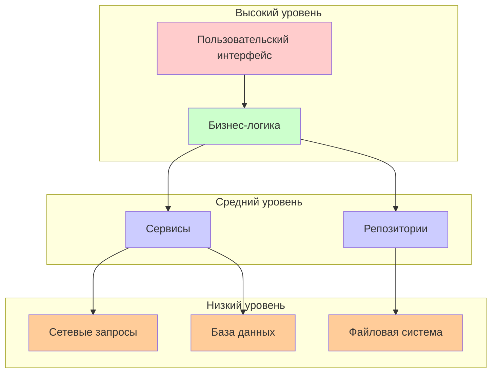
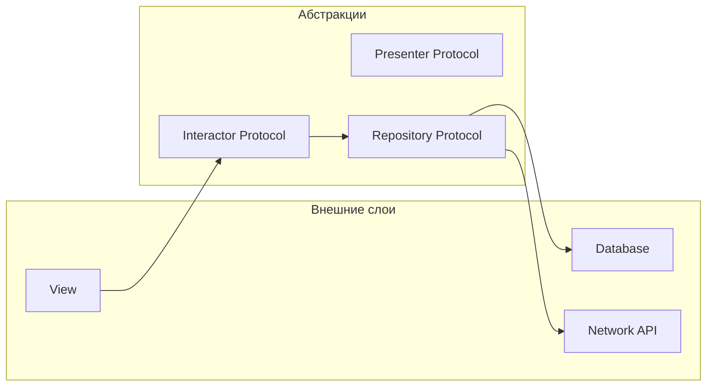

#oop #abstraction #protocols #architecture #design-patterns #swift

---

## Абстракция в программировании

### Определение
**Абстракция** — это принцип, позволяющий выделять **существенные характеристики** объекта, игнорируя несущественные детали. В программировании абстракция помогает управлять сложностью, скрывая внутреннюю реализацию и предоставляя только необходимый интерфейс для взаимодействия.

Простыми словами: абстракция — это **контракт**, который описывает *что* объект делает, но не *как* он это делает.

### Зачем это знать [[iOS]]-разработчику?
1.  **Управление сложностью:** Позволяет разбивать большие системы на понятные части.
2.  **Снижение связанности:** Модули зависят от абстракций, а не от конкретных реализаций.
3.  **Тестируемость:** Легко подменять реальные зависимости моками ([[Mock]]-объектами).
4.  **Переиспользование кода:** Один интерфейс может иметь множество реализаций.
5.  **Читаемость:** Абстракции документируют намерения, а не детали.

---

### Уровни абстракции



---

### Абстракция в [[Swift]]

#### 1. **Протоколы ([[Protocol]]s)**

Протоколы — основной инструмент абстракции в Swift.

```swift
// Абстракция: что делает сервис
protocol UserServiceProtocol {
    func fetchUser(id: Int) async throws -> User
    func saveUser(_ user: User) async throws
}

// Конкретная реализация 1: реальный API
class APIService: UserServiceProtocol {
    func fetchUser(id: Int) async throws -> User {
        // реальный сетевой запрос
    }
    
    func saveUser(_ user: User) async throws {
        // сохранение на сервер
    }
}

// Конкретная реализация 2: локальная база данных
class LocalDatabaseService: UserServiceProtocol {
    func fetchUser(id: Int) async throws -> User {
        // запрос к Core Data
    }
    
    func saveUser(_ user: User) async throws {
        // сохранение локально
    }
}

// Конкретная реализация 3: мок для тестов
class MockUserService: UserServiceProtocol {
    var shouldFail = false
    var mockUser = User(id: 1, name: "Mock")
    
    func fetchUser(id: Int) async throws -> User {
        if shouldFail {
            throw NSError(domain: "Mock", code: -1)
        }
        return mockUser
    }
    
    func saveUser(_ user: User) async throws {
        // ничего не делаем
    }
}
```

#### 2. **Абстрактные классы (через наследование)**

Swift не имеет ключевого слова `abstract`, но можно эмулировать через `fatalError` или `required` инициализаторы.

```swift
class Animal {
    // Абстрактный метод (должен быть переопределён)
    func makeSound() -> String {
        fatalError("Subclasses must override makeSound()")
    }
    
    // Конкретный метод (может использоваться напрямую)
    func move() -> String {
        return "Moving"
    }
}

class Dog: Animal {
    override func makeSound() -> String {
        return "Woof!"
    }
}

class Cat: Animal {
    override func makeSound() -> String {
        return "Meow!"
    }
}

let animals: [Animal] = [Dog(), Cat()]
for animal in animals {
    print(animal.makeSound())  // Woof! / Meow!
}
```

#### 3. **Дженерики ([[Generic]]s)**

Абстракция над типами данных.

```swift
// Абстрактный контейнер
protocol Container {
    associatedtype Item
    mutating func add(_ item: Item)
    var count: Int { get }
}

// Конкретная реализация
struct IntContainer: Container {
    typealias Item = Int
    private var items: [Int] = []
    
    mutating func add(_ item: Int) {
        items.append(item)
    }
    
    var count: Int {
        items.count
    }
}
```

#### 4. **Абстрактные фабрики (Abstract Factory)**

```swift
// Абстрактная фабрика
protocol ThemeFactory {
    func createButton() -> Button
    func createTextField() -> TextField
}

// Конкретная фабрика для светлой темы
class LightThemeFactory: ThemeFactory {
    func createButton() -> Button {
        return LightButton()
    }
    
    func createTextField() -> TextField {
        return LightTextField()
    }
}

// Конкретная фабрика для тёмной темы
class DarkThemeFactory: ThemeFactory {
    func createButton() -> Button {
        return DarkButton()
    }
    
    func createTextField() -> TextField {
        return DarkTextField()
    }
}
```

---

### Абстракция и тестирование

Абстракция позволяет легко подменять зависимости для тестирования.

```swift
// ViewModel, зависящий от абстракции
class UserProfileViewModel {
    private let userService: UserServiceProtocol
    
    init(userService: UserServiceProtocol) {
        self.userService = userService
    }
    
    func loadUser(id: Int) async -> User? {
        do {
            return try await userService.fetchUser(id: id)
        } catch {
            return nil
        }
    }
}

// Тест с моком
class UserProfileViewModelTests: XCTestCase {
    func testLoadUserSuccess() async {
        let mockService = MockUserService()
        mockService.mockUser = User(id: 42, name: "Test User")
        
        let viewModel = UserProfileViewModel(userService: mockService)
        let user = await viewModel.loadUser(id: 42)
        
        XCTAssertEqual(user?.name, "Test User")
    }
    
    func testLoadUserFailure() async {
        let mockService = MockUserService()
        mockService.shouldFail = true
        
        let viewModel = UserProfileViewModel(userService: mockService)
        let user = await viewModel.loadUser(id: 42)
        
        XCTAssertNil(user)
    }
}
```

---

### Абстракция в архитектурах

#### 1. **Clean Architecture (VIP)**



#### 2. **[[MVVM (Model-View-ViewModel) Architecture|MVVM]] с абстракциями**

```swift
// Абстракция сервиса
protocol AuthenticationServiceProtocol {
    func login(email: String, password: String) async throws -> User
    func logout() async
}

// ViewModel работает с абстракцией
class LoginViewModel: ObservableObject {
    private let authService: AuthenticationServiceProtocol
    
    init(authService: AuthenticationServiceProtocol) {
        self.authService = authService
    }
    
    func login(email: String, password: String) async -> Bool {
        do {
            let user = try await authService.login(email: email, password: password)
            return true
        } catch {
            return false
        }
    }
}
```

---

### Антипаттерны абстракции

#### 1. **Избыточная абстракция (Over-Abstraction)**

```swift
// ❌ Плохо — интерфейс одного метода не нужен
protocol AdderProtocol {
    func add(_ a: Int, _ b: Int) -> Int
}

struct Adder: AdderProtocol {
    func add(_ a: Int, _ b: Int) -> Int {
        return a + b
    }
}

// ✅ Хорошо — достаточно конкретной реализации
struct Adder {
    func add(_ a: Int, _ b: Int) -> Int {
        return a + b
    }
}
```

#### 2. **Утечка деталей реализации**

```swift
// ❌ Плохо — абстракция раскрывает детали
protocol UserService {
    func fetchUser(completion: @escaping (Result<User, NetworkError>) -> Void)
    // ↑ конкретная сетевая ошибка вместо общей
}

// ✅ Хорошо — общая абстракция
protocol UserService {
    func fetchUser() async throws -> User
}
```

#### 3. **Слишком широкий интерфейс**

```swift
// ❌ Плохо — интерфейс делает слишком много
protocol Repository {
    func save()
    func delete()
    func update()
    func fetch()
    func backup()
    func restore()
    func export()
    func import()
}

// ✅ Хорошо — разделение на маленькие интерфейсы
protocol Savable {
    func save()
}

protocol Deletable {
    func delete()
}

protocol Fetchable {
    func fetch()
}
```

---

### Преимущества абстракции

| Преимущество | Описание |
|--------------|----------|
| **Снижение сложности** | Скрывает детали, оставляя только суть |
| **Слабая связанность** | Модули зависят от интерфейсов, а не от реализаций |
| **Тестируемость** | Легко подменять реальные зависимости моками |
| **Гибкость** | Можно менять реализацию, не меняя клиентский код |
| **Переиспользование** | Одна абстракция может иметь множество реализаций |

### Недостатки

| Недостаток              | Описание                                          |
| ----------------------- | ------------------------------------------------- |
| **Избыточность**        | Иногда абстракция не нужна ([[YAGNI]])            |
| **Сложность навигации** | Больше файлов и протоколов                        |
| **Производительность**  | Динамическая диспетчеризация может быть медленнее |
| **Кривая обучения**     | Требует понимания принципов                       |

---

### Короткое правило

> **Абстракция** скрывает детали, оставляя только суть.  
> Используйте протоколы для определения контрактов.  
> Не создавайте абстракции "на будущее" — только когда они действительно нужны.

---

### Итог

**Абстракция** в Swift:

1.  **Реализуется через** протоколы, дженерики, наследование
2.  **Позволяет** снижать связанность и повышать тестируемость
3.  **Применяется в архитектурах** [[Clean Swift (VIP) Architecture|Clean Swift]], MVVM, [[VIPER Architecture|VIPER]]
4.  **Требует баланса** — избыточная абстракция вредна
5.  **Документирует намерения** через интерфейсы

Понимание абстракции — ключ к созданию гибких, тестируемых и поддерживаемых систем.