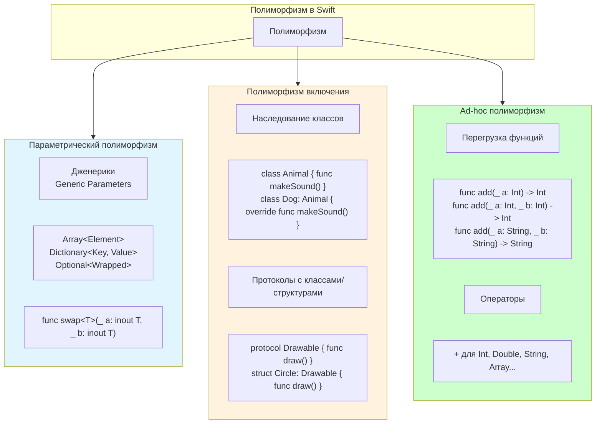

#oop #polymorphism #swift #protocols #generics #overloading #overriding

---

## Полиморфизм в программировании

### Определение
**Полиморфизм** — это способность объектов с одинаковым интерфейсом иметь разную реализацию. В переводе с греческого — "много форм". Полиморфизм позволяет единообразно работать с разными типами данных через общий интерфейс, абстрагируясь от их конкретной реализации.

Полиморфизм — один из трёх фундаментальных принципов ООП (наряду с инкапсуляцией и наследованием). В Swift полиморфизм реализуется через наследование, протоколы, дженерики и перегрузку функций.

### Зачем это знать iOS-разработчику?
1.  **Единообразная обработка:** Один и тот же код может работать с разными типами.
2.  **Расширяемость:** Новые типы можно добавлять без изменения существующего кода.
3.  **Тестируемость:** Легко подменять реальные зависимости моками.
4.  **Архитектура:** Основа для протокол-ориентированного программирования ([[POP]]).
5.  **Гибкость:** Адаптация поведения под конкретный тип во время выполнения.

---

### Виды полиморфизма



---

## 1. Параметрический полиморфизм ([[generic|Дженерики]])

Позволяет писать код, работающий с любым типом, сохраняя типобезопасность.

```swift
// Generic функция
func swapValues<T>(_ a: inout T, _ b: inout T) {
    let temp = a
    a = b
    b = temp
}

var x = 5, y = 10
swapValues(&x, &y)
print(x, y)  // 10, 5

var str1 = "Hello", str2 = "World"
swapValues(&str1, &str2)
print(str1, str2)  // World, Hello

// Generic структура
struct Stack<Element> {
    private var items: [Element] = []
    
    mutating func push(_ item: Element) {
        items.append(item)
    }
    
    mutating func pop() -> Element? {
        return items.popLast()
    }
}

var intStack = Stack<Int>()
intStack.push(1)
intStack.push(2)

var stringStack = Stack<String>()
stringStack.push("A")
stringStack.push("B")
```

---

## 2. Полиморфизм включения (Subtype Polymorphism)

Позволяет объекту выступать в роли другого типа (родительского класса или протокола).

### 2.1 Через [[наследование]] классов

```swift
class Animal {
    func makeSound() -> String {
        return "Some sound"
    }
}

class Dog: Animal {
    override func makeSound() -> String {
        return "Woof!"
    }
}

class Cat: Animal {
    override func makeSound() -> String {
        return "Meow!"
    }
}

class Cow: Animal {
    override func makeSound() -> String {
        return "Moo!"
    }
}

// Полиморфное поведение
let animals: [Animal] = [Dog(), Cat(), Cow()]
for animal in animals {
    print(animal.makeSound())
}
// Woof!
// Meow!
// Moo!
```

### 2.2 Через [[Protocol|протоколы]] (Protocol-Oriented Programming)

```swift
protocol Drawable {
    func draw() -> String
}

struct Circle: Drawable {
    func draw() -> String {
        return "○"
    }
}

struct Square: Drawable {
    func draw() -> String {
        return "□"
    }
}

struct Triangle: Drawable {
    func draw() -> String {
        return "△"
    }
}

// Полиморфизм через протокол
let shapes: [any Drawable] = [Circle(), Square(), Triangle()]
for shape in shapes {
    print(shape.draw())
}
// ○
// □
// △
```

### 2.3 Полиморфизм с [[some]] и [[any]]

```swift
// some — конкретный тип, скрытый за протоколом
func makeDrawable() -> some Drawable {
    return Circle()
}

let shape = makeDrawable()  // тип — Circle, но виден как Drawable

// any — экзистенциальный тип
func process(shape: any Drawable) {
    print(shape.draw())
}
```

---

## 3. Ad-hoc полиморфизм (Перегрузка функций)

Позволяет нескольким функциям иметь одно имя, но разные параметры.

```swift
// Перегрузка по количеству параметров
func add(_ a: Int, _ b: Int) -> Int {
    return a + b
}

func add(_ a: Int, _ b: Int, _ c: Int) -> Int {
    return a + b + c
}

// Перегрузка по типу параметров
func add(_ a: Double, _ b: Double) -> Double {
    return a + b
}

func add(_ a: String, _ b: String) -> String {
    return a + b
}

// Перегрузка по меткам аргументов
func multiply(_ a: Int, by b: Int) -> Int {
    return a * b
}

func multiply(_ a: Int, and b: Int) -> Int {
    return a * b
}

// Использование
print(add(2, 3))        // 5 (Int)
print(add(2, 3, 4))     // 9 (Int)
print(add(2.5, 3.5))    // 6.0 (Double)
print(add("Hello, ", "World"))  // Hello, World
print(multiply(4, by: 2))       // 8
print(multiply(4, and: 2))      // 8
```

---

### Полиморфизм и протоколы с ассоциированными типами

```swift
protocol Container {
    associatedtype Item
    mutating func add(_ item: Item)
    var count: Int { get }
}

struct StringContainer: Container {
    typealias Item = String
    private var items: [String] = []
    
    mutating func add(_ item: String) {
        items.append(item)
    }
    
    var count: Int {
        items.count
    }
}

struct IntContainer: Container {
    typealias Item = Int
    private var items: [Int] = []
    
    mutating func add(_ item: Int) {
        items.append(item)
    }
    
    var count: Int {
        items.count
    }
}

// ❌ Нельзя использовать как экзистенциальный тип
// let containers: [any Container] = [StringContainer(), IntContainer()]

// ✅ Можно через дженерики
func printCount<T: Container>(_ container: T) {
    print(container.count)
}
```

---

### Полиморфизм и операторы

```swift
// Перегрузка операторов — форма ad-hoc полиморфизма
struct Vector2D {
    var x: Double
    var y: Double
    
    static func + (lhs: Vector2D, rhs: Vector2D) -> Vector2D {
        return Vector2D(x: lhs.x + rhs.x, y: lhs.y + rhs.y)
    }
    
    static func * (vector: Vector2D, scalar: Double) -> Vector2D {
        return Vector2D(x: vector.x * scalar, y: vector.y * scalar)
    }
}

let v1 = Vector2D(x: 1, y: 2)
let v2 = Vector2D(x: 3, y: 4)
let v3 = v1 + v2          // (4, 6)
let v4 = v1 * 2           // (2, 4)
```

---

### Полиморфизм и замыкания

```swift
// Замыкания как способ достижения полиморфизма
func processNumbers(_ numbers: [Int], operation: (Int) -> Int) -> [Int] {
    return numbers.map(operation)
}

let numbers = [1, 2, 3, 4, 5]

let doubled = processNumbers(numbers) { $0 * 2 }      // [2, 4, 6, 8, 10]
let squared = processNumbers(numbers) { $0 * $0 }     // [1, 4, 9, 16, 25]
let isEven = processNumbers(numbers) { $0 % 2 == 0 ? 1 : 0 }  // [0, 1, 0, 1, 0]
```

---

### Полиморфизм в реальных [[iOS]]-задачах

#### 1. **Работа с [[API]] (разные типы ответов)**

```swift
protocol APIResponse {
    associatedtype DataType
    func parse(data: Data) throws -> DataType
}

struct UserResponse: APIResponse {
    typealias DataType = User
    
    func parse(data: Data) throws -> User {
        return try JSONDecoder().decode(User.self, from: data)
    }
}

struct ProductResponse: APIResponse {
    typealias DataType = [Product]
    
    func parse(data: Data) throws -> [Product] {
        return try JSONDecoder().decode([Product].self, from: data)
    }
}

class APIClient {
    func fetch<T: APIResponse>(_ responseType: T.Type, from url: URL) async throws -> T.DataType {
        let (data, _) = try await URLSession.shared.data(from: url)
        return try responseType.init().parse(data: data)
    }
}
```

#### 2. **UI компоненты**

```swift
protocol ReusableCell {
    static var reuseIdentifier: String { get }
    func configure(with data: Any)
}

extension UITableViewCell: ReusableCell {
    static var reuseIdentifier: String {
        return String(describing: self)
    }
    
    func configure(with data: Any) {
        // переопределяется в подклассах
    }
}

class UserCell: UITableViewCell {
    override func configure(with data: Any) {
        guard let user = data as? User else { return }
        textLabel?.text = user.name
    }
}

class ProductCell: UITableViewCell {
    override func configure(with data: Any) {
        guard let product = data as? Product else { return }
        textLabel?.text = product.title
        detailTextLabel?.text = "$\(product.price)"
    }
}
```

---

### Полиморфизм vs Свитчи ([[Switch]])

```swift
// ❌ Без полиморфизма — свитч по типу
func process(vehicle: Any) {
    switch vehicle {
    case is Car:
        print("Car processing")
    case is Bike:
        print("Bike processing")
    default:
        print("Unknown")
    }
}

// ✅ С полиморфизмом — открытое расширение
protocol Processable {
    func process()
}

extension Car: Processable {
    func process() {
        print("Car processing")
    }
}

extension Bike: Processable {
    func process() {
        print("Bike processing")
    }
}

func process(_ item: Processable) {
    item.process()  // Полиморфный вызов
}
```

---

### Сравнение видов полиморфизма

| Вид                       | Swift механизм             | Время разрешения | Гибкость      | Производительность         |
| ------------------------- | -------------------------- | ---------------- | ------------- | -------------------------- |
| **Параметрический**       | Дженерики                  | Компиляция       | Высокая       | Максимальная (статическая) |
| **Включения (классы)**    | Наследование               | Выполнение       | Средняя       | Высокая (vtable)           |
| **Включения (протоколы)** | Protocol [[Witness Table]] | Выполнение       | Очень высокая | Высокая (witness table)    |
| **Ad-hoc**                | Перегрузка функций         | Компиляция       | Средняя       | Максимальная               |

---

### Преимущества полиморфизма

| Преимущество | Описание |
|--------------|----------|
| **Гибкость** | Код работает с разными типами |
| **Расширяемость** | Новые типы добавляются без изменения существующего кода |
| **Единообразие** | Единый интерфейс для разных реализаций |
| **Тестируемость** | Легко подменять зависимости моками |
| **Абстракция** | Скрывает детали реализации |

---

### Короткое правило

> **Полиморфизм** — "один интерфейс, много реализаций".  
> Используйте **протоколы** для полиморфизма включения.  
> Используйте **дженерики** для параметрического полиморфизма.  
> Избегайте `switch` по типу — открытое расширение через протоколы лучше.

---

### Итог

**Полиморфизм** в Swift:

1.  **Три основных вида:**
    - Параметрический (дженерики)
    - Включения (наследование, протоколы)
    - Ad-hoc (перегрузка функций)
2.  **Реализуется через:** наследование, протоколы, дженерики, перегрузку
3.  **Позволяет:** писать гибкий, расширяемый и тестируемый код
4.  **Является:** одним из трёх столпов ООП
5.  **В Swift:** протокол-ориентированное программирование даёт ещё больше гибкости

Понимание полиморфизма необходимо для создания гибких архитектур, где код может работать с разными типами, не требуя изменений при добавлении новых.