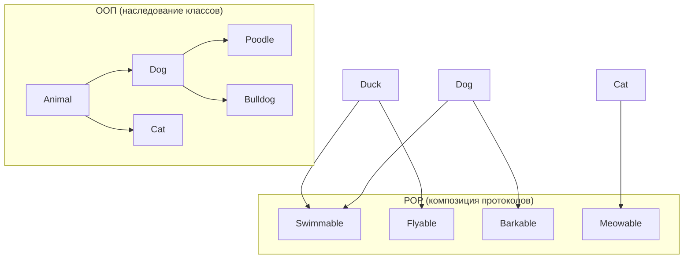

#swift #pop #protocol-oriented #protocols #generics #extensions #composition-over-inheritance

---

## POP (Protocol-Oriented Programming) в Swift

### Определение
**Protocol-Oriented Programming (POP)** — это парадигма программирования, продвигаемая Apple как альтернатива классическому наследованию классов. В основе POP лежат **протоколы**, **расширения протоколов** и **композиция**. Вместо создания глубоких иерархий классов, POP предлагает описывать поведение через протоколы и предоставлять реализации по умолчанию через расширения.

POP не заменяет полностью [[OOP|ООП]], но предлагает более гибкий и безопасный способ переиспользования кода, особенно в сочетании с value types (структурами и перечислениями). [[Swift]] с самого начала проектировался с поддержкой POP.

### Зачем это знать [[iOS]]-разработчику?
1.  **Гибкость:** Композиция протоколов гибче жёсткого наследования классов.
2.  **Value types:** Протоколы могут быть реализованы структурами и enum, не только классами.
3.  **Расширяемость:** Можно добавлять функциональность существующим типам через расширения протоколов.
4.  **Тестируемость:** Легче создавать моки и тестовые двойники.
5.  **Стандартная библиотека Swift:** Построена на протоколах ([[Collection]], [[protocol Sequence|Sequence]], [[Equatable]], [[Hashable]]).

---

### POP vs Наследование классов



| Характеристика                 | Наследование классов | Протоколы + расширения          |
| ------------------------------ | -------------------- | ------------------------------- |
| **Отношение**                  | "is-a" (является)    | "can do" (может делать)         |
| **Типы**                       | Только классы        | [[class]], [[struct]], [[enum]] |
| **Множественное наследование** | Нет                  | Да (несколько протоколов)       |
| **Реализация по умолчанию**    | В базовом классе     | В расширении протокола          |
| **Связанность**                | Высокая              | Низкая                          |
| **Гибкость**                   | Низкая               | Высокая                         |

---

### Ключевые компоненты POP

```swift
// 1. Протокол — описывает требования
protocol Drawable {
    func draw() -> String
}

// 2. Расширение протокола — реализация по умолчанию
extension Drawable {
    func draw() -> String {
        return "Drawing a shape"
    }
    
    func drawMultiple(times: Int) -> [String] {
        return Array(repeating: draw(), count: times)
    }
}

// 3. Соответствие протоколу (структура, класс, enum)
struct Circle: Drawable {
    func draw() -> String {
        return "○"
    }
}

struct Square: Drawable {
    // использует реализацию по умолчанию
}

let circle = Circle()
print(circle.draw())  // ○
print(circle.drawMultiple(times: 3))  // ["○", "○", "○"]

let square = Square()
print(square.draw())  // Drawing a shape
```

---

### Примеры POP

#### 1. **Композиция протоколов вместо глубокого наследования**

```swift
// ❌ ООП подход (жёсткая иерархия)
class Animal {
    func eat() { print("Eating") }
}

class Mammal: Animal {
    func giveBirth() { print("Giving birth") }
}

class Bird: Animal {
    func fly() { print("Flying") }
}

class Bat: Mammal {  // Что делать с Bat? Он и млекопитающее, и летает
    override func fly() { print("Flying") }  // Дублирование
}

// ✅ POP подход (композиция)
protocol Eatible {
    func eat()
}

protocol Flyable {
    func fly()
}

protocol Mammal {
    func giveBirth()
}

extension Eatible {
    func eat() { print("Eating") }
}

extension Flyable {
    func fly() { print("Flying") }
}

extension Mammal {
    func giveBirth() { print("Giving birth") }
}

struct Bat: Eatible, Flyable, Mammal { }
struct Bird: Eatible, Flyable { }
struct Dog: Eatible, Mammal { }

let bat = Bat()
bat.eat()        // Eating
bat.fly()        // Flying
bat.giveBirth()  // Giving birth
```

#### 2. **Реализация по умолчанию через расширения**

```swift
protocol Loggable {
    var logIdentifier: String { get }
    func log(message: String)
}

extension Loggable {
    func log(message: String) {
        print("[\(logIdentifier)]: \(message)")
    }
    
    func logError(_ error: Error) {
        log(message: "ERROR: \(error.localizedDescription)")
    }
}

struct User: Loggable {
    let id: Int
    let name: String
    
    var logIdentifier: String {
        return "User[\(id)]"
    }
}

struct Product: Loggable {
    let sku: String
    
    var logIdentifier: String {
        return "Product[\(sku)]"
    }
}

let user = User(id: 42, name: "Alice")
user.log(message: "Login successful")
// [User[42]]: Login successful

let product = Product(sku: "ABC-123")
product.logError(NSError(domain: "Inventory", code: -1))
// [Product[ABC-123]]: ERROR: The operation couldn’t be completed
```

#### 3. **Ограничения протоколов (where clauses)**

```swift
protocol Container {
    associatedtype Item
    mutating func add(_ item: Item)
    var count: Int { get }
}

extension Container where Item: Equatable {
    func contains(_ item: Item) -> Bool {
        // Реализация только для Equatable элементов
        return false  // упрощённо
    }
}

extension Container where Item == String {
    func joined(separator: String = "") -> String {
        // Специальная реализация для String
        return ""
    }
}
```

#### 4. **Протоколы с ассоциированными типами**

```swift
protocol Stack {
    associatedtype Element
    mutating func push(_ element: Element)
    mutating func pop() -> Element?
    var isEmpty: Bool { get }
}

struct IntStack: Stack {
    typealias Element = Int
    private var items: [Int] = []
    
    mutating func push(_ element: Int) {
        items.append(element)
    }
    
    mutating func pop() -> Int? {
        return items.popLast()
    }
    
    var isEmpty: Bool {
        return items.isEmpty
    }
}

// Generic реализация
struct GenericStack<T>: Stack {
    private var items: [T] = []
    
    mutating func push(_ element: T) {
        items.append(element)
    }
    
    mutating func pop() -> T? {
        return items.popLast()
    }
    
    var isEmpty: Bool {
        return items.isEmpty
    }
}
```

#### 5. **POP в реальном iOS-приложении**

```swift
// MARK: - Протоколы для сервисов
protocol NetworkServiceProtocol {
    func fetch<T: Decodable>(_ endpoint: String) async throws -> T
}

protocol CacheServiceProtocol {
    func get<T: Codable>(for key: String) -> T?
    func set<T: Codable>(_ value: T, for key: String)
}

protocol AnalyticsServiceProtocol {
    func track(event: String, parameters: [String: Any])
}

// MARK: - ViewModel с композицией протоколов
protocol ViewModelProtocol {
    associatedtype State
    associatedtype Action
    
    var state: State { get }
    func handle(_ action: Action)
}

class UserViewModel: ViewModelProtocol {
    typealias State = [User]
    typealias Action = UserAction
    
    @Published private(set) var state: [User] = []
    
    private let network: NetworkServiceProtocol
    private let cache: CacheServiceProtocol
    private let analytics: AnalyticsServiceProtocol
    
    init(network: NetworkServiceProtocol,
         cache: CacheServiceProtocol,
         analytics: AnalyticsServiceProtocol) {
        self.network = network
        self.cache = cache
        self.analytics = analytics
    }
    
    func handle(_ action: UserAction) {
        switch action {
        case .loadUsers:
            loadUsers()
        case .selectUser(let user):
            analytics.track(event: "user_selected", parameters: ["id": user.id])
        }
    }
    
    private func loadUsers() {
        Task {
            if let cached: [User] = cache.get(for: "users") {
                state = cached
                return
            }
            
            let users: [User] = try await network.fetch("/users")
            cache.set(users, for: "users")
            state = users
        }
    }
}

enum UserAction {
    case loadUsers
    case selectUser(User)
}
```

---

### Протоколы vs Классы: производительность

| Аспект       | Протокол (через [[generic]]s) | Протокол (через [[any]])         | Класс                 |
| ------------ | ----------------------------- | -------------------------------- | --------------------- |
| **Dispatch** | Статический (Direct)          | Динамический ([[Witness Table]]) | Динамический (vtable) |
| **Скорость** | ★★★★★ (~1-2 нс)               | ★★★★☆ (~3-5 нс)                  | ★★★★☆ (~3-5 нс)       |
| **Гибкость** | Ограниченная                  | Высокая                          | Средняя               |
| **Память**   | На стеке ([[struct]])         | Existential container            | Куча ([[heap]])       |

```swift
// Быстро (статическая диспетчеризация)
func drawGeneric<T: Drawable>(_ shape: T) {
    shape.draw()
}

// Медленнее (динамическая через witness table)
func drawExistential(_ shape: any Drawable) {
    shape.draw()
}
```

---

### Преимущества POP

| Преимущество                | Описание                                              |
| --------------------------- | ----------------------------------------------------- |
| **Композиция**              | Множественные протоколы вместо одного родителя        |
| **[[Value type]]s**         | Протоколы могут быть реализованы структурами и enum   |
| **Реализация по умолчанию** | Расширения протоколов дают код reuse без наследования |
| **Слабая связанность**      | Зависимости через протоколы легко подменять           |
| **Тестируемость**           | Легко создавать моки для протоколов                   |
| **Стандартная библиотека**  | Swift Collections построены на протоколах             |

### Недостатки POP

| Недостаток | Описание |
|------------|----------|
| **Сложность** | Может привести к избыточному количеству протоколов |
| **Ассоциированные типы** | Усложняют использование экзистенциальных типов (`any`) |
| **Отладка** | Сложнее отлаживать цепочки расширений |
| **Кривая обучения** | Требует переосмысления подходов от ООП |

---

### Короткое правило

> **POP** — предпочитай протоколы наследованию классов.  
> Используй **расширения протоколов** для реализации по умолчанию.  
> Комбинируй **несколько протоколов** вместо глубоких иерархий.  
> Для производительности используй **generics** вместо `any Protocol`.

---

### Итог

**Protocol-Oriented Programming** в Swift:

1.  **Основные принципы:** композиция протоколов, расширения протоколов, value types
2.  **Ключевые отличия от ООП:** нет жёсткой иерархии, множественное "наследование" поведения
3.  **Инструменты:** [[protocol]], [[extension]], [[associatedtype]], [[where]], [[some]], [[any]]
4.  **Применение:** стандартная библиотека [[Swift]], [[Combine]], [[SwiftUI]] (косвенно)
5.  **Преимущества:** гибкость, value types, тестируемость, слабая связанность

POP — это не замена ООП, а дополнительный инструмент. Лучшие Swift-приложения сочетают ООП (где нужна ссылочная семантика и иерархии) и POP (где нужна композиция и value types).

---

## 📖 Дополнительно

- [Apple Docs — Protocol-Oriented Programming in Swift](https://developer.apple.com/videos/play/wwdc2015/408/)
    
- [Ray Wenderlich — Protocol-Oriented Programming](https://www.raywenderlich.com/19905752-protocol-oriented-programming-in-swift)
    

---
