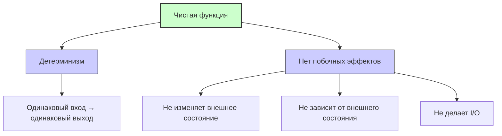

#functional-programming #pure-function #fp #swift #testing #deterministic

---
### Определение

**Pure Function (Чистая функция)** — это функция, которая:

1.  **Детерминирована:** Для одинаковых входных аргументов всегда возвращает одинаковый результат.
2.  **Не имеет побочных эффектов (side effects):** Не изменяет состояние вне своей области видимости (не модифицирует глобальные переменные, не пишет в файлы, не делает сетевых запросов, не вызывает `print()`).

Простыми словами: чистая функция **только вычисляет** и **возвращает** результат, ничего больше.

---

### Примеры

#### ✅ Чистые функции

```swift
// Сложение — чистая функция
func add(_ a: Int, _ b: Int) -> Int {
    return a + b
}

// Преобразование строки — чистая функция
func uppercased(_ string: String) -> String {
    return string.uppercased()
}

// Проверка чётности — чистая функция
func isEven(_ number: Int) -> Bool {
    return number % 2 == 0
}

// Всегда один и тот же вход → один и тот же выход
print(add(2, 3))  // 5
print(add(2, 3))  // 5
```

#### ❌ Нечистые функции

```swift
// 1. Зависит от внешнего состояния
var globalMultiplier = 2
func multiplyByGlobal(_ value: Int) -> Int {
    return value * globalMultiplier  // результат зависит от внешней переменной
}

// 2. Имеет побочный эффект (print)
func logAndAdd(_ a: Int, _ b: Int) -> Int {
    print("Adding \(a) and \(b)")  // побочный эффект
    return a + b
}

// 3. Изменяет внешнее состояние
var counter = 0
func increment() -> Int {
    counter += 1  // мутация внешней переменной
    return counter
}

// 4. Зависит от времени / случайности
func getCurrentTime() -> Date {
    return Date()  // разный результат при каждом вызове
}

func randomNumber() -> Int {
    return Int.random(in: 1...100)  // недетерминировано
}
```

---

### Почему это важно?

| Аспект | Преимущество чистой функции |
|---|---|
| **Тестируемость** | Легко тестировать — не нужно мокать внешние зависимости |
| **Предсказуемость** | Код ведёт себя одинаково всегда |
| **Параллелизм** | Безопасно вызывать из нескольких потоков (нет гонок данных) |
| **Кэширование** | Результаты можно кэшировать (мемоизация) |
| **Рефакторинг** | Легко изменять, не боясь сломать что-то ещё |
| **Композиция** | Чистые функции легко комбинировать в цепочки |

---

### Ключевые принципы



---

### Чистые функции в [[Swift]]

#### [[map]], [[filter]], [[reduce]] — классические чистые функции

```swift
let numbers = [1, 2, 3, 4, 5]

// map — чистая функция (не меняет исходный массив)
let doubled = numbers.map { $0 * 2 }  // [2, 4, 6, 8, 10]

// filter — чистая
let evens = numbers.filter { $0 % 2 == 0 }  // [2, 4]

// reduce — чистая
let sum = numbers.reduce(0, +)  // 15
```

#### Собственная чистая функция

```swift
// Чистая функция: не меняет входной массив, не имеет side effects
func sortedAscending(_ array: [Int]) -> [Int] {
    return array.sorted()
}

let original = [3, 1, 4, 2]
let sorted = sortedAscending(original)
print(original)  // [3, 1, 4, 2] — не изменился
print(sorted)    // [1, 2, 3, 4]
```

---

### Чистые функции и мемоизация (кэширование)

```swift
// Мемоизированная чистая функция
func memoizedFibonacci() -> (Int) -> Int {
    var cache: [Int: Int] = [:]
    
    func fib(_ n: Int) -> Int {
        if let cached = cache[n] { return cached }
        let result = n <= 1 ? n : fib(n - 1) + fib(n - 2)
        cache[n] = result
        return result
    }
    
    return fib
}

let fib = memoizedFibonacci()
print(fib(40))  // быстро, так как результат кэшируется
```

---

### Чистые функции в [[Combine]]

```swift
import Combine

// map с чистой функцией
let publisher = [1, 2, 3, 4, 5].publisher

// Чистая функция в transform
publisher
    .map { $0 * 2 }           // чистая
    .filter { $0 > 5 }        // чистая
    .sink { print($0) }       // side effect (но это терминатор)
```

---

### Когда можно нарушать чистоту

| Ситуация | Пример |
|---|---|
| **Логирование** | `print()`, `os_log` |
| **Сетевые запросы** | `URLSession.shared.dataTask` |
| **Работа с файлами** | `FileManager.default.write` |
| **Базы данных** | `Core Data.save()` |
| **UI обновления** | `label.text = ...` |

В реальном приложении **невозможно быть полностью чистым** — ввод-вывод и взаимодействие с пользователем требуют побочных эффектов. Важно **изолировать** нечистый код на границах системы, а внутри держать чистую логику.

---

### Паттерн: чистый core + нечистые границы

```swift
// Чистая бизнес-логика (легко тестировать)
func calculateTotalPrice(items: [Item], discountPercent: Int) -> Decimal {
    let subtotal = items.reduce(0) { $0 + $1.price }
    let discount = Decimal(discountPercent) / 100
    return subtotal * (1 - discount)
}

// Нечистый слой (I/O)
class OrderService {
    func processOrder(items: [Item], discount: Int) async throws {
        let total = calculateTotalPrice(items: items, discountPercent: discount)
        try await apiClient.submitOrder(total: total)
    }
}
```

---

### Короткое правило

> **Чистая функция** = детерминизм + отсутствие побочных эффектов.  
> Легко тестировать, кэшировать, параллелить.  
> Держи чистую логику внутри, а нечистые операции (I/O, UI) — на границах системы.

---

### Итог

**Pure Function (Чистая функция)** — фундаментальное понятие функционального программирования:

1.  **Детерминизм:** Одинаковый вход → одинаковый выход.
2.  **Нет побочных эффектов:** Не меняет внешнее состояние, не делает I/O.
3.  **Преимущества:** Лёгкое тестирование, кэширование, параллелизм, предсказуемость.
4.  **Примеры в Swift:** `map`, `filter`, `reduce`, математические функции.
5.  **Реальный мир:** Невозможно быть полностью чистым, но нужно **изолировать** нечистый код на границах системы.

Понимание чистых функций помогает писать более предсказуемый, тестируемый и поддерживаемый код.