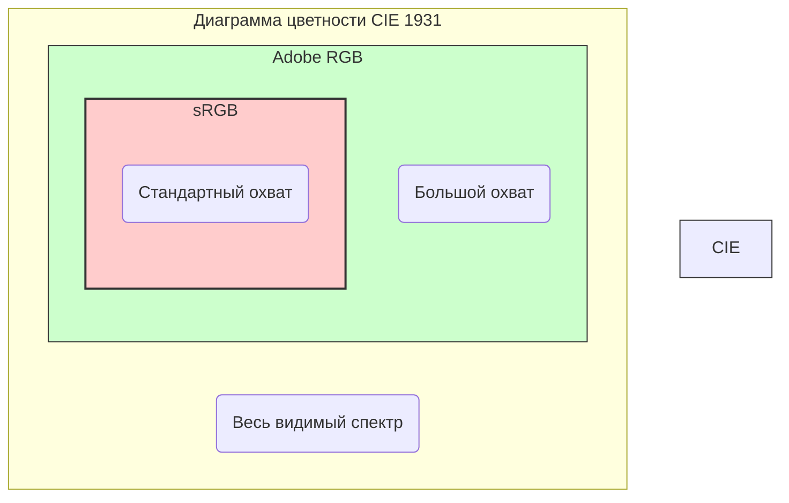

#color #color-space #graphics #uikit #design #srgb #displayp3 #imageio

---
## sRGB (Standard Red Green Blue)

### Определение
**sRGB (Standard Red Green Blue)** — это стандартизированное цветовое пространство, созданное совместно компаниями HP и Microsoft в 1996 году для унификации представления цвета в интернете, на мониторах и принтерах . В контексте [[iOS]]-разработки sRGB является **базовым и наиболее широко используемым цветовым пространством**, которое служит своеобразным "общим знаменателем" для отображения цветов на подавляющем большинстве устройств .

### Почему это важно для iOS-разработчика?
1.  **Стандарт по умолчанию:** До появления широкоцветных дисплеев (P3) все цвета в iOS создавались и отображались в пространстве sRGB .
2.  **Предсказуемость:** Использование sRGB гарантирует, что цвета будут выглядеть примерно одинаково на разных устройствах, включая старые модели iPhone, iPad и большинство мониторов сторонних производителей .
3.  **Совместимость с вебом и дизайном:** Макеты в [[Figma]], [[Sketch]] и цвета в [[HEX]]-формате по умолчанию интерпретируются в цветовом пространстве sRGB.
4.  **Фундамент для понимания цвета:** Понимание sRGB необходимо для осознанного перехода к более широким пространствам (P3) и корректной работы с Extended Range colors.

---

### Технические основы

#### 1. Цветовой охват (Gamut)
sRGB имеет **относительно небольшой цветовой охват** по сравнению с другими пространствами, такими как [[Adobe RGB]] или Display P3 . Он охватывает примерно 35% видимых человеческим глазом цветов (модель CIE 1931) и был разработан с учетом возможностей ЭЛТ-мониторов того времени .



**Особенности охвата:**
- **Сильные стороны:** Неплохо покрывает основные цвета и оттенки кожи.
- **Слабые стороны:** Особенно мал охват в области чистых голубых (cyan) и зеленых тонов. Например, самый насыщенный голубой в sRGB составляет лишь около 80% от аналогичного цвета в печатном стандарте ISO Coated V2 .

#### 2. Гамма-коррекция (Gamma)
sRGB использует гамму, приблизительно равную **2.2**. Это нелинейное кодирование яркости, которое лучше соответствует чувствительности человеческого глаза (который более чувствителен к изменениям в темных областях).

#### 3. Значения компонентов
Цвет в sRGB описывается тремя компонентами (Red, Green, Blue) и, опционально, Alpha.
- **Традиционное представление:** Целочисленные значения от 0 до 255.
- **Представление с плавающей точкой:** Значения от 0.0 до 1.0, где 0.0 — это минимум (0), а 1.0 — максимум (255) для данного канала.
- **Классическое поведение:** В iOS до версии 10 значения компонентов "зажимались" (clamping) к диапазону 0...1. Любое значение меньше 0 становилось 0, а больше 1 — 1 .

#### 4. sRGB vs Extended sRGB
Начиная с iOS 10, Apple ввела понятие **Extended Range Color Spaces** .
- **sRGB:** Значения компонентов жестко ограничены диапазоном `[0, 1]`.
- **Extended sRGB:** Значения компонентов **не ограничиваются** и могут быть меньше 0 или больше 1. Это позволяет временно хранить и обрабатывать цвета, выходящие за пределы видимого диапазона sRGB (например, очень яркие цвета из пространства P3), перед их финальным преобразованием для отображения на конкретном экране. Это критически важно для HDR и работы с широким цветовым охватом.

---

### sRGB в контексте iOS (Версии и особенности)

Понимание того, как iOS работала с sRGB в разные годы, поможет избежать ошибок при поддержке старых устройств.

| Версия iOS | Цветовое пространство по умолчанию | Поведение | Ключевая особенность |
|---|---|---|---|
| **iOS 9 и старше** | Device-dependent Gray / RGB | Значения `[0,1]` жестко фиксированы | Простое "зажатое" (clamped) поведение  |
| **iOS 10+** | Extended sRGB, Display P3 | Значения могут выходить за `[0,1]` | Поддержка широкого цвета и HDR  |

В современных версиях iOS (и в вашем коде на [[Swift]]/[[UIKit]]) вы всегда работаете в парадигме **Extended Color Spaces**. `UIColor` больше не обрезает значения, что дает гибкость для работы с разными дисплеями.

---

### Сравнение sRGB с другими цветовыми пространствами

Для iOS-разработчика наиболее важным сравнением является sRGB против **Display P3**.

| Характеристика | sRGB | Display P3 | Adobe RGB |
|---|---|---|---|
| **Где используется** | Интернет, старые дисплеи, стандартные изображения | Современные устройства Apple (iPhone 7+, iPad Pro 9.7+), киноиндустрия  | Профессиональная фотография, печать  |
| **Цветовой охват** | Меньше (≈35% CIE 1931) | **На 25-30% больше, чем sRGB**  | Еще больше, особенно в зеленых тонах  |
| **Гамма** | ~2.2 | ~2.2 (немного отличается) | 2.2 |
| **Устройства вывода** | Все | Только современные дисплеи | Профессиональные мониторы |
| **В iOS** | Базовое пространство для обратной совместимости | Пространство для максимальной яркости и насыщенности на новых устройствах | Не используется напрямую |

**Ключевой вывод:** Если вы используете цвет Display P3 на устройстве с обычным sRGB-экраном (например, старый iPhone SE), система автоматически преобразует (сожмет) яркий P3-цвет в ближайший доступный цвет sRGB. Обратное неверно — sRGB-цвет на P3-дисплее будет выглядеть точно так же, как задумано, просто без использования всех возможностей экрана.

---

### Примеры работы с sRGB в Swift

#### Уровень 1: Создание цвета в sRGB (традиционный способ)

```swift
import UIKit

class ViewController: UIViewController {
    
    override func viewDidLoad() {
        super.viewDidLoad()
        
        // Создание цвета в sRGB с компонентами 0.0 - 1.0
        // Красный цвет: (1.0, 0.0, 0.0)
        let redColor = UIColor(red: 1.0, green: 0.0, blue: 0.0, alpha: 1.0)
        
        // Синий цвет из HEX-компонентов (0, 0, 255) -> (0.0, 0.0, 1.0)
        let blueColor = UIColor(red: 0.0, green: 0.0, blue: 1.0, alpha: 1.0)
        
        // Использование
        view.backgroundColor = redColor
    }
}
```

#### Уровень 2: Работа с Extended sRGB (iOS 10+)
Начиная с iOS 10, мы можем создавать цвета со значениями вне диапазона `[0,1]`. Это не изменит отображение на sRGB-экране, но позволит корректно передать яркость для P3-дисплея.

```swift
import UIKit

class ExtendedColorViewController: UIViewController {
    
    override func viewDidLoad() {
        super.viewDidLoad()
        
        // Создаем "сверх-яркий" красный, который выходит за пределы sRGB
        // На P3-дисплее он будет очень насыщенным.
        let superBrightRed = UIColor(red: 1.2, green: 0.0, blue: 0.0, alpha: 1.0)
        
        // ВНИМАНИЕ: На старом sRGB-дисплее этот цвет будет автоматически 
        // "приведен" системой к ближайшему доступному цвету (вероятно, 
        // к обычному красному (1,0,0)). Код не упадет, но и "сверх-яркости" не будет.
        
        let infoView = UIView(frame: CGRect(x: 50, y: 100, width: 200, height: 100))
        infoView.backgroundColor = superBrightRed
        view.addSubview(infoView)
    }
}
```

#### Уровень 3: Проверка цветового пространства [[UIColor]]
Иногда нужно понять, в каком пространстве создан цвет.

```swift
import UIKit

extension UIColor {
    /// Возвращает название цветового пространства или "Unknown"
    var colorSpaceName: String {
        guard let cgColorSpace = self.cgColor.colorSpace else {
            return "No Color Space"
        }
        
        if #available(iOS 10.0, *) {
            switch cgColorSpace.name {
            case CGColorSpace.sRGB?:
                return "sRGB"
            case CGColorSpace.extendedSRGB?:
                return "Extended sRGB"
            case CGColorSpace.displayP3?:
                return "Display P3"
            case CGColorSpace.extendedLinearSRGB?:
                return "Extended Linear sRGB"
            default:
                return cgColorSpace.name?.description ?? "Other"
            }
        } else {
            // Fallback на старые версии
            return "Legacy (pre-iOS 10)"
        }
    }
}

// Использование:
let color = UIColor(red: 0.5, green: 0.2, blue: 0.8, alpha: 1.0)
print(color.colorSpaceName) 
// Вывод (на iOS 10+): Extended sRGB (так как это пространство по умолчанию)
```

#### Уровень 4: Работа с P3-цветами и преобразование в sRGB
Самый частый сценарий — дизайнер дает цвет в P3, а вам нужно отобразить его на всех устройствах.

```swift
import UIKit

class WideColorViewController: UIViewController {
    
    @IBOutlet weak var colorView: UIView!
    
    override func viewDidLoad() {
        super.viewDidLoad()
        
        // 1. Создаем цвет в пространстве Display P3
        // Эти значения дают яркий, насыщенный зеленый, который возможен только на P3.
        let p3Green = UIColor(displayP3Red: 0.0, green: 0.9, blue: 0.0, alpha: 1.0)
        
        // 2. Применяем цвет к вью
        colorView.backgroundColor = p3Green
        
        // 3. Что происходит под капотом?
        // - На устройстве с P3-дисплеем (iPhone X и новее, iPad Pro 9.7+):
        //   Система использует точные значения P3, и зеленый будет ярким.
        // - На устройстве с sRGB-дисплеем (iPhone SE, старые iPad):
        //   iOS автоматически выполняет цветокоррекцию (Color Management).
        //   Она сжимает широкий P3-цвет в ближайший представимый цвет sRGB,
        //   чтобы изображение выглядело максимально хорошо, но без "вылета" за границы.
        
        // 4. Принудительное преобразование P3 -> sRGB (обычно не нужно, но возможно)
        let sRGBVersion = p3Green.withColorSpace(CGColorSpace(name: CGColorSpace.sRGB)!)
        if let sRGBColor = sRGBVersion {
            print("Цвет преобразован в sRGB")
        }
    }
    
    // Проверка, поддерживает ли экран P3
    func isDisplayP3Supported() -> Bool {
        if #available(iOS 9.3, *) {
            return UIScreen.main.traitCollection.displayGamut == .P3
        } else {
            return false
        }
    }
}
```

#### Уровень 5: Создание UIImage с P3-цветами и сохранение в sRGB
При работе с изображениями нужно быть особенно внимательным.

```swift
import UIKit
import CoreImage
import ImageIO

class ImageColorSpaceViewController: UIViewController {
    
    @IBOutlet weak var imageView: UIImageView!
    
    func createImageWithP3Colors() {
        let size = CGSize(width: 200, height: 200)
        
        // Создаем CIImage с P3-цветами (через CIFilter или напрямую)
        let p3ColorSpace = CGColorSpace(name: CGColorSpace.displayP3)!
        
        // Создаем CIImage с контекстом P3
        let context = CIContext()
        
        let renderer = UIGraphicsImageRenderer(size: size, format: UIGraphicsImageRendererFormat())
        // ВНИМАНИЕ: UIGraphicsImageRendererFormat по умолчанию использует 
        // extended sRGB. Чтобы явно задать P3, нужно создать свой формат.
        
        let p3Format = UIGraphicsImageRendererFormat()
        if #available(iOS 12.0, *) {
            p3Format.preferredRange = .extended
            // Можно также явно задать цветовое пространство:
            // p3Format.colorSpace = CGColorSpace(name: CGColorSpace.displayP3)
        }
        
        let p3Renderer = UIGraphicsImageRenderer(size: size, format: p3Format)
        
        let image = p3Renderer.image { context in
            // Рисуем в контексте, который поддерживает P3
            let rect = CGRect(origin: .zero, size: size)
            
            // Яркий P3-зеленый
            UIColor(displayP3Red: 0.0, green: 1.0, blue: 0.0, alpha: 1.0).setFill()
            context.fill(rect)
        }
        
        imageView.image = image
        
        // Сохранение в sRGB JPEG (для совместимости)
        if let cgImage = image.cgImage {
            let sRGBColorSpace = CGColorSpace(name: CGColorSpace.sRGB)!
            let bitmapInfo = cgImage.bitmapInfo
            
            // Создаем новый контекст для преобразования в sRGB
            if let context = CGContext(data: nil,
                                       width: cgImage.width,
                                       height: cgImage.height,
                                       bitsPerComponent: cgImage.bitsPerComponent,
                                       bytesPerRow: 0,
                                       space: sRGBColorSpace,
                                       bitmapInfo: bitmapInfo.rawValue) {
                
                context.draw(cgImage, in: CGRect(x: 0, y: 0, width: cgImage.width, height: cgImage.height))
                
                if let sRGBImage = context.makeImage() {
                    let uiImage = UIImage(cgImage: sRGBImage)
                    if let jpegData = uiImage.jpegData(compressionQuality: 0.9) {
                        // Сохраняем JPEG в sRGB
                        print("Сохранен JPEG размером \(jpegData.count / 1024) KB")
                    }
                }
            }
        }
    }
}
```

#### Уровень 6: sRGB в SwiftUI
В [[SwiftUI]] управление цветовым пространством происходит через `ColorRenderingMode` .

```swift
import SwiftUI

struct ContentView: View {
    var body: some View {
        VStack {
            // Цвет по умолчанию (зависит от контекста)
            Rectangle()
                .fill(Color.blue)
                .frame(width: 100, height: 100)
            
            // Явное использование sRGB
            Rectangle()
                .fill(Color(.sRGB, red: 0.0, green: 0.5, blue: 1.0, opacity: 1.0))
                .frame(width: 100, height: 100)
            
            // Установка режима рендеринга для всего контейнера
            Rectangle()
                .fill(Color(red: 1.2, green: 0.0, blue: 0.0)) // Extended red
                .frame(width: 100, height: 100)
                .colorRenderingMode(.extendedLinear) // Использовать extended sRGB
        }
    }
}
```

---

### Best Practices и важные нюансы

#### 1. **Всегда проверяй поддержку P3**
Если ты используешь `UIColor(displayP3Red:...)`, не предполагай, что пользователь увидит именно этот цвет. На sRGB-экране цвет будет сжат.

```swift
if traitCollection.displayGamut == .P3 {
    // Можно смело использовать более насыщенные цвета
} else {
    // Используй стандартные sRGB-цвета
}
```

#### 2. **HEX всегда sRGB**
Цвета, заданные через HEX (например, `#FF5733`), интерпретируются в sRGB. Если дизайнер дал HEX и сказал, что это цвет для кнопки — смело используй его через `UIColor(hex: "#...")`, это будет корректно на всех устройствах.

#### 3. **Контент, созданный пользователем (фото)**
Современные iPhone снимают в HEIC с широким цветовым охватом (P3). iOS автоматически управляет цветом при отображении таких фото. **Не конвертируй их в sRGB принудительно**, если не требуется явная совместимость (например, загрузка на старый сервер). Доверься системе.

#### 4. **Производительность**
Работа с P3 и extended пространствами не оказывает значительного влияния на производительность на современных устройствах. На старых устройствах (до A9) преобразование цветов может быть чуть затратнее, но это редко становится узким местом.

#### 5. **Color Management в iOS**
iOS имеет мощную систему управления цветом (Color Management). Когда ты задаешь цвет с явным цветовым пространством (например, Display P3), iOS автоматически преобразует его в цветовое пространство экрана устройства. Это преобразование происходит с использованием профилей ICC и математически точно, чтобы цвет выглядел максимально близко к авторскому замыслу.

#### 6. **Сохранение изображений**
При сохранении изображений в [[JPEG]]/[[PNG]]:
- **JPEG** обычно сохраняется в sRGB (или с внедренным ICC-профилем). Если ты сохраняешь P3-цвета в JPEG без профиля, на других устройствах цвета могут выглядеть блекло.
- **[[HEIC]]** (HEIF) отлично сохраняет P3 и HDR-данные.

### Итог
**sRGB** — это фундамент цветопередачи в iOS. Даже работая с широкими цветовыми пространствами (P3), необходимо понимать ограничения и особенности sRGB как "общего знаменателя". Главные выводы для разработчика:
1.  По умолчанию ты работаешь в **Extended sRGB** (значения вне [0,1] разрешены).
2.  Используй `UIColor(displayP3Red:...)` для максимальной насыщенности на современных устройствах.
3.  Не бойся автоматического управления цветом в iOS — оно работает предсказуемо и качественно.
4.  При экспорте изображений для максимальной совместимости конвертируй их в sRGB.