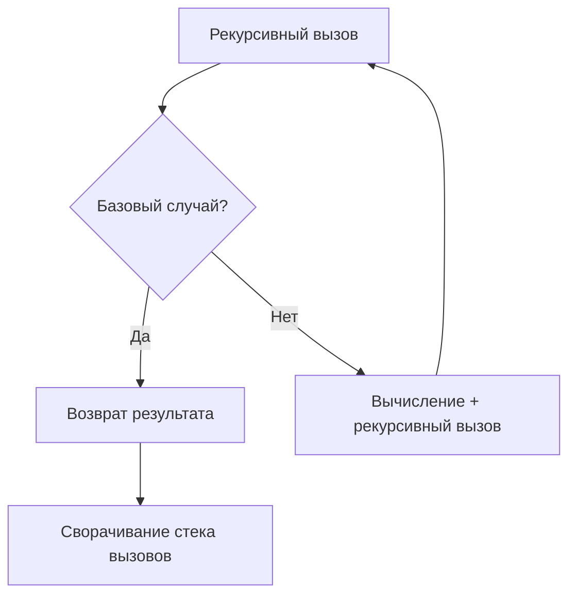

#swift #recursion #algorithms #functional-programming #stack #performance #interview

---

### Определение

**Рекурсивная функция** — это функция, которая **вызывает саму себя** прямо или косвенно для решения задачи. Рекурсия позволяет разбить сложную проблему на более простые подзадачи того же типа.

Каждая рекурсивная функция должна иметь:
1. **Базовый случай (base case)** — условие остановки рекурсии (без него — бесконечная рекурсия и переполнение стека)
2. **Рекурсивный случай (recursive case)** — вызов функции самой себя с изменёнными параметрами, приближающимися к базовому случаю



---

### Зачем это знать iOS-разработчику?

| Причина                             | Объяснение                                              |
| ----------------------------------- | ------------------------------------------------------- |
| **Алгоритмические собеседования**   | 70% задач на деревья и графы решаются рекурсией         |
| **Обход деревьев**                  | UI-иерархия, XML/HTML парсинг, файловая система         |
| **Разделяй и властвуй**             | Быстрая сортировка, сортировка слиянием, бинарный поиск |
| **Backtracking**                    | Генерация перестановок, решение судоку, задача о ферзях |
| **Функциональное программирование** | Рекурсия — основа FP (вместо циклов)                    |

---

## 1. Основные виды рекурсии

| Вид рекурсии | Описание | Пример |
|---|---|---|
| **Прямая рекурсия** | Функция вызывает саму себя | `func factorial(n) { return n * factorial(n-1) }` |
| **Косвенная рекурсия** | Функция A вызывает B, а B вызывает A | `func isEven(n) { if n==0 return true else return isOdd(n-1) }` |
| **Хвостовая рекурсия** | Рекурсивный вызов — последняя операция в функции | `func sum(n, acc) { if n==0 return acc else return sum(n-1, acc+n) }` |
| **Линейная рекурсия** | Один рекурсивный вызов на уровень | `func factorial(n)` |
| **Древовидная рекурсия** | Несколько рекурсивных вызовов | `func fibonacci(n) { return fib(n-1) + fib(n-2) }` |

---

## 2. Классические примеры рекурсивных функций

### 2.1. Факториал (линейная рекурсия)

```swift
// MARK: - Факториал (классическая рекурсия)
func factorial(_ n: Int) -> Int {
    // Базовый случай
    guard n > 1 else { return 1 }
    // Рекурсивный случай
    return n * factorial(n - 1)
}

print(factorial(5))  // 120
// Стек вызовов: 5 * 4 * 3 * 2 * 1
```

### 2.2. Числа Фибоначчи (древовидная рекурсия)

```swift
// MARK: - Фибоначчи (наивная рекурсия — экспоненциальная сложность)
func fibonacci(_ n: Int) -> Int {
    guard n > 1 else { return n }
    return fibonacci(n - 1) + fibonacci(n - 2)
}

print(fibonacci(10))  // 55
// Внимание: fibonacci(40) будет вычисляться очень долго!
```

### 2.3. Сумма элементов массива

```swift
// MARK: - Сумма массива (линейная рекурсия)
func sum(_ array: [Int]) -> Int {
    guard let first = array.first else { return 0 }
    return first + sum(Array(array.dropFirst()))
}

print(sum([1, 2, 3, 4, 5]))  // 15
```

### 2.4. Возведение в степень

```swift
// MARK: - Степень (быстрая рекурсия O(log n))
func power(_ base: Int, _ exponent: Int) -> Int {
    if exponent == 0 { return 1 }
    if exponent % 2 == 0 {
        let half = power(base, exponent / 2)
        return half * half
    } else {
        return base * power(base, exponent - 1)
    }
}

print(power(2, 10))  // 1024
```

---

## 3. Хвостовая рекурсия (Tail Recursion)

### 3.1. Проблема: переполнение стека

```swift
// ❌ Обычная рекурсия — не хвостовая
func sumRecursive(_ n: Int) -> Int {
    if n == 0 { return 0 }
    return n + sumRecursive(n - 1)  // + n выполняется ПОСЛЕ рекурсивного вызова
}
// Для n = 100_000 → переполнение стека (crash)
```

### 3.2. Решение: хвостовая рекурсия с аккумулятором

```swift
// ✅ Хвостовая рекурсия — рекурсивный вызов последний
func sumTailRecursive(_ n: Int, _ accumulator: Int = 0) -> Int {
    if n == 0 { return accumulator }
    return sumTailRecursive(n - 1, accumulator + n)  // рекурсивный вызов — последний
}
// Компилятор может оптимизировать в цикл (Tail Call Optimization)
```

### 3.3. Оптимизация хвостовой рекурсии в [[Swift]]

```swift
// Swift не гарантирует TCO, но в release-сборке часто оптимизирует
// Для гарантии можно использовать явный цикл или атрибут `@inline`
@inline(__always)
func tailRecursiveFactorial(_ n: Int, _ acc: Int = 1) -> Int {
    return n <= 1 ? acc : tailRecursiveFactorial(n - 1, acc * n)
}
```

---

## 4. Косвенная рекурсия

```swift
// MARK: - Проверка чётности/нечётности через косвенную рекурсию
func isEven(_ n: Int) -> Bool {
    if n == 0 { return true }
    return isOdd(n - 1)
}

func isOdd(_ n: Int) -> Bool {
    if n == 0 { return false }
    return isEven(n - 1)
}

print(isEven(4))  // true
print(isOdd(5))   // true
```

---

## 5. Рекурсия на структурах данных

### 5.1. Рекурсивное перечисление ([[Linked List]])

```swift
// MARK: - Связный список через рекурсивное enum
indirect enum List<Element> {
    case empty
    case node(Element, next: List<Element>)
    
    // Рекурсивное добавление элемента
    func appending(_ value: Element) -> List<Element> {
        switch self {
        case .empty:
            return .node(value, next: .empty)
        case let .node(head, next):
            return .node(head, next: next.appending(value))
        }
    }
    
    // Рекурсивное получение длины
    var count: Int {
        switch self {
        case .empty:
            return 0
        case let .node(_, next):
            return 1 + next.count
        }
    }
}

let list = List<Int>.empty
    .appending(1)
    .appending(2)
    .appending(3)
print(list.count)  // 3
```

### 5.2. Обход дерева (Tree Traversal)

```swift
// MARK: - Бинарное дерево
indirect enum BinaryTree<T: Comparable> {
    case empty
    case node(T, left: BinaryTree, right: BinaryTree)
    
    // Рекурсивная вставка
    func inserting(_ value: T) -> BinaryTree {
        switch self {
        case .empty:
            return .node(value, left: .empty, right: .empty)
        case let .node(head, left, right):
            if value < head {
                return .node(head, left: left.inserting(value), right: right)
            } else if value > head {
                return .node(head, left: left, right: right.inserting(value))
            } else {
                return self
            }
        }
    }
    
    // Рекурсивный поиск
    func contains(_ value: T) -> Bool {
        switch self {
        case .empty:
            return false
        case let .node(head, left, right):
            if value < head {
                return left.contains(value)
            } else if value > head {
                return right.contains(value)
            } else {
                return true
            }
        }
    }
    
    // Рекурсивный обход в глубину (in-order)
    func inOrder() -> [T] {
        switch self {
        case .empty:
            return []
        case let .node(head, left, right):
            return left.inOrder() + [head] + right.inOrder()
        }
    }
}

var tree = BinaryTree<Int>.empty
tree = tree.inserting(5)
tree = tree.inserting(3)
tree = tree.inserting(7)
tree = tree.inserting(1)
print(tree.inOrder())  // [1, 3, 5, 7]
```

---

## 6. Backtracking (Возврат) — рекурсия с откатом

### 6.1. Генерация всех перестановок

```swift
// MARK: - Генерация перестановок массива
func permutations<T>(_ array: [T]) -> [[T]] {
    var result: [[T]] = []
    var current = array
    
    func backtrack(_ start: Int) {
        if start == current.count - 1 {
            result.append(current)
            return
        }
        
        for i in start..<current.count {
            current.swapAt(start, i)
            backtrack(start + 1)
            current.swapAt(start, i)  // откат
        }
    }
    
    backtrack(0)
    return result
}

let perms = permutations([1, 2, 3])
print(perms.count)  // 6
```

### 6.2. Задача о ферзях (N-Queens)

```swift
// MARK: - N-Queens (размещение N ферзей на доске NxN)
func solveNQueens(_ n: Int) -> [[String]] {
    var result: [[String]] = []
    var board = Array(repeating: Array(repeating: ".", count: n), count: n)
    
    func isSafe(_ row: Int, _ col: Int) -> Bool {
        // Проверка вертикали
        for i in 0..<row {
            if board[i][col] == "Q" { return false }
        }
        // Проверка диагонали ↖
        var i = row - 1
        var j = col - 1
        while i >= 0 && j >= 0 {
            if board[i][j] == "Q" { return false }
            i -= 1; j -= 1
        }
        // Проверка диагонали ↗
        i = row - 1
        j = col + 1
        while i >= 0 && j < n {
            if board[i][j] == "Q" { return false }
            i -= 1; j += 1
        }
        return true
    }
    
    func backtrack(_ row: Int) {
        if row == n {
            result.append(board.map { $0.joined() })
            return
        }
        
        for col in 0..<n {
            if isSafe(row, col) {
                board[row][col] = "Q"
                backtrack(row + 1)
                board[row][col] = "."  // откат
            }
        }
    }
    
    backtrack(0)
    return result
}

let solutions = solveNQueens(4)
print(solutions.count)  // 2
```

---

## 7. Рекурсия и производительность

### 7.1. Сравнение рекурсии и итерации

```swift
import Foundation

// Итеративный подход (быстрее, нет риска переполнения стека)
func factorialIterative(_ n: Int) -> Int {
    var result = 1
    for i in 1...n {
        result *= i
    }
    return result
}

// Рекурсивный подход (медленнее, но элегантнее)
func factorialRecursive(_ n: Int) -> Int {
    return n <= 1 ? 1 : n * factorialRecursive(n - 1)
}

// Измерение производительности
func measure(_ name: String, _ block: () -> Void) {
    let start = CFAbsoluteTimeGetCurrent()
    block()
    let end = CFAbsoluteTimeGetCurrent()
    print("\(name): \(String(format: "%.4f", (end - start) * 1000)) ms")
}

measure("Iterative") { _ = factorialIterative(20) }   // ~0.01 ms
measure("Recursive") { _ = factorialRecursive(20) }   // ~0.02 ms
```

### 7.2. Проблема переполнения стека (Stack Overflow)

```swift
// ❌ Рекурсия без хвостовой оптимизации — краш при n = 100_000
func sumRecursive(_ n: Int) -> Int {
    if n == 0 { return 0 }
    return n + sumRecursive(n - 1)
}
// sumRecursive(100_000) → Thread 1: EXC_BAD_ACCESS (stack overflow)

// ✅ Итеративное решение — безопасно
func sumIterative(_ n: Int) -> Int {
    var result = 0
    for i in 1...n {
        result += i
    }
    return result
}
```

---

## 8. Оптимизация: мемоизация (кэширование)

```swift
// MARK: - Фибоначчи с мемоизацией (O(n) вместо O(2^n))
func fibonacciMemoized() -> (Int) -> Int {
    var cache: [Int: Int] = [:]
    
    func fib(_ n: Int) -> Int {
        if let cached = cache[n] { return cached }
        let result = n <= 1 ? n : fib(n - 1) + fib(n - 2)
        cache[n] = result
        return result
    }
    
    return fib
}

let fib = fibonacciMemoized()
print(fib(40))  // ~0.001 ms (быстро)
print(fib(40))  // ~0.0001 ms (из кэша)
```

---

## 9. Рекурсия в [[SwiftUI]] (обход иерархии)

```swift
import SwiftUI

// Рекурсивный обход View-иерархии
func findViews<T: View>(ofType type: T.Type, in view: some View) -> [T] {
    var result: [T] = []
    // В реальном коде здесь был бы Mirror или runtime introspection
    return result
}

// Рекурсивное создание вложенных View
struct RecursiveTreeView: View {
    let depth: Int
    let maxDepth: Int
    
    var body: some View {
        if depth < maxDepth {
            VStack {
                Text("Level \(depth)")
                RecursiveTreeView(depth: depth + 1, maxDepth: maxDepth)
            }
        } else {
            Text("Leaf at level \(depth)")
        }
    }
}
```

---

## 10. Когда использовать рекурсию

| Сценарий | Рекомендация | Почему |
|---|---|---|
| **Обход деревьев и графов** | ✅ | Естественное выражение рекурсивной структуры |
| **Разделяй и властвуй** | ✅ | Быстрая сортировка, сортировка слиянием |
| **Backtracking** | ✅ | Генерация перестановок, задачи на доске |
| **Простые итерации (сумма, факториал)** | ❌ | Лучше использовать циклы (быстрее, безопаснее) |
| **Глубокие рекурсии (>1000 уровней)** | ❌ | Риск переполнения стека |
| **Производительный код** | ❌ | Итерация быстрее (нет overhead вызовов) |

---

## 11. Короткое правило

> **Рекурсия** — элегантное решение для задач с рекурсивной структурой (деревья, графы, backtracking).  
> Для простых итераций используй **циклы**.  
> При глубокой рекурсии (тысячи вызовов) — **хвостовая рекурсия** или **итерация**.  
> **Мемоизация** превращает экспоненциальную рекурсию в линейную.

---

## 12. Итог

**Рекурсивная функция** в Swift:

| Характеристика | Значение |
|---|---|
| **Базовый случай** | Обязательное условие остановки |
| **Рекурсивный случай** | Вызов функции самой себя |
| **Сложность** | Зависит от задачи (O(n) до O(2^n)) |
| **Память** | O(глубина рекурсии) на стеке |
| **Риски** | Stack overflow при глубокой рекурсии |
| **Оптимизация** | Хвостовая рекурсия, мемоизация, итерация |

**Ключевые выводы:**
- Рекурсия — мощный инструмент для **рекурсивных структур данных** (деревья, графы)
- Всегда должна быть **базовый случай** (иначе бесконечная рекурсия)
- Для глубоких рекурсий используй **хвостовую рекурсию** или **итерацию**
- **Мемоизация** ускоряет рекурсивные вычисления (Фибоначчи)

Понимание рекурсии необходимо для прохождения технических собеседований и эффективного решения задач на деревья, графы и backtracking.