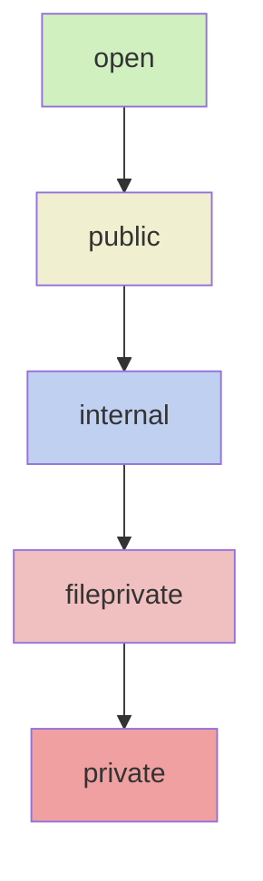

#general_theory #Swift 
## 📘 Определение

**Уровни доступа** (Access Control) в [[Swift]] определяют, где и кем можно использовать типы, свойства, методы или константы/переменные.  
Swift поддерживает **многоуровневую систему доступа**, которая помогает инкапсулировать данные и защищать внутреннюю реализацию.

---

## 🔹 Основные уровни доступа

| Уровень                                                                                          | Где доступен                                                                          |
| ------------------------------------------------------------------------------------------------ | ------------------------------------------------------------------------------------- |
| [[Уровни доступа в Swift#5. `open` — доступ и возможность переопределять\|Open]]                 | Доступен **везде**, включая другие модули, и может быть **переопределён**.            |
| [[Уровни доступа в Swift#4. `public` — доступ из других модулей, нельзя переопределять\|Public]] | Доступен **везде**, **но нельзя переопределять** вне модуля.                          |
| [[Уровни доступа в Swift#3. `internal` — доступ внутри модуля (по умолчанию)\|Internal]]         | Доступен **только внутри модуля** (по умолчанию, если не указан).                     |
| [[Уровни доступа в Swift#2. `fileprivate` — доступ в пределах файла\|Fileprivate]]               | Доступен **только в том же файле**.                                                   |
| [[Уровни доступа в Swift#1. `private` — доступ только внутри класса/структуры\|Private]]         | Доступен **только в пределах объявления (scope)**, включая extensions в том же файле. |

> Модули — это отдельные Targets в [[Xcode]] или сторонние Frameworks.

---

## 🔹 Примеры кода

### 1. `private` — доступ только внутри класса/структуры

```swift
class BankAccount {
    private var balance: Double = 0.0
    
    func deposit(_ amount: Double) {
        balance += amount
    }
    
    func getBalance() -> Double {
        return balance
    }
}

let account = BankAccount()
account.deposit(100)
// account.balance // Ошибка! private
```

---

### 2. `fileprivate` — доступ в пределах файла

```swift
fileprivate struct Logger {
    static func log(_ msg: String) {
        print(msg)
    }
}

Logger.log("Отладка") // Работает внутри файла
```

---

### 3. `internal` — доступ внутри модуля (по умолчанию)

```swift
struct User {
    var name: String // internal по умолчанию
}

let user = User(name: "Alice") // Доступно внутри модуля
```

---

### 4. `public` — доступ из других модулей, нельзя переопределять

```swift
public class Animal {
    public func speak() {
        print("Some sound")
    }
}

let dog = Animal()
dog.speak() // Доступно из любого модуля, но метод нельзя override вне модуля
```

---

### 5. `open` — доступ и возможность переопределять

```swift
open class Vehicle {
    open func drive() {
        print("Driving")
    }
}

public class Car: Vehicle {
    override open func drive() {
        print("Car is driving")
    }
}
```

---

## 🖼 Схема уровней доступа



- Чем выше в таблице/схеме — больше доступ кода из других модулей.
    
- `private` — самый строгий уровень.
    

---

## 💡 Замечания

- По умолчанию все типы и члены имеют `internal`.
    
- Для классов и методов `open` и `public` различаются **только возможностью наследования и переопределения**.
    
- Extensions могут видеть `fileprivate` и `private` только в рамках файла или области видимости.
    
- Используйте минимально возможный уровень доступа для безопасности и инкапсуляции.
    

---

## 📖 Дополнительно

- [Apple Docs — Access Control](https://docs.swift.org/swift-book/LanguageGuide/AccessControl.html)
    
- [Ray Wenderlich — Swift Access Control](https://www.raywenderlich.com/11377214-swift-access-control)
    

---
