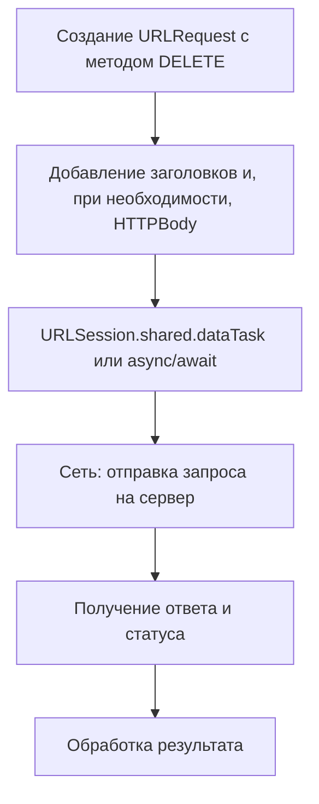

#network #Swift 
## 📘 Определение

**HTTP DELETE** — это метод протокола [[HTTP]], который используется для **удаления ресурса на сервере**.

Особенности:

- DELETE обычно **идемпотентен**: повторные одинаковые запросы не изменяют результат после первого удаления.
    
- В [[iOS]] DELETE-запросы выполняются через [[URLSession]] или сторонние библиотеки (например, Alamofire).
    
- Данные для DELETE-запроса обычно передаются через **[[URL]] или заголовки**, а не в теле запроса.
    

---

## 🔹 Примеры кода

### 1. Простейший DELETE-запрос

```swift
import Foundation

let url = URL(string: "https://jsonplaceholder.typicode.com/posts/1")!
var request = URLRequest(url: url)
request.httpMethod = "DELETE"

let task = URLSession.shared.dataTask(with: request) { data, response, error in
    if let httpResponse = response as? HTTPURLResponse {
        print("Status code: \(httpResponse.statusCode)")
    }
    if let data = data, let responseText = String(data: data, encoding: .utf8) {
        print(responseText)
    }
}
task.resume()
```

---

### 2. DELETE-запрос с кастомными заголовками

```swift
request.addValue("Bearer TOKEN_HERE", forHTTPHeaderField: "Authorization")
request.addValue("application/json", forHTTPHeaderField: "Accept")
```

---

### 3. Асинхронный DELETE-запрос с [[async]]/[[await]] ([[Swift]] 5.5+)

```swift
import Foundation

var request = URLRequest(url: URL(string: "https://jsonplaceholder.typicode.com/posts/1")!)
request.httpMethod = "DELETE"

Task {
    do {
        let (_, response) = try await URLSession.shared.data(for: request)
        if let httpResponse = response as? HTTPURLResponse {
            print("Status code: \(httpResponse.statusCode)")
        }
    } catch {
        print(error)
    }
}
```

---

### 4. DELETE с URL параметрами

```swift
var components = URLComponents(string: "https://api.example.com/items")!
components.queryItems = [URLQueryItem(name: "id", value: "123")]

var request = URLRequest(url: components.url!)
request.httpMethod = "DELETE"

URLSession.shared.dataTask(with: request) { data, response, error in
    print(response!)
}.resume()
```

---

### 5. DELETE с [[Codable]]-моделью (редко используется, но возможно)

```swift
struct DeleteRequest: Codable {
    let reason: String
}

let deleteBody = DeleteRequest(reason: "No longer needed")
request.httpBody = try? JSONEncoder().encode(deleteBody)
request.addValue("application/json", forHTTPHeaderField: "Content-Type")
```

---

## 🖼 Схема работы DELETE-запроса



---

## 💡 Замечания

- DELETE-запросы **идемпотентны** и должны удалять ресурс на сервере.
    
- Обычно данные передаются через **URL или заголовки**, но иногда тело запроса используется для пояснения причины удаления.
    
- Для удобства асинхронной работы лучше использовать `async/await`.
    

---

## 📖 Дополнительно

- [RFC 7231 — HTTP DELETE Method](https://datatracker.ietf.org/doc/html/rfc7231#section-4.3.5)
    
- [Apple Docs — URLSession](https://developer.apple.com/documentation/foundation/urlsession)
    

---
