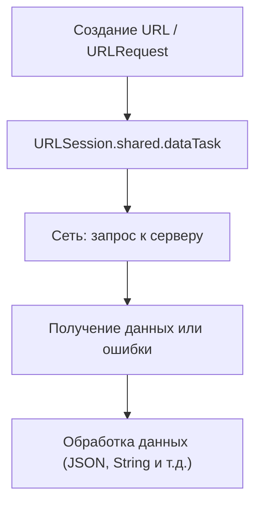

#network #Swift 
## 📘 Определение

**HTTP GET** — это метод протокола [[HTTP]] для **запроса данных с сервера**.

Особенности:

- Используется для **получения информации**, без изменения состояния сервера.
    
- Данные передаются в **[[URL]] query parameters**.
    
- В [[iOS]] GET-запросы выполняются через [[URLSession]] или сторонние библиотеки ([[Alamofire]]).
    

---

## 🔹 Примеры кода

### 1. Простейший GET-запрос с `URLSession`

```swift
import Foundation

let url = URL(string: "https://jsonplaceholder.typicode.com/posts/1")!
let task = URLSession.shared.dataTask(with: url) { data, response, error in
    if let error = error {
        print("Ошибка: \(error)")
        return
    }
    guard let data = data else { return }
    let text = String(data: data, encoding: .utf8)
    print(text!)
}
task.resume()
```

---

### 2. GET-запрос с проверкой HTTP Response

```swift
let url = URL(string: "https://jsonplaceholder.typicode.com/posts/1")!
let task = URLSession.shared.dataTask(with: url) { data, response, error in
    if let httpResponse = response as? HTTPURLResponse {
        print("Status code: \(httpResponse.statusCode)")
    }
    if let data = data, let json = try? JSONSerialization.jsonObject(with: data) {
        print(json)
    }
}
task.resume()
```

---

### 3. GET-запрос с [[URLQueryItem]] (параметры)

```swift
var components = URLComponents(string: "https://api.example.com/search")!
components.queryItems = [
    URLQueryItem(name: "q", value: "swift"),
    URLQueryItem(name: "limit", value: "10")
]

let url = components.url!
let task = URLSession.shared.dataTask(with: url) { data, _, _ in
    if let data = data {
        print(String(data: data, encoding: .utf8)!)
    }
}
task.resume()
```

---

### 4. GET-запрос с кастомными заголовками

```swift
var request = URLRequest(url: URL(string: "https://api.example.com/user")!)
request.httpMethod = "GET"
request.addValue("application/json", forHTTPHeaderField: "Accept")
request.addValue("Bearer TOKEN_HERE", forHTTPHeaderField: "Authorization")

let task = URLSession.shared.dataTask(with: request) { data, _, error in
    if let data = data {
        print(String(data: data, encoding: .utf8)!)
    }
}
task.resume()
```

---

### 5. GET-запрос с декодированием [[JSON]] в модель ([[Codable]])

```swift
struct Post: Codable {
    let id: Int
    let title: String
    let body: String
}

let url = URL(string: "https://jsonplaceholder.typicode.com/posts/1")!
URLSession.shared.dataTask(with: url) { data, _, _ in
    if let data = data {
        let decoder = JSONDecoder()
        if let post = try? decoder.decode(Post.self, from: data) {
            print(post.title)
        }
    }
}.resume()
```

---

## 🖼 Схема работы GET-запроса



---

## 💡 Замечания

- GET-запросы должны быть **безопасными и идемпотентными** (не изменяют данные на сервере).
    
- Для **асинхронной обработки** используется `URLSession` и `dataTask`.
    
- Для **сложных проектов** удобно использовать Alamofire или Combine.
    
- Не забудьте вызвать `task.resume()` — без этого запрос **не выполнится**.
    

---

## 📖 Дополнительно

- [Apple Docs — URLSession](https://developer.apple.com/documentation/foundation/urlsession)
    
- [Apple Docs — URLSession Data Task](https://developer.apple.com/documentation/foundation/urlsessiondatatask)
    

---
