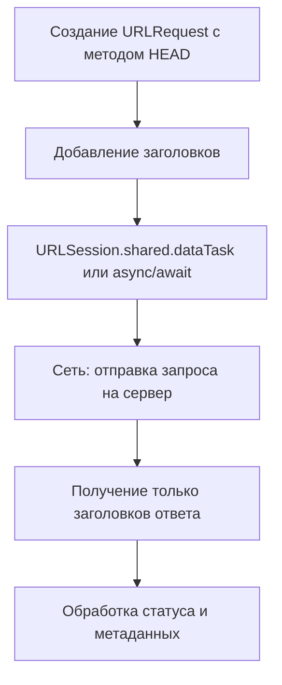

#network #Swift 
## 📘 Определение

**HTTP HEAD** — это метод протокола [[HTTP]], который запрашивает **только заголовки ответа** без тела ресурса.

Особенности:

- Используется для проверки **наличия ресурса**, **метаданных** или **даты последнего изменения**.
    
- Идеально подходит для **оптимизации запросов** (не загружать весь контент, если нужно только узнать размер или статус).
    
- В iOS HEAD-запросы выполняются через [[URLSession]].
    

---

## 🔹 Примеры кода

### 1. Простейший HEAD-запрос

```swift
import Foundation

let url = URL(string: "https://jsonplaceholder.typicode.com/posts/1")!
var request = URLRequest(url: url)
request.httpMethod = "HEAD"

let task = URLSession.shared.dataTask(with: request) { data, response, error in
    if let httpResponse = response as? HTTPURLResponse {
        print("Status code: \(httpResponse.statusCode)")
        print("Headers: \(httpResponse.allHeaderFields)")
    }
}
task.resume()
```

---

### 2. HEAD-запрос с кастомными заголовками

```swift
request.addValue("Bearer TOKEN_HERE", forHTTPHeaderField: "Authorization")
request.addValue("application/json", forHTTPHeaderField: "Accept")
```

---

### 3. Асинхронный HEAD-запрос с [[async]]/[[await]] ([[Swift]] 5.5+)

```swift
import Foundation

var request = URLRequest(url: URL(string: "https://jsonplaceholder.typicode.com/posts/1")!)
request.httpMethod = "HEAD"

Task {
    do {
        let (_, response) = try await URLSession.shared.data(for: request)
        if let httpResponse = response as? HTTPURLResponse {
            print("Status code: \(httpResponse.statusCode)")
            print("Headers: \(httpResponse.allHeaderFields)")
        }
    } catch {
        print(error)
    }
}
```

---

### 4. Проверка существования ресурса

```swift
let task = URLSession.shared.dataTask(with: request) { _, response, _ in
    if let httpResponse = response as? HTTPURLResponse {
        if httpResponse.statusCode == 200 {
            print("Ресурс доступен")
        } else {
            print("Ресурс недоступен: \(httpResponse.statusCode)")
        }
    }
}
task.resume()
```

---

### 5. Получение метаданных файла

```swift
let url = URL(string: "https://example.com/image.png")!
var request = URLRequest(url: url)
request.httpMethod = "HEAD"

URLSession.shared.dataTask(with: request) { _, response, _ in
    if let httpResponse = response as? HTTPURLResponse {
        if let length = httpResponse.value(forHTTPHeaderField: "Content-Length") {
            print("Размер файла: \(length) байт")
        }
        if let type = httpResponse.value(forHTTPHeaderField: "Content-Type") {
            print("Тип файла: \(type)")
        }
    }
}.resume()
```

---

## 🖼 Схема работы HEAD-запроса



---

## 💡 Замечания

- HEAD **не возвращает тело ответа**, экономя трафик.
    
- Используется для:
    
    - проверки доступности ресурса
        
    - получения метаданных (Content-Length, Last-Modified)
        
    - проверки кеша
        
- Для асинхронной обработки удобно использовать `async/await`.
    

---

## 📖 Дополнительно

- [RFC 7231 — HTTP HEAD Method](https://datatracker.ietf.org/doc/html/rfc7231#section-4.3.2)
    
- [Apple Docs — URLSession](https://developer.apple.com/documentation/foundation/urlsession)
    

---
