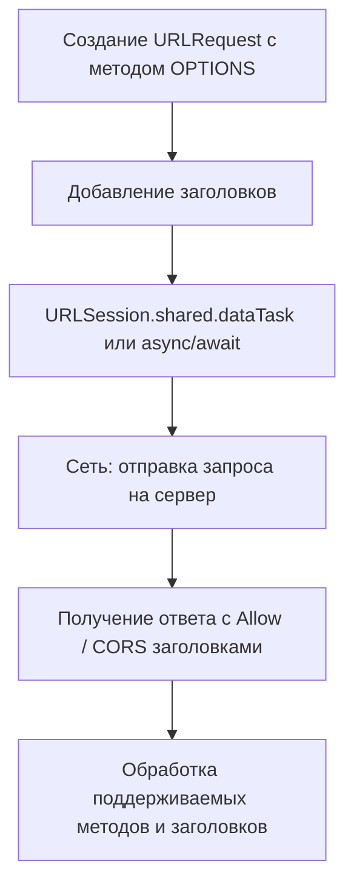

#network #Swift 
## 📘 Определение

**HTTP OPTIONS** — это метод протокола [[HTTP]], который используется для **запроса, какие методы HTTP поддерживаются сервером для конкретного ресурса**.

Особенности:

- OPTIONS не запрашивает сам ресурс, а **только доступные методы и заголовки**.
    
- Часто используется для **CORS** (Cross-Origin Resource Sharing) в веб-приложениях.
    
- В [[iOS]] OPTIONS-запросы выполняются через [[URLSession]].
    

---

## 🔹 Примеры кода

### 1. Простейший OPTIONS-запрос

```swift
import Foundation

let url = URL(string: "https://jsonplaceholder.typicode.com/posts/1")!
var request = URLRequest(url: url)
request.httpMethod = "OPTIONS"

let task = URLSession.shared.dataTask(with: request) { data, response, error in
    if let httpResponse = response as? HTTPURLResponse {
        print("Status code: \(httpResponse.statusCode)")
        print("Allow header: \(httpResponse.value(forHTTPHeaderField: "Allow") ?? "нет")")
    }
}
task.resume()
```

---

### 2. OPTIONS-запрос с кастомными заголовками

```swift
request.addValue("application/json", forHTTPHeaderField: "Accept")
request.addValue("Bearer TOKEN_HERE", forHTTPHeaderField: "Authorization")
```

---

### 3. Асинхронный OPTIONS-запрос с [[async]]/[[await]] ([[Swift]] 5.5+)

```swift
import Foundation

var request = URLRequest(url: URL(string: "https://jsonplaceholder.typicode.com/posts/1")!)
request.httpMethod = "OPTIONS"

Task {
    do {
        let (_, response) = try await URLSession.shared.data(for: request)
        if let httpResponse = response as? HTTPURLResponse {
            print("Status code: \(httpResponse.statusCode)")
            print("Allow: \(httpResponse.value(forHTTPHeaderField: "Allow") ?? "нет")")
        }
    } catch {
        print(error)
    }
}
```

---

### 4. Получение поддерживаемых методов

```swift
let task = URLSession.shared.dataTask(with: request) { _, response, _ in
    if let httpResponse = response as? HTTPURLResponse,
       let allow = httpResponse.value(forHTTPHeaderField: "Allow") {
        let methods = allow.components(separatedBy: ", ")
        print("Поддерживаемые методы: \(methods)")
    }
}
task.resume()
```

---

### 5. OPTIONS с проверкой CORS (для веб-подобных [[API]])

```swift
request.addValue("Origin", forHTTPHeaderField: "https://example.com")

URLSession.shared.dataTask(with: request) { _, response, _ in
    if let httpResponse = response as? HTTPURLResponse {
        if let allowMethods = httpResponse.value(forHTTPHeaderField: "Access-Control-Allow-Methods") {
            print("Разрешённые методы CORS: \(allowMethods)")
        }
    }
}.resume()
```

---

## 🖼 Схема работы OPTIONS-запроса



---

## 💡 Замечания

- OPTIONS **не возвращает тело ресурса**, только метаданные о поддерживаемых методах.
    
- Часто используется для:
    
    - CORS-проверки
        
    - динамического определения поддерживаемых методов сервера
        
    - тестирования API
        
- Для асинхронного выполнения удобно использовать `async/await`.
    

---

## 📖 Дополнительно

- [RFC 7231 — HTTP OPTIONS Method](https://datatracker.ietf.org/doc/html/rfc7231#section-4.3.7)
    
- [Apple Docs — URLSession](https://developer.apple.com/documentation/foundation/urlsession)
    

---
