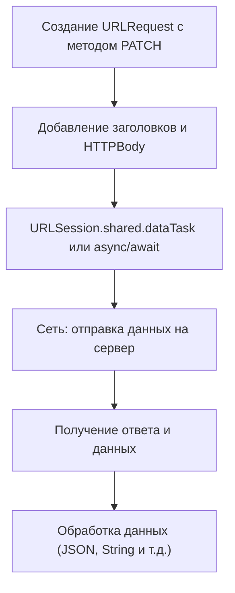

#network #Swift 
## 📘 Определение

**HTTP PATCH** — это метод протокола [[HTTP]], который используется для **частичного обновления ресурса на сервере**.

Особенности:

- В отличие от [[PUT]], который заменяет весь ресурс, PATCH изменяет **только указанные поля**.
    
- Данные передаются в **теле запроса ([[HTTPBody]])**.
    
- В iOS PATCH-запросы выполняются через [[URLSession]] или сторонние библиотеки (например, [[Alamofire]]).
    

---

## 🔹 Примеры кода

### 1. Простейший PATCH-запрос с `URLSession`

```swift
import Foundation

let url = URL(string: "https://jsonplaceholder.typicode.com/posts/1")!
var request = URLRequest(url: url)
request.httpMethod = "PATCH"
request.addValue("application/json", forHTTPHeaderField: "Content-Type")

let json: [String: Any] = ["title": "updated title only"]
request.httpBody = try? JSONSerialization.data(withJSONObject: json)

let task = URLSession.shared.dataTask(with: request) { data, response, error in
    if let data = data,
       let jsonString = String(data: data, encoding: .utf8) {
        print(jsonString)
    }
}
task.resume()
```

---

### 2. PATCH-запрос с проверкой HTTP Response

```swift
let task = URLSession.shared.dataTask(with: request) { data, response, error in
    if let httpResponse = response as? HTTPURLResponse {
        print("Status code: \(httpResponse.statusCode)")
    }
    if let data = data,
       let json = try? JSONSerialization.jsonObject(with: data) {
        print(json)
    }
}
task.resume()
```

---

### 3. PATCH с [[Codable]]-моделью

```swift
struct PostUpdate: Codable {
    let title: String
}

let update = PostUpdate(title: "Partial Update")
request.httpBody = try? JSONEncoder().encode(update)

URLSession.shared.dataTask(with: request) { data, _, _ in
    if let data = data,
       let response = try? JSONDecoder().decode(PostUpdate.self, from: data) {
        print(response.title) // Partial Update
    }
}.resume()
```

---

### 4. PATCH-запрос с кастомными заголовками

```swift
request.addValue("Bearer TOKEN_HERE", forHTTPHeaderField: "Authorization")
request.addValue("application/json", forHTTPHeaderField: "Accept")
```

---

### 5. Асинхронный PATCH-запрос с [[async]]/[[await]] ([[Swift]] 5.5+)

```swift
import Foundation

struct PostUpdate: Codable {
    let title: String
}

let update = PostUpdate(title: "Async PATCH")
var request = URLRequest(url: URL(string: "https://jsonplaceholder.typicode.com/posts/1")!)
request.httpMethod = "PATCH"
request.addValue("application/json", forHTTPHeaderField: "Content-Type")
request.httpBody = try? JSONEncoder().encode(update)

Task {
    do {
        let (data, _) = try await URLSession.shared.data(for: request)
        let response = try JSONDecoder().decode(PostUpdate.self, from: data)
        print(response.title) // Async PATCH
    } catch {
        print(error)
    }
}
```

---

## 🖼 Схема работы PATCH-запроса



---

## 💡 Замечания

- PATCH используется для **частичного обновления ресурса**.
    
- В отличие от PUT, PATCH **не заменяет весь объект**, а только указанные поля.
    
- Всегда указывайте `Content-Type`, если отправляете [[JSON]].
    
- Асинхронный код с `async/await` упрощает обработку запросов.
    

---

## 📖 Дополнительно

- [RFC 5789 — HTTP PATCH Method](https://datatracker.ietf.org/doc/html/rfc5789)
    
- [Apple Docs — URLSession](https://developer.apple.com/documentation/foundation/urlsession)
    

---
