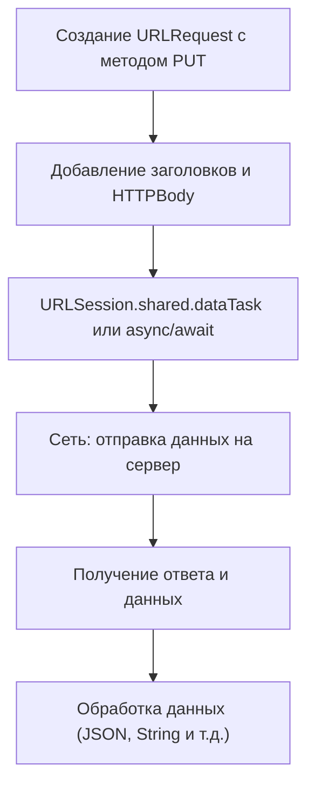

#network #Swift 
## 📘 Определение

**HTTP PUT** — это метод протокола [[HTTP]], который используется для **обновления существующего ресурса на сервере** или его **создания**, если ресурс ещё не существует.

Особенности:

- Данные передаются в **теле запроса ([[HTTPBody]])**.
    
- В отличие от [[POST-HTTP|POST]], PUT обычно **идемпотентен** (несколько одинаковых запросов дают один результат).
    
- В [[iOS]] PUT-запросы выполняются через [[URLSession]] или сторонние библиотеки (например, [[Alamofire]]).
    

---

## 🔹 Примеры кода

### 1. Простейший PUT-запрос с `URLSession`

```swift
import Foundation

let url = URL(string: "https://jsonplaceholder.typicode.com/posts/1")!
var request = URLRequest(url: url)
request.httpMethod = "PUT"
request.addValue("application/json", forHTTPHeaderField: "Content-Type")

let json: [String: Any] = ["id": 1, "title": "updated title", "body": "updated body", "userId": 1]
request.httpBody = try? JSONSerialization.data(withJSONObject: json)

let task = URLSession.shared.dataTask(with: request) { data, response, error in
    if let data = data, 
       let jsonString = String(data: data, encoding: .utf8) {
        print(jsonString)
    }
}
task.resume()
```

---

### 2. PUT-запрос с проверкой HTTP Response

```swift
let task = URLSession.shared.dataTask(with: request) { data, response, error in
    if let httpResponse = response as? HTTPURLResponse {
        print("Status code: \(httpResponse.statusCode)")
    }
    if let data = data, 
       let json = try? JSONSerialization.jsonObject(with: data) {
        print(json)
    }
}
task.resume()
```

---

### 3. PUT-запрос с [[Codable]]-моделью

```swift
struct Post: Codable {
    let id: Int
    let title: String
    let body: String
    let userId: Int
}

let updatedPost = Post(id: 1, title: "Updated", body: "Updated body", userId: 1)
request.httpBody = try? JSONEncoder().encode(updatedPost)

URLSession.shared.dataTask(with: request) { data, _, _ in
    if let data = data, 
       let responsePost = try? JSONDecoder().decode(Post.self, from: data) {
        print(responsePost.title) // Updated
    }
}.resume()
```

---

### 4. PUT-запрос с кастомными заголовками

```swift
request.addValue("Bearer TOKEN_HERE", forHTTPHeaderField: "Authorization")
request.addValue("application/json", forHTTPHeaderField: "Accept")
```

---

### 5. Асинхронный PUT-запрос с [[async]]/[[await]] ([[Swift]] 5.5+)

```swift
import Foundation

struct Post: Codable {
    let id: Int
    let title: String
    let body: String
    let userId: Int
}

let updatedPost = Post(id: 1, title: "Async PUT", body: "Body", userId: 1)
var request = URLRequest(url: URL(string: "https://jsonplaceholder.typicode.com/posts/1")!)
request.httpMethod = "PUT"
request.addValue("application/json", forHTTPHeaderField: "Content-Type")
request.httpBody = try? JSONEncoder().encode(updatedPost)

Task {
    do {
        let (data, _) = try await URLSession.shared.data(for: request)
        let responsePost = try JSONDecoder().decode(Post.self, from: data)
        print(responsePost)
    } catch {
        print(error)
    }
}
```

---

## 🖼 Схема работы PUT-запроса



---

## 💡 Замечания

- PUT-запрос **идемпотентен**: несколько одинаковых запросов приведут к одному результату.
    
- Отличие от [[POST-HTTP|POST]]: PUT обычно **обновляет конкретный ресурс**, POST — создаёт новый.
    
- Всегда указывайте `Content-Type`, если отправляете [[JSON]].
    
- Для удобства асинхронного кода можно использовать [[async]]/[[await]].
    

---

## 📖 Дополнительно

- [Apple Docs — URLSession](https://developer.apple.com/documentation/foundation/urlsession)
    
- [RFC 7231 — HTTP/1.1: PUT Method](https://datatracker.ietf.org/doc/html/rfc7231#section-4.3.4)
    

---
