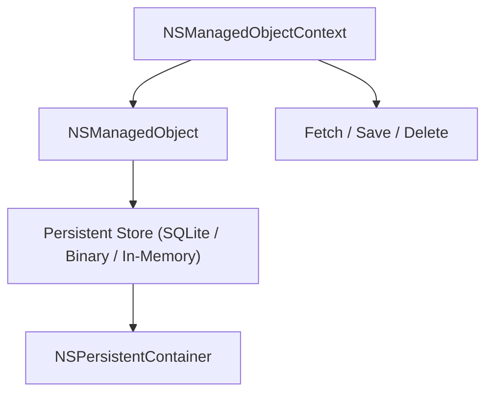

#save_data #swift #coredata 
## 📘 Определение

**Core Data** — это **фреймворк Apple для управления локальной базой данных** в [[iOS]], macOS и других платформах Apple.

Особенности:

- Позволяет хранить, извлекать, обновлять и удалять данные локально.
    
- Работает как ORM (Object-Relational Mapping): объекты [[Swift]] можно сохранять в базу.
    
- Поддерживает **схемы данных (Model), связи, запросы и миграции**.
    
- Обычно используется с **[[NSManagedObjectContext]], [[NSManagedObject]] и [[NSPersistentContainer]]**.
    

---

## 🔹 Примеры кода

### 1. Простейшая настройка Core Data

```swift
import CoreData
import UIKit

class PersistenceManager {
    static let shared = PersistenceManager()
    
    lazy var persistentContainer: NSPersistentContainer = {
        let container = NSPersistentContainer(name: "MyModel") // MyModel.xcdatamodeld
        container.loadPersistentStores { _, error in
            if let error = error {
                fatalError("Core Data load error: \(error)")
            }
        }
        return container
    }()
    
    var context: NSManagedObjectContext {
        return persistentContainer.viewContext
    }
}
```

---

### 2. Создание и сохранение объекта

```swift
let context = PersistenceManager.shared.context

let user = User(context: context) // User — NSManagedObject из модели
user.name = "Alice"
user.age = 25

do {
    try context.save()
    print("User saved")
} catch {
    print("Save error: \(error)")
}
```

---

### 3. Получение данных (fetch request)

```swift
let request: NSFetchRequest<User> = User.fetchRequest()
request.predicate = NSPredicate(format: "age > %d", 18)
request.sortDescriptors = [NSSortDescriptor(key: "name", ascending: true)]

do {
    let users = try context.fetch(request)
    users.forEach { print($0.name ?? "") }
} catch {
    print("Fetch error: \(error)")
}
```

---

### 4. Обновление данных

```swift
let request: NSFetchRequest<User> = User.fetchRequest()
request.predicate = NSPredicate(format: "name == %@", "Alice")

if let user = try? context.fetch(request).first {
    user.age = 26
    try? context.save()
}
```

---

### 5. Удаление данных

```swift
let request: NSFetchRequest<User> = User.fetchRequest()
request.predicate = NSPredicate(format: "name == %@", "Alice")

if let user = try? context.fetch(request).first {
    context.delete(user)
    try? context.save()
}
```

---

### 6. Использование фонового контекста для асинхронной работы

```swift
PersistenceManager.shared.persistentContainer.performBackgroundTask { context in
    let user = User(context: context)
    user.name = "Bob"
    user.age = 30
    
    do {
        try context.save()
        print("Saved in background")
    } catch {
        print(error)
    }
}
```

---

## 🖼 Схема работы Core Data



---

## 💡 Замечания

- Core Data **не является полноценной SQL-базой**, хотя часто использует [[SQLite]] под капотом.
    
- Сохраняйте изменения через `context.save()`.
    
- Для больших данных используйте **фоновые контексты**.
    
- Поддерживаются **связи между объектами**: один-к-одному, один-ко-многим, многие-ко-многим.
    
- [[NSPredicate]] и [[NSSortDescriptor]] позволяют выполнять **фильтрацию и сортировку** данных.
    

---

## 📖 Дополнительно

- [Apple Docs — Core Data](https://developer.apple.com/documentation/coredata)
    
- [Core Data Guide — Ray Wenderlich](https://www.raywenderlich.com/7569-core-data-tutorial-getting-started)
    

---
